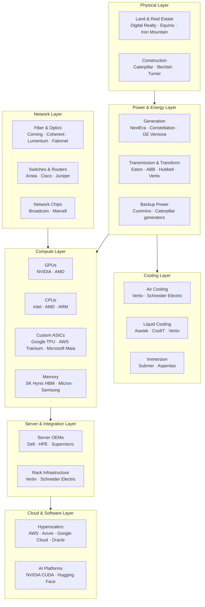

# Chapter 00: The AI Data Center Ecosystem

## Why Data Centers Matter Now

Training a single large AI model (like GPT-4 or Gemini Ultra) requires:
- Thousands of high-end GPUs running 24/7 for months
- Megawatts of power — enough to power a small city
- Petabytes of fast storage
- Ultra-low-latency networking between every GPU
- Massive cooling infrastructure to remove heat
- Physical buildings engineered for weight, power density, and security

This has created a **new industrial wave** — not just a software story. The companies that supply, build, and power these facilities are as critical as the chip designers themselves.

---

## The Full Stack: Who Does What?

---

## Market Size & Growth

| Segment | 2023 Market | 2027E Market | Key Driver |
|---------|-------------|--------------|------------|
| Data center construction | ~$50B | ~$120B | Hyperscaler capex |
| Power infrastructure | ~$15B | ~$40B | AI power density surge |
| Networking (switches) | ~$25B | ~$60B | 400G → 800G → 1.6T upgrades |
| Optical components | ~$8B | ~$20B | Scale-out fabric demand |
| HBM memory | ~$4B | ~$20B | GPU memory bandwidth needs |
| Server market | ~$100B | ~$200B | AI server ASP 5x standard |

---

## Chapters in This Curriculum

| Chapter | Topic | Key Companies |
|---------|-------|---------------|
| 01 | Physical Infrastructure & Construction | Caterpillar, Bechtel, Digital Realty, Equinix |
| 02 | Power & Energy | Vistra, Constellation, GE Vernova, Eaton, Vertiv |
| 03 | Cooling Systems | Vertiv, Schneider Electric, Asetek, Submer |
| 04 | Networking & Interconnects | Arista, Cisco, Broadcom, Marvell, NVIDIA |
| 05 | Optics & Fiber | Coherent, Lumentum, Corning, Fabrinet |
| 06 | Memory & Storage | SK Hynix, Micron, Samsung, Seagate |
| 07 | Servers & Hardware OEMs | Dell, HPE, Supermicro |
| 08 | Cloud Hyperscalers | AWS, Azure, Google Cloud, Meta, Oracle |

---

## Mental Model: The Data Center as a City

Think of a hyperscale AI data center the way you'd think of building a city from scratch:

| City Component | Data Center Equivalent |
|---------------|------------------------|
| Land & zoning | Real estate REITs, permitting |
| Roads & utilities | Power lines, fiber conduit |
| Power plant | On-site generators, utility contracts, nuclear PPAs |
| Water/sewage | Cooling towers, liquid cooling loops |
| Buildings | Steel-frame server halls (engineered for 200+ lbs/sqft floor loads) |
| Communication | Fiber optics, high-speed switches |
| Residents | Servers, GPUs, storage arrays |
| City government | Cloud operator (AWS/Azure/Google) |

The key insight: **AI has made the power and networking layers as bottlenecked as the chips themselves.**
