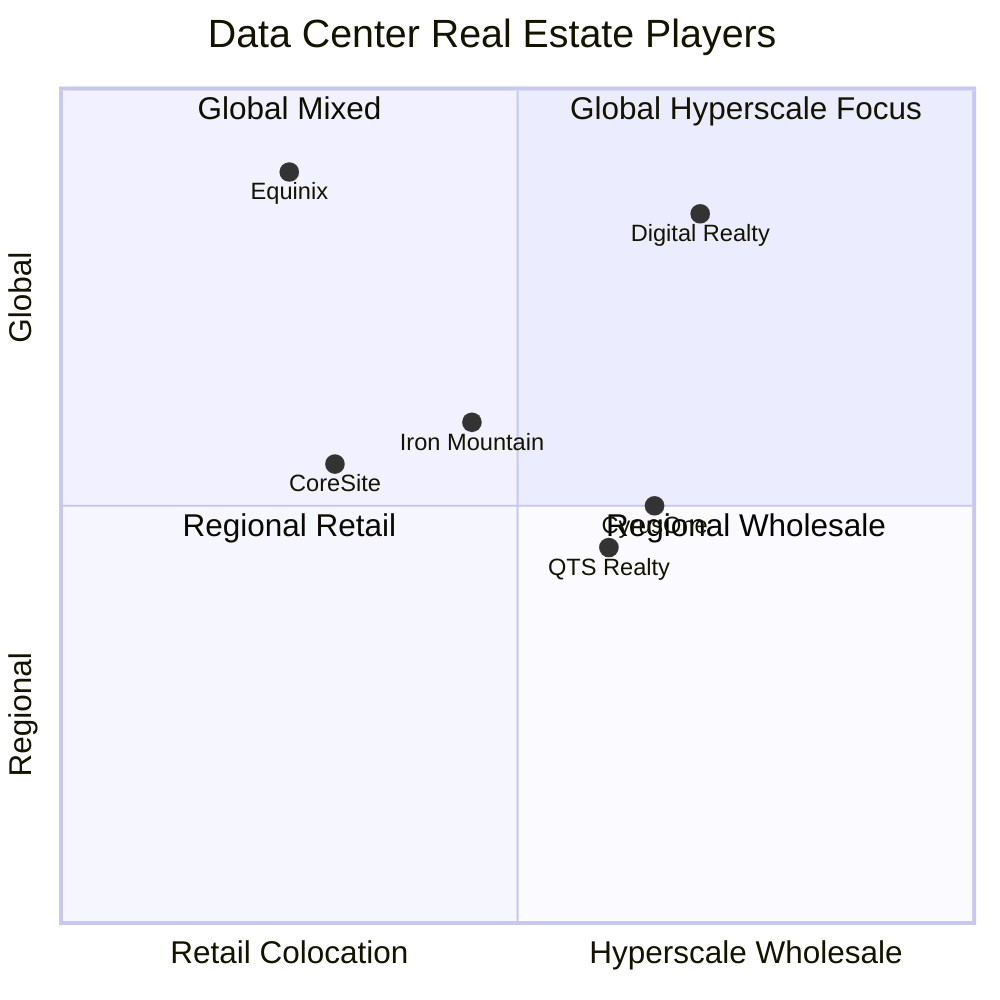

# Chapter 01: Physical Infrastructure & Construction

## Before a Single Server is Racked

Building a hyperscale AI data center requires solving physical problems at industrial scale before any compute hardware arrives:

- **Site selection**: Power availability, water access, seismic stability, tax incentives, fiber routes
- **Land acquisition**: 50–500+ acres, often in rural areas near cheap power
- **Permitting**: Environmental review, utility interconnect agreements (can take 2–5 years)
- **Construction**: Engineered buildings designed for massive electrical loads and heat density

A single NVIDIA GB200 NVL72 rack weighs ~1,400 kg and draws ~120 kW. Standard office buildings are built for ~50 kg/m² and 100W/m². Data centers require specialized structural and electrical engineering.

---

## The Construction Supply Chain

```mermaid
flowchart LR
    subgraph Site["Site Prep"]
        A[Land\nAcquisition]
        B[Permitting\n& Zoning]
        C[Grading\n& Earthwork]
    end

    subgraph Heavy["Heavy Construction"]
        D[Foundation\n& Structural Steel]
        E[Electrical\nInfrastructure]
        F[Mechanical\nSystems - HVAC]
    end

    subgraph Interior["Interior Build-out"]
        G[Raised Floors\nor Slab]
        H[Cable Trays\n& Conduit]
        I[Fire Suppression]
    end

    subgraph Equip["Equipment Install"]
        J[Generators\n& UPS]
        K[Cooling Units]
        L[Switch Gear\n& Transformers]
    end

    Site --> Heavy --> Interior --> Equip
```

---

## Key Companies: Construction Equipment

### Caterpillar (CAT) — Ticker: CAT

Caterpillar is the backbone of any large-scale earthwork and site preparation project.

| CAT Product | Data Center Use |
|------------|-----------------|
| Excavators (390F) | Site grading, foundation digging |
| Motor Graders (16M3) | Road and pad leveling |
| Diesel generators (Cat XQ2000) | Primary and backup power |
| Gensets (3500 series) | Continuous rated power for critical facilities |

**Key insight**: CAT makes both construction *equipment* and *power generation* products. Their industrial diesel and gas generators are used for backup power in data centers worldwide. A large data center may have $50M+ of CAT generators on-site.

---

## Key Companies: Construction & Engineering (EPC)

**EPC = Engineering, Procurement, Construction** — firms that manage the entire build.

| Company | Ticker | Role | Notable Projects |
|---------|--------|------|-----------------|
| Bechtel | Private | Mega-project EPC, power plants | Nuclear, semiconductor fabs, data centers |
| Turner Construction | Private (HOCHTIEF) | General contractor, data centers | Major hyperscaler campuses |
| Fluor | FLR | EPC for industrial/energy | Power infrastructure |
| AECOM | ACM | Engineering & design | Data center design/build |
| Skanska | SKA-B (Sweden) | Construction, sustainability focus | Green data centers |
| DPR Construction | Private | Tech-focused GC | Silicon Valley hyperscalers |

---

## Key Companies: Real Estate & REITs

Once built, data centers become highly valuable real estate. Several REITs specialize in owning and leasing them.

| Company | Ticker | Model | Revenue (2024E) |
|---------|--------|-------|-----------------|
| Equinix | EQIX | Retail colo + interconnection | ~$8.7B |
| Digital Realty | DLR | Wholesale hyperscale leases | ~$5.5B |
| Iron Mountain | IRM | Colo + records storage | ~$5.6B |
| CyrusOne | Private (KKR) | Hyperscale wholesale | Private |
| Compass Datacenters | Private | Hyperscale build-to-suit | Private |

**Equinix** operates 260+ data centers across 70 metros — the "neutral internet exchanges" where networks interconnect. **Digital Realty** focuses on large shell leases to Microsoft, AWS, Google, and Meta.

---

## Physical Engineering Constraints

### Floor Load
Standard office: ~2.5 kN/m² (50 lbs/ft²)
Data center raised floor: 10–20 kN/m² (200–400 lbs/ft²)
AI liquid-cooled rack zones: 20–30 kN/m²

### Power Density Trends

| Era | Rack Power Density | Cooling Method |
|-----|-------------------|----------------|
| 2010 (web servers) | 2–5 kW/rack | Air (CRAC units) |
| 2018 (cloud GPUs) | 10–20 kW/rack | Hot aisle containment |
| 2022 (A100 clusters) | 30–50 kW/rack | Direct liquid cooling |
| 2024 (H100/B200) | 70–120 kW/rack | Rear-door heat exchangers / CDUs |
| 2026+ (next-gen) | 150–200 kW/rack | Full liquid or immersion |

This density explosion is *breaking* traditional data center designs and forcing complete rethinks of building architecture.

---

## Investment Angle

| Driver | Beneficiary |
|--------|------------|
| Hyperscaler capex surge | Turner, DPR, Bechtel (private — hard to invest directly) |
| Generator demand | Caterpillar (CAT), Cummins (CMI) |
| Data center REIT leasing | Equinix (EQIX), Digital Realty (DLR) |
| Structural steel & materials | Nucor (NUE), US Steel |
| Permitting/utility delays driving modular builds | Modular data center manufacturers |
