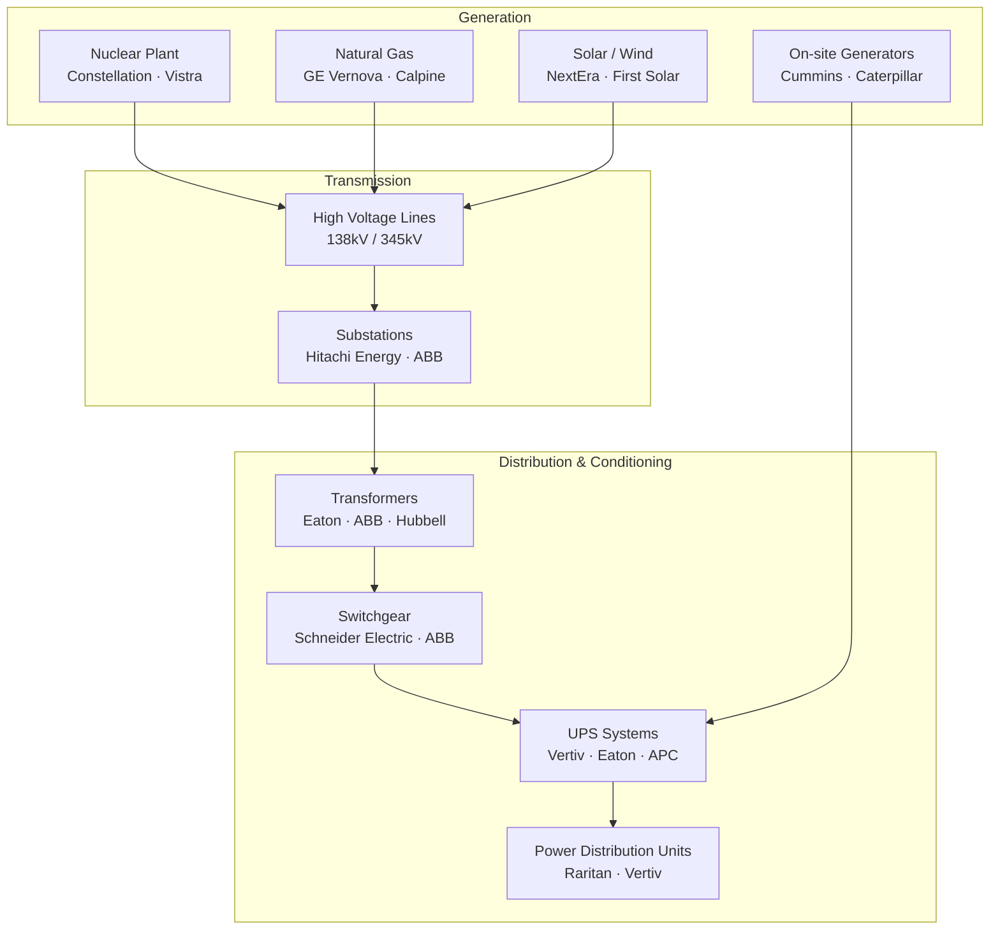
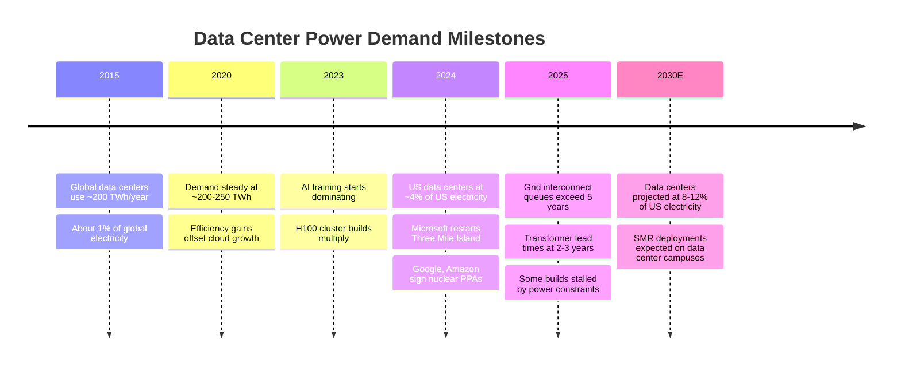

# Chapter 02: Power & Energy

## The Power Problem

AI is an energy crisis in slow motion. A single NVIDIA H100 GPU draws ~700W. A rack of 8 H100s draws ~6 kW. A 50,000-GPU training cluster draws **~35 megawatts** — enough to power 30,000 homes.

Hyperscalers are now the largest industrial electricity customers in the United States. Microsoft, Google, Amazon, and Meta collectively plan to spend over **$300 billion** on data center infrastructure in 2025–2026 alone, with power infrastructure as the key constraint.

---

## Power Path from Grid to GPU

1. **Utility generates power** at ~500 kV AC
2. **Step-down transformer** brings it to 138 kV for transmission
3. **Substation** on-site steps down to 12–35 kV
4. **Medium-voltage switchgear** routes to data hall transformers
5. **Low-voltage transformers** bring it to 480V
6. **UPS (Uninterruptible Power Supply)** filters and provides battery backup
7. **Power Distribution Units (PDUs)** deliver to individual rack strips
8. **Server power supplies** convert AC → DC for compute

Every step involves specialized equipment — and every step is a potential bottleneck.

---

## Energy Generation Players

### Nuclear Power — The AI Darling

Nuclear is uniquely attractive for hyperscalers: always-on (capacity factor ~93%), carbon-free, and located near existing grid infrastructure.

| Company | Ticker | Role | AI Data Center Connection |
|---------|--------|------|--------------------------|
| Constellation Energy | CEG | Largest US nuclear operator | Microsoft 20-year PPA for Three Mile Island restart |
| Vistra Energy | VST | Nuclear + gas + storage | Amazon nuclear PPA deals |
| NuScale Power | SMR | Small Modular Reactors (SMR) | Long-term colocation potential |
| Oklo | OKLO | Microreactors | Sam Altman-backed, OpenAI alignment |

**Three Mile Island Unit 1** was restarted in 2024 specifically to power Microsoft Azure data centers in Pennsylvania — a landmark moment for nuclear/AI convergence.

### Natural Gas & Peakers

| Company | Ticker | Role |
|---------|--------|------|
| GE Vernova | GEV | Gas turbines, grid tech, electrification |
| Calpine | Private | Largest US gas-fired generator |
| Talen Energy | TLN | Gas + nuclear, data center campuses |

**GE Vernova** is a spinoff from GE focused on power generation and grid infrastructure. With data centers pushing grid demand, their gas turbines and grid stabilization tech are in high demand.

### Renewables

| Company | Ticker | Focus |
|---------|--------|-------|
| NextEra Energy | NEE | Largest US renewable generator |
| First Solar | FSLR | US-made solar panels (IRA beneficiary) |
| Brookfield Renewable | BEPC | Global renewable portfolio |
| Orsted | ORSTED | Offshore wind |

Hyperscalers have 24/7 carbon-free energy (CFE) commitments, driving massive renewable PPAs. But solar/wind intermittency means nuclear + renewables + storage is the real answer.

---

## Power Infrastructure Equipment

### Transformers — The Hidden Bottleneck

Transformers are the least glamorous but most constrained piece. Lead times have stretched to **2–3 years** due to surging demand from both data centers and grid modernization.

| Company | Ticker | Product |
|---------|--------|---------|
| Eaton | ETN | Distribution transformers, switchgear, UPS |
| ABB | ABB | Power transformers, grid automation |
| Hubbell | HUBB | Electrical components, transformers |
| Hitachi Energy | 6501 (Japan) | HV transformers, HVDC |
| SPX Technologies | SPXC | Dry-type transformers |

### UPS (Uninterruptible Power Supply) & Power Conditioning

| Company | Ticker | Product |
|---------|--------|---------|
| Vertiv | VRT | UPS, power distribution, thermal mgmt — the dominant pure-play |
| Eaton | ETN | UPS systems (9PX, 93PM series) |
| Schneider Electric | SU (France) | APC brand UPS, EcoStruxure DCIM |

**Vertiv** is the closest pure-play to AI data center power infrastructure. They make UPS systems, power distribution, and thermal management — all three are exploding in demand.

---

## The Power Capacity Crisis

---

## Investment Angle

| Theme | Companies | Why |
|-------|-----------|-----|
| Nuclear renaissance | CEG, VST, OKLO | Hyperscaler PPAs, baseload demand |
| Grid & transformer shortage | ETN, HUBB, ABB | 2-3yr lead times, no quick fix |
| Pure-play power infra | VRT (Vertiv) | UPS + cooling + power distribution |
| Gas turbine demand | GEV | Backup and peaker power for data centers |
| Renewable PPAs | NEE, FSLR | 24/7 CFE commitments |
| Backup generation | CAT, CMI (Cummins) | On-site generator mandates |
