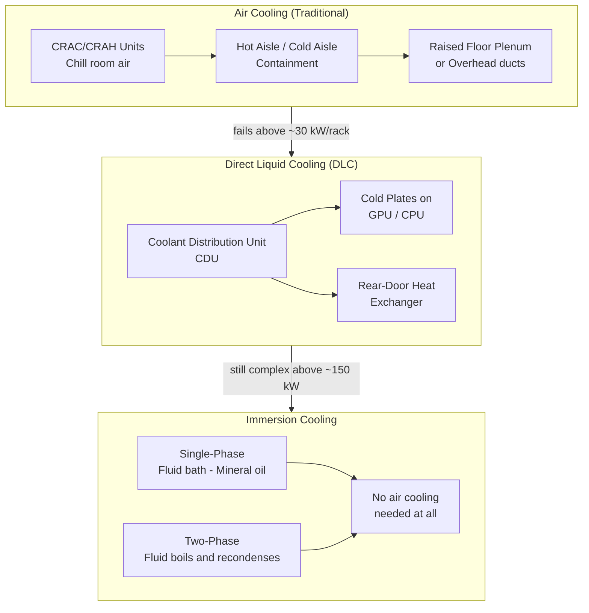
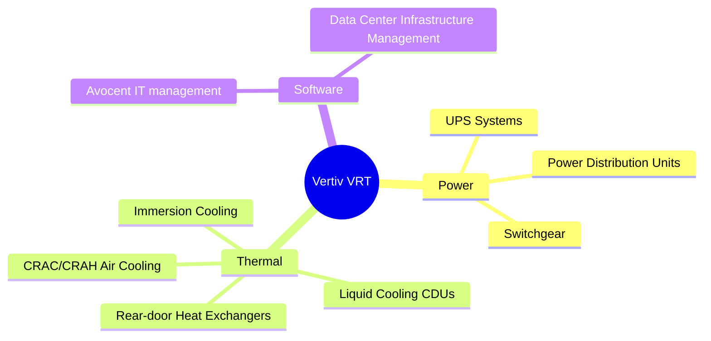

# Chapter 03: Cooling Systems

## Why Cooling Is a First-Class Problem

Every watt of power consumed by a GPU becomes heat. A data center consuming 100 MW of power produces 100 MW of heat — equivalent to a small industrial furnace. Removing that heat efficiently is the difference between a working cluster and a pile of burned silicon.

The thermal challenge has become dramatically harder with AI:

| GPU Generation | TDP (Thermal Design Power) | Primary Cooling |
|---------------|---------------------------|-----------------|
| NVIDIA V100 (2017) | 300W | Air (hot aisle containment) |
| NVIDIA A100 (2020) | 400W | Air + some liquid |
| NVIDIA H100 SXM (2022) | 700W | Liquid-assisted air |
| NVIDIA B200 (2024) | 1,000W | Direct liquid cooling required |
| NVIDIA GB200 NVL72 rack | ~120,000W (120 kW) | Full liquid cooling mandatory |

Air simply cannot remove heat fast enough from next-generation AI racks. The industry is in the middle of a forced transition to liquid cooling.

---

## Cooling Architecture: Three Approaches

---

## Air Cooling: The Legacy Standard

### How It Works
Cold air (65-75°F) is delivered to the front of server racks. Servers pull it through and exhaust hot air (90-95°F) out the back. Hot and cold aisles alternate, and containment keeps them from mixing.

### Key Products
- **CRAC** (Computer Room Air Conditioner): Refrigerant-based, cools via evaporator coils
- **CRAH** (Computer Room Air Handler): Uses chilled water from a central chiller plant, more efficient at scale
- **Economization**: Using outside air or cooling towers when ambient temp is low enough (free cooling)

| Company | Ticker | Air Cooling Products |
|---------|--------|---------------------|
| Vertiv | VRT | Liebert CRAC/CRAH, precision cooling |
| Schneider Electric | SU | APC InRow cooling, NetShelter |
| Stulz | Private (Germany) | Precision air conditioning |
| Airedale | Private (Modine) | Fluid coolers, chillers |

---

## Direct Liquid Cooling (DLC)

### How It Works
A **Coolant Distribution Unit (CDU)** pumps chilled water or dielectric fluid through **cold plates** mounted directly on the chip. The fluid absorbs heat and returns to the CDU to be rechilled. Far more efficient than air — water carries ~3,500× more heat per unit volume than air.

### Cold Plate vs. Rear-Door Heat Exchanger

| Method | How | Best For |
|--------|-----|----------|
| Cold plates | Fluid touches chip package directly | Highest thermal loads, GPU clusters |
| Rear-door HX | Heat exchanger at rack exhaust catches hot air | Retrofit to existing air-cooled halls |
| In-row coolers | Cooling unit between rows | Medium density upgrade path |

### Key Companies

| Company | Ticker | DLC Products | Notes |
|---------|--------|-------------|-------|
| Vertiv | VRT | CDUs, liquid cooling systems | Dominant market leader |
| Asetek | ASETEK (Oslo) | Liquid cooling for HPC and data centers | GPU cold plate pioneers |
| CoolIT Systems | Private | Rack CDUs, cold plates | Major OEM supplier (Dell, HPE) |
| Aavid (Boyd Corp) | Private | Thermal management, cold plates | Engineering focus |
| Motivair | Private | Chiller/CDU systems | HPC data centers |

**NVIDIA** now designs its GB200 NVL72 systems to *require* liquid cooling. This is forcing server OEMs and data center operators to adopt DLC even if they preferred air.

---

## Immersion Cooling

### Single-Phase Immersion
Servers are submerged in a tank of **dielectric fluid** (non-conductive mineral oil or engineered fluid). The fluid absorbs heat and is pumped through external heat exchangers. Simple but messy — maintenance means reaching into a tank of oil.

### Two-Phase Immersion
Servers are submerged in a fluid with a **low boiling point** (e.g., 3M Novec, Engineered Fluid). As chips heat the fluid, it boils, rises as vapor, condenses on cooling coils above, and drips back. Extremely efficient — the phase change carries enormous heat.

| Company | Type | Notes |
|---------|------|-------|
| Submer | Private (Spain) | Single-phase, SmartPodX tanks |
| Asperitas | Private (Netherlands) | Single-phase, server-agnostic |
| GRC (Green Revolution Cooling) | Private | Single-phase, ICEtank |
| LiquidStack | Private | Two-phase, semiconductor focus |
| 3M | MMM | Novec fluids (two-phase) |

**Immersion is still niche** (~1-2% of deployments) but growing fast for AI/HPC clusters where maximum density is required.

---

## Cooling Water & Sustainability

Data centers that use water cooling towers can consume enormous amounts of water. A 100 MW data center might use **1-3 million gallons of water per day** for evaporative cooling.

This is driving:
- **Water-free cooling**: Closed-loop liquid systems that reject heat to dry coolers
- **Warm water cooling**: Designing to use 85°F water (vs. traditional 55°F chilled water), allowing more use of "free cooling" via cooling towers or geothermal
- **Facility siting near water**: Rivers, lakes, cold climates

---

## The Vertiv Deep Dive

Vertiv (VRT) is the clearest pure-play on AI data center infrastructure. They make the three things every data center needs regardless of who makes the chips:

| Metric | 2022 | 2023 | 2024E |
|--------|------|------|-------|
| Revenue | ~$5.0B | ~$6.9B | ~$8.5B |
| Backlog growth | Normal | +60% | Record highs |
| Revenue mix AI-related | ~15% | ~35% | ~50% |

---

## Investment Angle

| Theme | Companies | Catalyst |
|-------|-----------|----------|
| DLC adoption forced by NVIDIA | VRT, ASETEK, CoolIT | GB200 requires liquid — no choice |
| Air cooling still 90%+ of installs | VRT, Schneider | Massive legacy refresh cycle |
| Immersion niche growing | Submer, GRC, LiquidStack | Ultra-high density compute |
| Fluids & materials | 3M (MMM), Engineered Fluids | Two-phase fluid demand |
| Cooling towers / chillers | AAON, Modine | Chilled water plant expansion |
