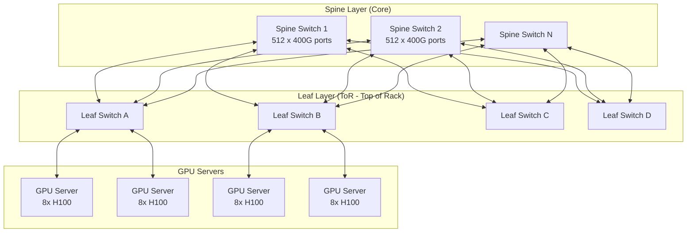
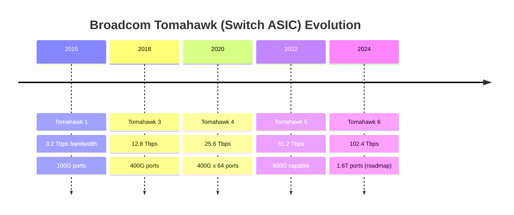
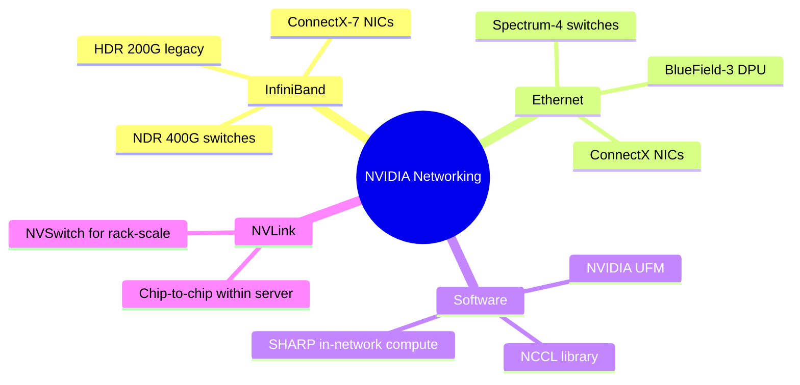
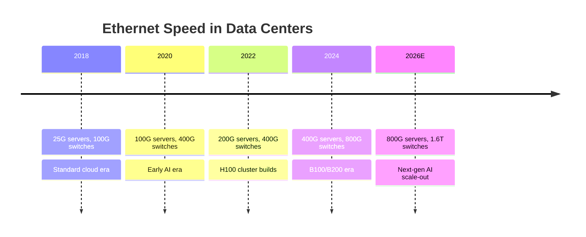

# Chapter 04: Networking & Interconnects

## Why Networking Is the Other AI Bottleneck

When you train a large AI model across 10,000 GPUs, each GPU must constantly share gradient updates with every other GPU. If the network is slow, GPUs sit idle waiting for data — expensive hardware doing nothing.

The networking requirement for AI clusters is fundamentally different from traditional cloud:

| Workload | Network Pattern | Tolerance for Latency |
|---------|----------------|----------------------|
| Web serving | Client → server (N-S traffic) | ~10ms acceptable |
| Traditional cloud | VM-to-VM, some parallelism | ~1ms acceptable |
| AI training (distributed) | All-to-all, every GPU to every GPU | <1 microsecond required |
| AI inference (large model) | Tensor parallelism across GPUs | <500 nanoseconds ideal |

This drives demand for the fastest, lowest-latency networking technology ever built.

---

## Network Topology: How AI Clusters Are Wired

This **leaf-spine** (Clos) topology gives every GPU an equal-latency path to every other GPU. For massive AI clusters, this scales to multi-tier: leaf → spine → super-spine.

---

## Two Competing Fabrics: Ethernet vs. InfiniBand

This is one of the most important technology battles in AI infrastructure:

| Attribute | Ethernet (RoCE) | InfiniBand |
|-----------|----------------|------------|
| Creator | IEEE standard | Mellanox (now NVIDIA) |
| Speed | Up to 800G per port | Up to 400G HDR, 800G NDR |
| Latency | ~1–3 microseconds | ~0.5–1 microsecond |
| Ecosystem | Open, many vendors | NVIDIA proprietary |
| Management | Standard IP tools | NVIDIA UFM |
| Cost | Competitive | Premium |
| Who uses it | Meta, Google (custom), Microsoft Azure | NVIDIA DGX SuperPOD, many HPC |

**NVIDIA's InfiniBand** (via Mellanox acquisition, $6.9B in 2020) gives them a vertical integration advantage: GPUs + interconnect + switches all optimized together. But hyperscalers are pushing hard on **Ultra Ethernet** to break this lock-in.

---

## Key Networking Companies

### Arista Networks (ANET) — The AI Networking Pure-Play

Arista makes the Ethernet switches that connect most hyperscale AI clusters. Their EOS (Extensible Operating System) is the gold standard for high-performance networking.

| Product Line | Use Case | Port Speed |
|-------------|----------|------------|
| 7060X series | Spine/leaf AI fabric | 400G, 800G |
| 7800R series | Core routing | 400G |
| 7700 series | Distributed Etherlink fabric | 400G/800G |

Arista's revenue from cloud titans (Microsoft, Meta, Google, Amazon) exceeds 40% of total revenue. Every major AI cluster expansion is a potential Arista win.

### Cisco Systems (CSCO)

The traditional networking giant. Has been slower to the AI networking transition but competes in:
- **Nexus 9000** series: High-density data center switches
- **Silicon One**: Custom networking ASIC
- **Meraki**: Managed networking
- **Splunk** (acquired 2024): Observability and security

Cisco's AI networking share is smaller than Arista's but they have massive enterprise customer relationships.

### Juniper Networks (now part of HPE)

- **QFX series**: Data center switches, AI fabric capable
- **PTX series**: Core routing
- HPE completed Juniper acquisition in 2024 — now integrated into HPE's server/networking portfolio

---

## Network Semiconductor Companies

The switches themselves require highly specialized chips. Two companies dominate:

### Broadcom (AVGO) — The Network Chip King

Broadcom makes the **Tomahawk** and **Trident** series ASICs that power most Ethernet switches in the world, including Arista and Cisco switches.

Broadcom also makes:
- **Jericho** series: Core routing chips
- **Stingray**: SmartNIC/DPU chips
- **Custom AI ASICs**: Google TPU v5, Meta MTIA networking

### Marvell Technology (MRVL)

Marvell competes with Broadcom in networking chips and is expanding into custom AI silicon:

| Product | Use |
|---------|-----|
| Prestera switch ASICs | Enterprise/data center switching |
| Teralynx | Hyperscale Ethernet switches |
| Octeon DPU | Data processing units for cloud |
| Custom AI inference chips | Amazon, Microsoft engagements |

Marvell's custom ASIC business (designing chips specifically for cloud customers) is a major growth driver.

---

## NVIDIA's Networking Stack

NVIDIA's acquisition of Mellanox gave them a complete AI networking stack:

**NVLink** is NVIDIA's proprietary chip-to-chip interconnect within a server — 900 GB/s bidirectional in H100. **NVSwitch** scales this to the full rack. This is why NVIDIA GPU clusters often outperform theoretical specs: the interconnect is engineered as a system.

---

## Speed Roadmap

---

## Investment Angle

| Theme | Companies | Why |
|-------|-----------|-----|
| AI Ethernet switches | ANET (Arista) | Direct picks from Meta, Microsoft, Google |
| Network chips | AVGO (Broadcom) | Inside every switch from every vendor |
| Custom networking ASICs | MRVL (Marvell), AVGO | Cloud customers bypassing merchant silicon |
| InfiniBand/NVLink lock-in | NVDA | Vertical stack advantage for AI clusters |
| Enterprise networking refresh | CSCO, ANET | Every company upgrading for AI traffic |
