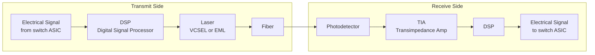
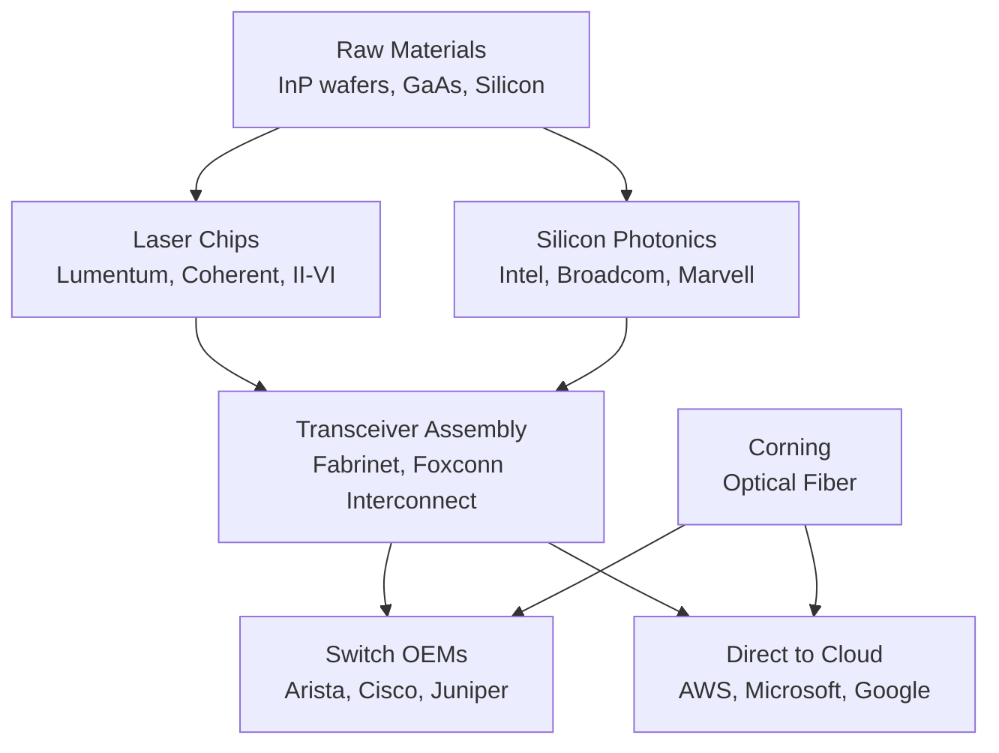

# Chapter 05: Optics & Fiber

## Why Optics Are Critical for AI

Electrical signals traveling through copper cables degrade rapidly beyond a few meters. At 400G or 800G speeds, copper reaches its physical limits at ~3 meters. **Optical transceivers** convert electrical signals to light, send them over fiber, and convert back — enabling connections across a building, campus, or continent without signal loss.

AI clusters make optics a **volume business** like never before:
- A 10,000-GPU cluster might have **50,000–100,000 optical transceivers**
- Each connects a GPU server to a switch, or a switch to another switch
- A single transceiver costs $100–$1,000+ depending on speed and reach
- One large AI data center can consume $50M–$200M in optical components

---

## How an Optical Transceiver Works

Key components inside a transceiver:
- **Laser**: Generates light (typically 850nm VCSEL for short reach, 1310nm EML for longer)
- **DSP (Digital Signal Processor)**: Encodes/decodes the signal, handles error correction
- **Photodetector**: Converts light back to electrical current
- **TIA (Transimpedance Amplifier)**: Amplifies the weak photodetector signal

---

## Transceiver Form Factors & Speeds

| Form Factor | Typical Speed | Reach | Use Case |
|------------|--------------|-------|---------|
| SFP28 | 25G | 100m–10km | Legacy server connections |
| QSFP28 | 100G (4×25G) | 100m–40km | Current standard ToR |
| QSFP56 | 200G | 100m–2km | Mid-gen switches |
| QSFP-DD | 400G (8×50G) | 100m–10km | Current AI cluster standard |
| OSFP | 400G / 800G | 100m–2km | Next-gen high-power transceivers |
| QSFP-DD 800G | 800G (8×100G) | 100m–2km | 2024–2025 AI switches |
| 1.6T (CPO) | 1,600G | On-board | Co-packaged optics, future |

**Co-Packaged Optics (CPO)**: The next frontier — integrating the optical engine directly into the switch package, eliminating the transceiver pluggable entirely. Reduces power and latency but requires complete redesign of switches.

---

## Key Optics Companies

### Coherent Corp (COHR) — The Largest Independent Optics Co.

Formed by the merger of II-VI and Finisar (2022). They cover the entire optical spectrum:

| Segment | Products |
|---------|----------|
| Transceivers | 100G, 400G, 800G pluggable modules |
| Lasers | VCSELs, DFB lasers, EML lasers |
| Indium phosphide | The semiconductor substrate for high-speed lasers |
| Amplifiers | EDFA optical amplifiers for long-haul |
| Silicon photonics | Integrated optical circuits |

Coherent is one of the few vertically integrated optics companies — they make the lasers *inside* their own transceivers, unlike assemblers who buy lasers from suppliers.

### Lumentum (LITE)

Lumentum focuses on high-performance lasers and photonic components:

| Product | Use |
|---------|-----|
| EML lasers | High-speed transceivers (800G, 1.6T) |
| VCSEL arrays | Short-reach data center transceivers |
| 3D sensing lasers | iPhone Face ID (LiDAR, consumer) |
| ROADM | Reconfigurable optical add-drop for telecom |

Lumentum's laser components go *inside* transceivers made by other companies (including Coherent's competitors). Their EML lasers are essential for 400G+ single-mode transceivers.

### Fabrinet (FN) — The Contract Manufacturer

Fabrinet is the **TSMC of optics** — they don't design optical products, they manufacture them for others with extreme precision. Almost every major optical company uses Fabrinet:

| Customer | Products Made at Fabrinet |
|----------|--------------------------|
| Coherent | High-volume transceivers |
| Lumentum | ROADM modules |
| Ciena | Coherent optical line systems |
| Cisco | Optical transceivers |
| NVIDIA | Networking modules |

Fabrinet operates advanced optical manufacturing in **Thailand and the US**, with precision assembly clean rooms. As transceiver volumes explode with AI, Fabrinet is a volume leverage play.

| Metric | 2022 | 2023 | 2024E |
|--------|------|------|-------|
| Revenue | ~$2.0B | ~$2.4B | ~$2.9B |
| Revenue from Nvidia | <5% | ~15% | ~20%+ |

### Corning (GLW) — The Fiber Backbone

Corning invented optical fiber and remains the global leader. Every AI cluster and every connection between data centers runs on fiber:

| Product | Use |
|---------|-----|
| Single-mode fiber | Long-haul and campus connections |
| Multimode fiber (OM4/OM5) | Short-reach within data center |
| Fiber cable assemblies | Pre-terminated trunk cables |
| Gorilla Glass | (Not optics but major Corning segment) |

Data center fiber is a **consumable** — as data centers expand, they continuously buy more. A new hyperscale campus might use **millions of meters** of fiber.

### InnoLight, Eoptolink (Chinese Competitors)

Chinese optical transceiver makers have taken significant market share in volume segments:

| Company | Country | Notes |
|---------|---------|-------|
| InnoLight | China | High-volume 400G supplier, growing 800G |
| Eoptolink | China | Broad transceiver portfolio |
| HiSilicon (Huawei) | China | Internal silicon photonics |

US export controls have partially disrupted Chinese optics companies' access to advanced components, creating opportunity for US/Taiwan suppliers.

---

## Silicon Photonics: The Next Generation

Traditional transceivers use **III-V semiconductors** (indium phosphide, gallium arsenide) for lasers — expensive and hard to scale. **Silicon photonics** integrates optical components onto silicon chips using standard semiconductor fab processes.

| Company | Silicon Photonics Approach |
|---------|--------------------------|
| Intel | IXL (Intel Integrated Photonics), foundry services |
| Cisco | Acacia acquisition (2021), coherent silicon photonics |
| Broadcom | Co-packaged optics chiplets for switches |
| Marvell | Custom silicon photonics for cloud customers |
| Ayar Labs | Optical I/O chiplets (in-package photonics) |

Silicon photonics enables **co-packaged optics** — putting the optical engine directly on the switch ASIC package, eliminating the pluggable transceiver entirely. This reduces power by ~30-40% and could reshape the transceiver market entirely by 2027-2028.

---

## The Optics Supply Chain

---

## Investment Angle

| Theme | Companies | Catalyst |
|-------|-----------|----------|
| 800G transceiver ramp | COHR, LITE, FN | Every new AI cluster needs 800G |
| Contract manufacturing volume | FN (Fabrinet) | Leverage on volume, low capital risk |
| Fiber consumption | GLW (Corning) | Continuous consumable across all data centers |
| Silicon photonics transition | AVGO, MRVL, Intel | CPO could displace pluggable transceivers |
| Laser component supply | LITE, COHR | Scarce III-V material expertise |
