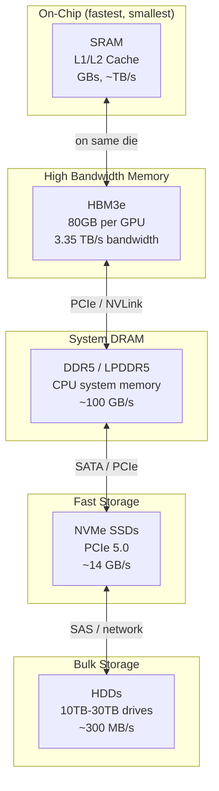
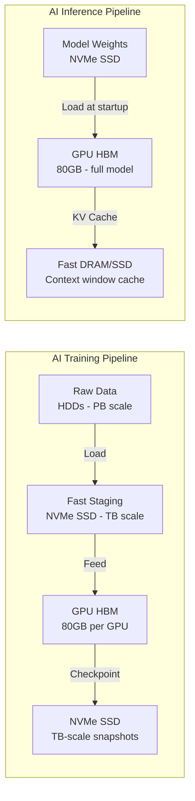

# Chapter 06: Memory & Storage

## Memory's Role in AI

AI models are memory-hungry. A 70-billion parameter model like Llama 3 requires ~140 GB just to store the weights in FP16. Training a frontier model like GPT-4 requires keeping trillions of activations, gradients, and optimizer states in memory simultaneously.

The memory hierarchy for AI looks like this:

Each layer down: **more capacity, slower speed, lower cost per GB**.

---

## HBM: The AI Memory Kingmaker

**HBM (High Bandwidth Memory)** is the most critical and supply-constrained memory in AI. Unlike standard DRAM (flat chips connected by PCB traces), HBM is:

- **3D stacked**: Multiple DRAM dies stacked vertically with TSV (Through-Silicon Vias)
- **Wide interface**: 1024-bit bus vs. 64-bit for DDR5 — gives massive bandwidth
- **Physically adjacent to GPU**: Sits on the same substrate as the GPU die (CoWoS packaging)

### HBM Generations

| Generation | Bandwidth | Per-Stack Capacity | Used In |
|-----------|-----------|-------------------|---------|
| HBM2 | 256 GB/s | 8–16 GB | NVIDIA V100, AMD MI50 |
| HBM2e | 410 GB/s | 16–32 GB | NVIDIA A100 |
| HBM3 | 819 GB/s | 24 GB | NVIDIA H100 |
| HBM3e | 1,200 GB/s | 24–36 GB | NVIDIA H200, AMD MI300X |
| HBM4 (2025E) | ~2,000 GB/s | 32–64 GB | NVIDIA B200, next-gen |

An H100 has **6 HBM3 stacks = 80 GB total, 3.35 TB/s bandwidth**. A GB200 uses HBM3e for even more.

### HBM Suppliers: A Tight Oligopoly

| Company | Market Share | Ticker | Notes |
|---------|-------------|--------|-------|
| SK Hynix | ~50% | 000660 (Korea) | Technology leader, first HBM3e to NVIDIA |
| Samsung | ~35% | 005930 (Korea) | Qualification challenges for H100/H200 |
| Micron | ~15% | MU | Catching up rapidly, HBM3e qualified for H200 |

**SK Hynix** won the AI era by shipping HBM2e to NVIDIA before competitors and maintaining technology leadership. Samsung has struggled with quality issues on NVIDIA qualifications. Micron is the US-based alternative that US national security concerns make strategically important.

HBM capacity is **booked 18+ months in advance**. NVIDIA cannot build more H100s or B200s faster than HBM can be produced.

---

## DRAM: System Memory

Standard DRAM powers server CPUs and acts as a buffer between storage and compute. AI servers need enormous amounts — a typical AI server has 1–2 TB of DDR5 DRAM for the CPU, separate from GPU HBM.

| Company | Ticker | Market Share | Notes |
|---------|--------|-------------|-------|
| Samsung | 005930 | ~45% | Largest by volume |
| SK Hynix | 000660 | ~28% | Strong in server DRAM |
| Micron | MU | ~23% | Only US-based DRAM maker |

DRAM is a cyclical commodity business — prices fluctuate wildly with supply/demand. AI has structurally increased demand, but oversupply periods still happen.

---

## NAND Flash: SSDs for AI Storage

**NAND Flash** stores model weights at rest, training datasets, checkpoints, and inference cache. AI clusters need massive fast storage:

- **Training datasets**: Billions of text/image/video files (petabytes)
- **Model checkpoints**: Saved every few hours during training — TB-scale
- **KV Cache** (inference): Key-value attention cache grows with context length

### NAND Suppliers

| Company | Ticker | Brand | Notes |
|---------|--------|-------|-------|
| Samsung | 005930 | Samsung V-NAND | Technology leader, vertical integration |
| SK Hynix (Solidigm) | 000660 | Solidigm (former Intel NAND) | Enterprise NVMe SSDs |
| Micron | MU | Crucial / Micron | 232-layer and 276-layer 3D NAND |
| Western Digital | WDC | WD / SanDisk | 3D NAND + HDD |
| Kioxia | Private (Japan) | Kioxia | Joint venture with WD on NAND |

---

## Hard Disk Drives: Bulk Storage Still Matters

Despite SSDs being faster, HDDs remain dominant for bulk storage due to cost — an HDD costs ~$15–25/TB vs ~$50–100/TB for NAND SSD.

AI training pipelines use HDDs for:
- **Cold storage**: Raw training data before it's loaded into fast storage
- **Backup/archive**: Model checkpoints after training
- **Inference data**: Logs, embeddings, user data at scale

### HDD Suppliers (A Duopoly)

| Company | Ticker | Market Share | Key Products |
|---------|--------|-------------|--------------|
| Seagate | STX | ~45% | Exos X (20–32 TB enterprise), Mozaic PMR |
| Western Digital | WDC | ~40% | Ultrastar, Gold series |
| Toshiba | 6502 (Japan) | ~15% | Enterprise HDDs |

**Seagate's Mozaic** platform uses HAMR (Heat-Assisted Magnetic Recording) to achieve 30+ TB per drive. As AI training datasets grow to exabyte scale, HDD density matters enormously.

---

## Emerging: CXL Memory Expansion

**CXL (Compute Express Link)** is a new standard that allows CPU and GPU to share a common memory pool over PCIe, enabling:
- Adding large amounts of DRAM beyond what fits on a motherboard
- Sharing memory between multiple processors
- Using cheaper DRAM to extend HBM-starved GPUs

| Company | CXL Play |
|---------|----------|
| Samsung | CXL Memory modules (CMM) |
| SK Hynix | CXL DRAM modules |
| Micron | CXL memory expansion |
| Rambus | CXL controller IP |
| Montage Technology | CXL memory buffer chips |

CXL is still early (2024–2026 adoption window) but could significantly change memory economics in AI servers.

---

## Storage for AI: The Full Picture

---

## Investment Angle

| Theme | Companies | Why |
|-------|-----------|-----|
| HBM supply constraint | MU (most accessible US stock) | HBM bottleneck = pricing power for years |
| DRAM cyclicality + AI floor | MU, Samsung (ADR) | AI creates structural demand floor |
| Enterprise SSD growth | MU, WDC | NVMe SSDs replacing HDD in hot-tier storage |
| HDD density & exabyte scale | STX, WDC | AI dataset growth drives HDD demand at high capacity |
| CXL memory expansion | MU, Samsung | Early innings, 2025–2027 opportunity |
