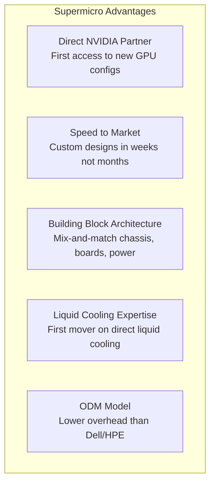
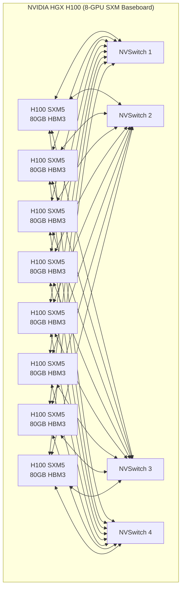

# Chapter 07: Servers & Hardware OEMs

## The Server as a System

A GPU is useless by itself. It needs:
- A motherboard designed for its power and thermal requirements
- A CPU to run the OS and orchestration software
- High-speed memory (DRAM) for the host
- NVMe storage for the OS and fast data staging
- Networking cards (NICs/HBAs) to connect to the cluster fabric
- A power supply sized for the total load
- A chassis that fits in a rack, manages airflow, and survives years of operation

**Server OEMs** (Original Equipment Manufacturers) integrate all of this into a validated, certified system. They handle the mechanical engineering, thermal validation, power design, firmware, and supply chain that chip designers like NVIDIA never touch.

---

## The AI Server vs. Standard Server

| Attribute | Standard Cloud Server | AI Training Server (H100 x8) |
|----------|----------------------|------------------------------|
| CPU | 2× Intel/AMD (64 cores) | 2× Intel/AMD (for orchestration) |
| GPUs | 0–2 (for rendering/acceleration) | 8× H100 SXM5 (80GB each) |
| System DRAM | 256 GB – 1 TB DDR5 | 1–2 TB DDR5 |
| Storage | 2–4× NVMe SSDs | 8–16× NVMe SSDs |
| Networking NICs | 2× 25G | 8× 400G InfiniBand + 2× 100G Ethernet |
| Power draw | 300–800W | 5,000–10,000W |
| Cost | $5,000–$20,000 | $200,000–$400,000 |
| ASP premium | — | ~15–20× standard server |

**This ASP (Average Selling Price) premium** is why AI servers are transforming the revenue of server OEMs even as unit volumes stay relatively small.

---

## Key Server OEMs

### Super Micro Computer (SMCI) — The AI Server Pure-Play

Supermicro has become the breakout winner of the AI server buildout:

| Metric | FY2022 | FY2023 | FY2024 |
|--------|--------|--------|--------|
| Revenue | ~$5.2B | ~$7.1B | ~$14.9B |
| AI server % of mix | ~20% | ~40% | ~70% |

**Key risk**: Supermicro faced accounting investigations and delayed filings in 2024, creating uncertainty. Their technology leadership remains intact but governance risk is real.

### Dell Technologies (DELL)

Dell's infrastructure solutions group (ISG) is a major AI server beneficiary:

| Product Line | Notes |
|-------------|-------|
| PowerEdge XE9680 | 8-GPU H100/H200 server, top AI platform |
| PowerEdge R760xa | Mid-range AI inference server |
| PowerStore | All-flash storage for AI data pipelines |
| Dell AI Factory | Bundled AI infrastructure offering |

Dell has deep enterprise relationships — when a Fortune 500 company builds an on-premise AI cluster, Dell is often the preferred partner. They also offer **financing and professional services** that pure ODMs cannot match.

| Metric | FY2023 | FY2024 |
|--------|--------|--------|
| ISG Revenue | ~$34B | ~$38B |
| AI server backlog | Growing rapidly | Record levels |

### Hewlett Packard Enterprise (HPE)

HPE competes with Dell in enterprise AI infrastructure:

| Product | Notes |
|---------|-------|
| ProLiant DL380 Gen11 | Mainstream enterprise server with GPU options |
| Cray/HPE EX | Supercomputing platforms for HPC and AI |
| GreenLake | Cloud-like consumption model for on-prem |
| Slingshot Interconnect | HPE's proprietary high-speed fabric for HPC |
| Juniper networking | Now part of HPE (2024 acquisition) |

HPE's strength is in **HPC (High-Performance Computing)** — national labs, research institutions, universities. These are adjacent to AI training clusters and HPE is positioning aggressively.

### ODM Players: Quanta, Wistron, Foxconn

**ODMs (Original Design Manufacturers)** build servers to hyperscaler specifications without selling under their own brand. The hyperscalers (AWS, Google, Meta) often bypass Dell/HPE entirely and buy directly from ODMs:

| Company | Country | Notable Customers |
|---------|---------|------------------|
| Quanta Computer | Taiwan | Meta, AWS, Google |
| Wistron | Taiwan | Microsoft, various |
| Foxconn (Hon Hai) | Taiwan | Apple servers, GPU servers |
| Inventec | Taiwan | Microsoft, Google |
| MiTAC | Taiwan | Various hyperscalers |

These companies operate on thin margins (~3-5%) but at massive volume. As hyperscalers spend $50B+ on servers annually, even 1% margin change is significant.

---

## AI Server Architecture Deep Dive

### The HGX Platform (NVIDIA's Reference Design)

NVIDIA defines a standard board form factor called **HGX** for multi-GPU servers:

OEMs (Supermicro, Dell, HPE) buy the HGX baseboard from NVIDIA and design their own chassis, power, and cooling around it.

### GB200 NVL72: The New Unit of Compute

NVIDIA's Blackwell generation changed the unit from a server to a **rack**:

| NVL72 Spec | Value |
|-----------|-------|
| GPUs per rack | 72× B200 GPUs |
| CPUs per rack | 36× Grace CPUs (ARM-based) |
| HBM memory | 72 × 192 GB = ~13.8 TB total |
| Rack power | ~120 kW |
| Rack weight | ~1,400 kg |
| NVLink bandwidth | 1.8 TB/s GPU-to-GPU |
| Price per rack | ~$3M+ |

This is an entirely liquid-cooled, factory-integrated rack — a departure from the traditional "build it in the data center" approach.

---

## PCBs & Contract Manufacturing

### PCBs (Printed Circuit Boards)
AI servers require extreme-performance PCBs — high layer counts, fine traces, controlled impedance. The shift to liquid cooling and higher frequencies makes PCB quality more critical.

| Company | Ticker | Notes |
|---------|--------|-------|
| TTM Technologies | TTMI | High-tech PCBs for servers and networking |
| Sanmina | SANM | EMS + PCBs for data center equipment |
| Tripod Technology | 3044 (Taiwan) | Leading AI server PCB supplier |
| Unimicron | 3037 (Taiwan) | ABF substrate supplier for GPU packages |

**ABF (Ajinomoto Build-up Film) substrates** — the interposer layer inside GPU packages — became a major bottleneck during the initial AI surge. Key suppliers: Ibiden and Shinko (both Japan).

---

## Investment Angle

| Theme | Companies | Why |
|-------|-----------|-----|
| AI server OEM volume | SMCI, DELL | 15–20× ASP premium vs. standard servers |
| Enterprise AI buildout | DELL, HPE | Fortune 500 AI cluster deployments |
| ODM exposure | Quanta, Foxconn (limited US liquidity) | Hyperscaler direct buying |
| PCB and substrate | TTMI, Unimicron, Ibiden | AI server complexity drives PCB upgrade |
| Rack-scale integration | SMCI, DELL | NVL72 and future rack-scale products |
