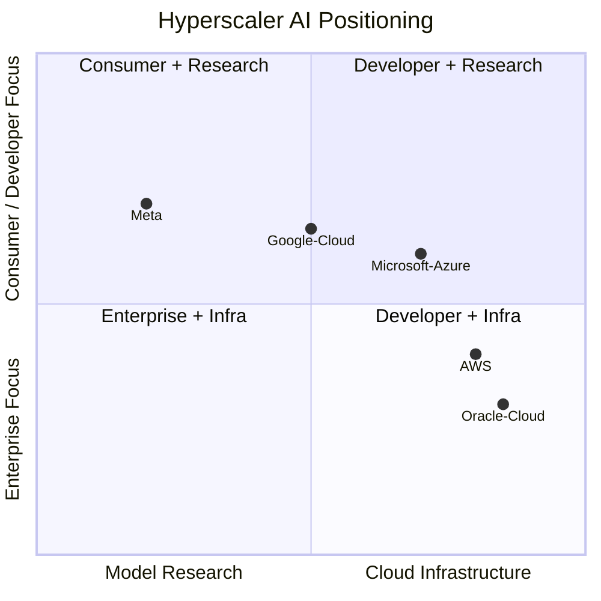
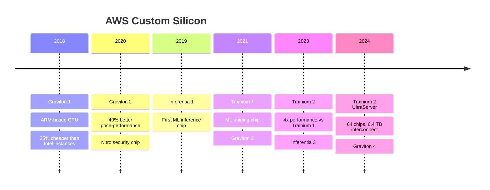
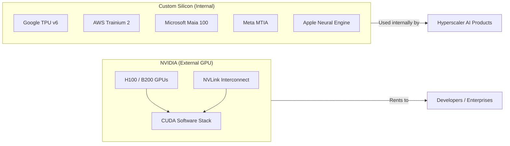

# Chapter 08: Cloud Hyperscalers & AI Platforms

## The Top of the Stack

Hyperscalers sit at the top of the AI data center ecosystem. They are simultaneously:
- **Customers** of every layer below (chips, servers, networking, optics, power, real estate)
- **Competitors** to each other (cloud wars)
- **Builders** of custom silicon (challenging chip suppliers)
- **Platforms** for external AI developers (monetizing the infrastructure)

Their capex decisions flow through the entire supply chain — when Microsoft announces a $100B data center plan, it triggers orders across every chapter in this curriculum.

---

## The Big Five Hyperscalers

---

## Microsoft / Azure (MSFT)

Microsoft is the most aggressive AI spender and has the clearest AI monetization story through OpenAI integration.

| Dimension | Details |
|-----------|---------|
| AI investment | $13B+ invested in OpenAI; $80B capex planned FY2025 |
| Key AI product | Azure OpenAI Service (GPT-4o, o1, o3) |
| Custom silicon | Azure Maia 100 (AI training ASIC), Cobalt (ARM CPU) |
| Nuclear | 20-year PPA with Constellation for Three Mile Island restart |
| Data center footprint | 60+ regions worldwide, aggressive expansion |
| Key AI revenue | Microsoft 365 Copilot ($30/user/month), Azure AI |

**Microsoft's moat**: OpenAI exclusivity on Azure, GitHub Copilot (dominant in developer tools), and deep enterprise relationships through Office/Teams.

---

## Amazon Web Services (AWS) — AMZN

AWS is the largest cloud provider by revenue and is building its own AI silicon stack to reduce NVIDIA dependency.

| Dimension | Details |
|-----------|---------|
| Revenue | ~$100B run rate (2024) — largest cloud |
| Custom silicon | Trainium 2 (training), Inferentia 3 (inference), Graviton 4 (CPU) |
| Key AI product | Amazon Bedrock (multi-model API), Amazon Q (enterprise AI) |
| AI model | Anthropic investment ($4B), Claude on Bedrock |
| Data center | Committed $150B+ in new US data centers (2025 announcement) |

**AWS's custom silicon strategy**: By designing Trainium and Inferentia, AWS reduces its dependence on NVIDIA GPUs and improves margins. However, NVIDIA GPUs still dominate for cutting-edge training workloads.

### AWS Custom Silicon Timeline

---

## Google Cloud (GOOGL)

Google invented the **Transformer** architecture (the "T" in GPT) and has been building AI infrastructure longer than any hyperscaler.

| Dimension | Details |
|-----------|---------|
| Custom silicon | TPU v5e, TPU v5p (training & inference) |
| Key AI product | Gemini (Ultra, Pro, Flash), Vertex AI |
| Data center | Carbon-free since 2007; 24/7 CFE goal by 2030 |
| Research | DeepMind integration, AlphaFold, AlphaCode |
| Unique asset | Waymo (autonomous vehicle AI) |

**Google's TPU advantage**: Google's Tensor Processing Units are custom ASICs optimized specifically for the TensorFlow/JAX ML frameworks that Google uses internally. TPUs have trained Gemini, AlphaFold, and most Google AI products. Google Cloud rents TPU access to external developers.

| TPU Version | Year | Key Feature |
|-------------|------|-------------|
| TPU v2 | 2017 | First external availability |
| TPU v3 | 2018 | HBM memory, pods of 1024 chips |
| TPU v4 | 2021 | 275 TFLOPS BF16, optical interconnects |
| TPU v5e | 2023 | Inference-optimized, cost-effective |
| TPU v5p | 2023 | Training-optimized, largest pods |
| TPU v6 (Trillium) | 2024 | 4.7× performance vs v5e |

---

## Meta Platforms (META)

Meta is unusual — they're a hyperscaler that doesn't sell cloud services. They build infrastructure purely for their own AI products (Instagram, WhatsApp, Facebook, Meta AI).

| Dimension | Details |
|-----------|---------|
| GPU investment | 350,000+ H100s in 2024; planning 600,000+ in 2025 |
| Custom silicon | MTIA (Meta Training and Inference Accelerator) |
| Open source | Llama 3 (open-weight models), PyTorch |
| Key AI product | Meta AI assistant, Reels ranking, ads optimization |
| Infrastructure | Built own data center campuses, own fiber networks |

**Meta's scale**: Meta's AI infrastructure investment rivals any cloud provider even though they don't sell AI-as-a-service externally. Their Llama open-source models have commoditized AI model development.

---

## Oracle Cloud Infrastructure (OCI) — ORCL

Oracle has emerged as a dark horse in AI cloud by being willing to build **massive dedicated GPU clusters** for AI companies that others won't:

| Dimension | Details |
|-----------|---------|
| Key differentiator | Massive GPU cluster rentals (10,000–100,000 GPU deals) |
| Key customers | xAI (Elon Musk), rumored OpenAI, others |
| NVIDIA relationship | Signed one of largest GPU orders ever |
| Data center | Aggressively building new regions |
| Revenue | ~$7B cloud run rate (2024), growing >40% YoY |

Oracle's willingness to sign large long-term contracts and build dedicated clusters has attracted AI companies that want GPU capacity without sharing infrastructure.

---

## Custom Silicon: Hyperscalers vs. NVIDIA

The most important strategic theme: every major hyperscaler is investing heavily in custom AI silicon to reduce NVIDIA dependency.

| Company | Custom Chip | Status | NVIDIA Dependency |
|---------|------------|--------|------------------|
| Google | TPU v5/v6 | Production | Low for internal; still buys NVIDIA |
| AWS | Trainium 2 | Production | Moderate |
| Microsoft | Maia 100 | Early production | High (OpenAI needs NVIDIA) |
| Meta | MTIA | Production | Very high (still massive NVIDIA buyer) |

Despite this, **NVIDIA still dominates** because: CUDA software lock-in, performance leadership, and the fact that the biggest AI models are trained on NVIDIA hardware first.

---

## AI Platform Wars: Who Sells AI to Developers?

| Platform | Provider | Key Offering |
|---------|----------|-------------|
| Azure OpenAI Service | Microsoft | GPT-4o, o3, DALL-E API |
| Amazon Bedrock | AWS | Claude, Llama, Titan — multi-model |
| Vertex AI | Google | Gemini, model garden, fine-tuning |
| Hugging Face | Independent | Open-source models, Inference API |
| Together AI | Independent | Open-source fine-tuning and inference |
| Replicate | Independent | Run open models via API |

---

## Capex as an Ecosystem Signal

Hyperscaler capex announcements are the strongest leading indicator for every supply chain company below:

| Year | Microsoft | Google | Amazon | Meta | Total Big 4 |
|------|-----------|--------|--------|------|-------------|
| 2022 | $23B | $32B | $63B | $32B | ~$150B |
| 2023 | $28B | $33B | $53B | $28B | ~$142B |
| 2024 | $55B | $52B | $75B | $38B | ~$220B |
| 2025E | $80B+ | $75B+ | $100B+ | $60B+ | ~$315B+ |

Every dollar of capex flows to:
- ~40%: Servers and compute (NVDA, SMCI, DELL, HPE, ODMs)
- ~20%: Power infrastructure (VRT, ETN, CEG, GEV)
- ~15%: Networking (ANET, AVGO, MRVL)
- ~10%: Optics and fiber (COHR, FN, GLW, LITE)
- ~10%: Real estate and construction (DLR, EQIX, CAT)
- ~5%: Storage (STX, WDC, MU)

---

## Investment Angle

| Theme | Companies | Why |
|-------|-----------|-----|
| Cloud AI revenue ramp | MSFT, GOOGL, AMZN | Monetizing the capex already spent |
| Capex supplier leverage | NVDA, ANET, VRT, AVGO | Capex dollars translate directly |
| Custom silicon threat to NVIDIA | Watch NVDA performance vs. custom | Long-term risk to GPU moat |
| Oracle surprise growth | ORCL | Underestimated GPU cluster provider |
| Meta AI monetization | META | Largest infrastructure, limited monetization so far |
