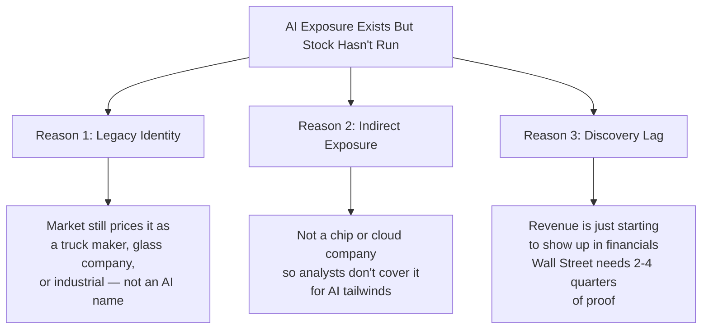
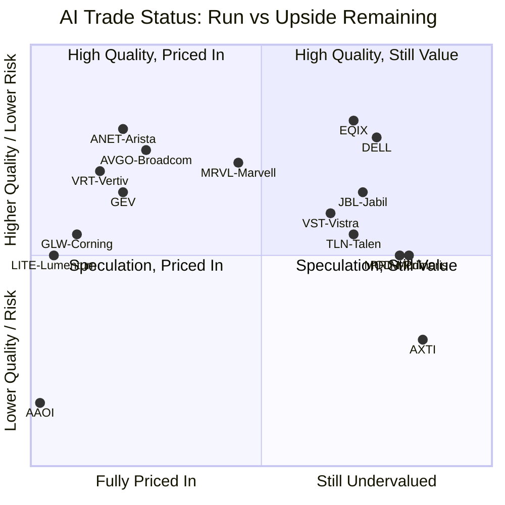

# Chapter 00: The Framework — Who Has Run and Who Hasn't

## The Core Question

NVIDIA is up 800%+ since 2022. Micron is up 200%+. SK Hynix is up 300%+. Arista is up 335% in three years. The "obvious" AI trades have been made.

The question now: **which companies have genuine AI exposure that the market hasn't fully priced in yet?**

This curriculum is research-driven and current as of May 2026. It identifies companies where the AI revenue story is real but the stock hasn't fully re-rated — and explains *why* the market may be slow to recognize them.

---

## The Three Reasons Markets Are Slow to Re-Rate

**Dell** (DELL): market prices it as a PC/enterprise company despite $8.95B in AI server revenue last quarter.

**Modine Manufacturing** (MOD): market prices it as an auto-parts industrial despite data center cooling becoming 25% of revenue with 50-70% annual growth.

**Cummins** (CMI): market prices it as a truck engine maker despite data center generators now being the fastest-growing segment.

**AXT Inc.** (AXTI): almost no one knows they make indium phosphide wafers — the raw material inside every high-speed optical laser used in AI data centers.

---

## The Spectrum: Where Each Stock Stands

---

## Summary Table: The Full Scorecard

| Ticker | Company | Segment | 1-2yr Return | Fwd P/E | AI Trade Status |
|--------|---------|---------|-------------|---------|----------------|
| LITE | Lumentum | Optics | +339% (2025) | Stretched | VERY LATE |
| AAOI | Applied Optoelec. | Optics | +1,264% (1yr) | Consensus PT -44% below price | DANGEROUSLY LATE |
| GLW | Corning | Fiber/Optics | +300%+ (1yr) | Most targets below current | LATE |
| COHR | Coherent | Optics | +435% (1yr) | Stretched | LATE |
| GEV | GE Vernova | Power | +178% (1yr) | F valuation grade | LATE-MID |
| VRT | Vertiv | Power/Cooling | +170% (1yr) | ~53x forward P/E | LATE-MID |
| CRDO | Credo Technology | Networking | +140% (1yr) | Expensive | LATE-MID |
| ANET | Arista Networks | Networking | +335% (3yr) | ~65x trailing P/E | LATE-MID |
| AVGO | Broadcom | Networking chips | +124% (2024) | 41x forward P/E | LATE-MID |
| FIX | Comfort Systems | Cooling/HVAC | Strong | Backlog doubling | MID |
| PWR | Quanta Services | Construction | Strong | Record $48.5B backlog | MID |
| CMI | Cummins | Generators | Nearly doubled | 23x fwd P/E | MID, fairly priced |
| ETN | Eaton | Power distrib. | Significant | A-grade quality | MID, quality compounder |
| NVT | nVent Electric | Cooling | +65% organic | Slightly above DCF | MID |
| FN | Fabrinet | Optics contract mfg | Moderate | Reasonable | MID |
| EME | EMCOR | Construction | +33.6% (3mo) | Premium, earns it | MID |
| CAT | Caterpillar | Construction/Gen | +25% YTD | Under-appreciated AI angle | MID, overlooked |
| CEG | Constellation | Nuclear power | Big 2024, pulled back | Re-entry candidate | MID, second leg |
| MRVL | Marvell | Networking chips | +93% (2024) | 24x fwd P/E | MID, relative value vs AVGO |
| VST | Vistra | Nuclear power | +264% 2024, then flat | 16x fwd P/E | RE-ENTRY OPPORTUNITY |
| DELL | Dell | AI Servers | +67% YTD 2026 | **14x fwd P/E** | **UNDERVALUED** |
| EQIX | Equinix | Data center REIT | Moderate | 86% of NAV | **UNDERVALUED** |
| TLN | Talen Energy | Nuclear power | +67% (1yr) | Under-discussed | **EARLY-MID** |
| JBL | Jabil | Contract mfg | +127% (vs CLS +314%) | 13.57x fwd P/E | **EARLY vs peers** |
| MOD | Modine Mfg | Cooling | Modest | Pure-play transformation | **EARLY/UNDISCOVERED** |
| PRIM | Primoris Services | Construction | Moderate | Less covered | **EARLY-MID** |
| MYRG | MYR Group | Elec. contractor | Moderate | Less followed | **EARLY-MID** |
| AXTI | AXT Inc. | Optics materials | Modest | Upstream InP wafers | **EARLY/OVERLOOKED** |

---

## Chapters in This Curriculum

| Chapter | Focus | Key Names |
|---------|-------|-----------|
| 01 | Nuclear Power — The Clean AI Energy Trade | VST, TLN, CEG, BWXT |
| 02 | Cooling — The Undiscovered Layer | MOD, NVT, FIX |
| 03 | AI Servers — Best Value in the Stack | DELL, JBL vs. CLS, SMCI recovery |
| 04 | Networking Chips — Relative Value | MRVL vs. AVGO, CRDO, ALAB |
| 05 | Optics & Materials — Upstream Plays | AXTI, FN, and what's left in COHR/LITE |
| 06 | Electrical Contractors — Picks & Shovels | PRIM, MYRG, EME, PWR |
| 07 | Data Center REITs — The Discount | EQIX vs. DLR, IRM transformation |
| 08 | Portfolio Watchlist — Putting It Together | Tiered watchlist with catalysts |

---

## The Most Important Lesson

The "picks and shovels" framing is useful but incomplete. The real edge is finding **companies whose revenue is already transforming from AI but whose stock identity hasn't changed yet**.

- Dell is an AI server company priced as a PC company
- Modine is an AI cooling company priced as an auto-parts supplier
- Cummins is a data center power company priced as a diesel truck maker
- AXT is an AI photonics materials company almost no one has ever heard of

The stock market re-rates identities slowly. Finding the gap between *what a company actually earns* and *what the market thinks it is* is where the best remaining opportunities live.
