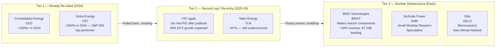
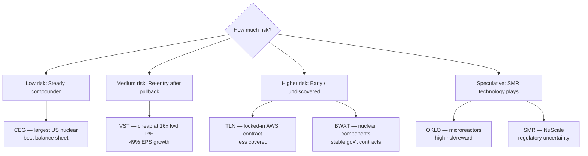

# Chapter 01: Nuclear Power — The Clean AI Energy Trade

## Why Nuclear Is the AI Energy Solution

Hyperscalers have a problem: they've committed to 24/7 carbon-free energy (CFE) AND they need massive, always-on baseload power. Solar and wind don't work at night or in calm weather. Natural gas is carbon-emitting. The answer the market has converged on: **nuclear**.

Key facts:
- Nuclear capacity factor: ~93% (runs almost all the time)
- Solar capacity factor: ~25% (sun doesn't always shine)
- Wind capacity factor: ~35%
- A 100 MW nuclear unit = effectively 93 MW of guaranteed power, 24/7, carbon-free

In 2024, Microsoft signed a 20-year PPA to restart Three Mile Island's Unit 1 (835 MW) just for their Azure data centers. That single event ignited the nuclear re-rating. But not all nuclear stocks re-rated equally.

---

## The Three-Tier Nuclear Trade

---

## Vistra Energy (VST) — The Re-Entry Opportunity

**The story**: Vistra was the S&P 500's #1 performer in 2024, up 264%. Then it pulled back ~19% in H1 2025 as investors rotated. Now it's setting up for a second leg as nuclear PPA contracts start delivering real revenue in 2026–2027.

| Metric | Value |
|--------|-------|
| 2024 return | +264% |
| Post-peak pullback | ~19% |
| Forward P/E (2026E) | **~16x** |
| EPS growth expected 2026 | **+49%** |
| Adjusted EBITDA guidance 2026 | $6.8–7.6B |
| Nuclear + gas portfolio | ~41 GW capacity |
| Nuclear share of capacity | ~6 GW (Comanche Peak, Illinois plants) |

**Why the valuation is compelling**: 16x forward P/E for a company growing earnings 49% with a multi-year PPA backlog. Compare that to VRT (Vertiv) at 53x forward P/E or ANET (Arista) at 38x. VST is cheap *relative to what it's becoming*.

**Key risk**: Wholesale power prices are volatile. If power prices fall, VST's merchant generation revenue falls. The PPA contracts partially insulate them but not completely.

---

## Constellation Energy (CEG) — The Blue Chip Nuclear

**The story**: CEG owns and operates the largest fleet of nuclear plants in the US (~24 GW). The Microsoft Three Mile Island deal made them the poster child for the nuclear AI trade, sending the stock up 150%+ in 2024. Then it pulled back ~21% YTD in early 2026 before re-accelerating.

| Metric | Value |
|--------|-------|
| Nuclear capacity | ~24 GW (largest in US) |
| Notable deals | Microsoft 20-yr PPA (Three Mile Island); Meta 1.1 GW deal |
| 2025 acquisition | Calpine merger adds 55 GW total capacity |
| 1-year return | ~+28.57% (after 2024 run and pullback) |
| Forward P/E | More reasonable post-pullback |

**Why still interesting**: The Calpine acquisition (announced 2025) makes CEG dramatically larger. Calpine is the largest US natural gas generator, adding a hedge to nuclear-only exposure. The combined entity is the largest power generator in the US and uniquely positioned to sell both nuclear baseload AND gas peaker capacity to hyperscalers.

**The pullback is the opportunity**: CEG's 21% pullback in early 2026 before re-accelerating suggests institutional profit-taking that creates a re-entry for long-term holders.

---

## Talen Energy (TLN) — The Undercovered Nuclear Play

**The story**: Talen owns the Susquehanna nuclear plant in Pennsylvania and has done something no one else has — **co-located an Amazon Web Services data center directly on the nuclear plant campus**. AWS gets dedicated, always-on nuclear power without using the grid at all. Talen signed an expanded PPA: 1,920 MW through 2042.

| Metric | Value |
|--------|-------|
| 1-year return | +66.63% (vs VST's 264% peak) |
| AWS PPA | 1,920 MW through 2042 |
| Business model | Nuclear + gas + data center campus |
| Coverage | Much less followed than CEG or VST |

**Why it's interesting**: TLN has the most direct, structurally locked-in AI revenue of any nuclear company (20+ year AWS contract). Yet it has gotten far less attention and has far less valuation re-rating than CEG or VST. The co-location model (nuclear plant + on-campus data center) may prove to be the template others copy, making Talen the early mover.

**Risk**: Smaller company, less liquidity, grid-connected generation still subject to power price volatility on the portions not under PPA.

---

## BWX Technologies (BWXT) — Nuclear Components, Not Generation

**The story**: BWXT doesn't generate power — they *make the parts* that go inside nuclear reactors. They manufacture fuel assemblies, reactor components, and nuclear propulsion systems for the US Navy. As nuclear expands, BWXT is the "picks and shovels" of nuclear.

| Metric | Value |
|--------|-------|
| Revenue growth | +18% YoY |
| Backlog | $7.26B |
| Government contracts | US Navy (nuclear propulsion — very stable) |
| Commercial nuclear | Growing segment as SMRs develop |

**Why it's different**: BWXT's business is largely government-contracted (less cyclical), but the commercial nuclear renaissance creates an upside optionality that the market hasn't yet priced in.

---

## Small Modular Reactors (SMRs) — The Long Game

SMRs are next-generation nuclear reactors that are smaller (50–300 MW vs. 1,000 MW for conventional plants), factory-built, and deployable near data center campuses.

| Company | Ticker | Technology | Status |
|---------|--------|-----------|--------|
| NuScale Power | SMR | Light water SMR | Regulatory approved; first project cancelled — proving grounds ongoing |
| Oklo | OKLO | Microreactor (fast neutron) | Sam Altman as Chairman; OpenAI alignment; pre-revenue |
| TerraPower | Private (Bill Gates) | Natrium sodium-cooled reactor | Groundbreaking 2024 Wyoming plant |

**The honest view on SMRs**: These are 5–10 year stories at minimum. NuScale's first commercial project was cancelled in 2023 due to cost overruns. They remain speculative. The nuclear plays with real near-term cash flows are VST, CEG, and TLN — not SMR developers.

---

## Investment Framework for Nuclear

---

## Key Risks

| Risk | Which Stocks Affected |
|------|----------------------|
| Wholesale power price decline | VST, CEG (merchant generation portions) |
| Hyperscaler capex cuts | All (reduces PPA demand) |
| Nuclear plant operational issues | VST, CEG, TLN |
| SMR cost overruns / project cancellations | OKLO, SMR, TerraPower |
| Regulatory slowdowns | All nuclear |
| Rate case outcomes | Utility-adjacent generators |

---

## Bottom Line

The nuclear trade has two speeds:
1. **Already discovered** (CEG, VST 2024 run): The trade happened. You need a re-entry catalyst.
2. **Re-entry on VST**: At 16x forward P/E with 49% EPS growth, VST after the pullback is arguably one of the better risk/reward setups in the entire AI infrastructure space.
3. **Still early (TLN, BWXT)**: Less covered, less re-rated, real AI revenue already contracted.

The key insight: nuclear power is not a 2024 trade that's over — it's a 10-year structural shift in how hyperscalers source electricity. The trade has only just begun to be recognized.
