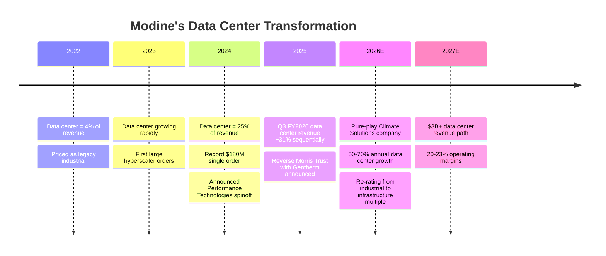
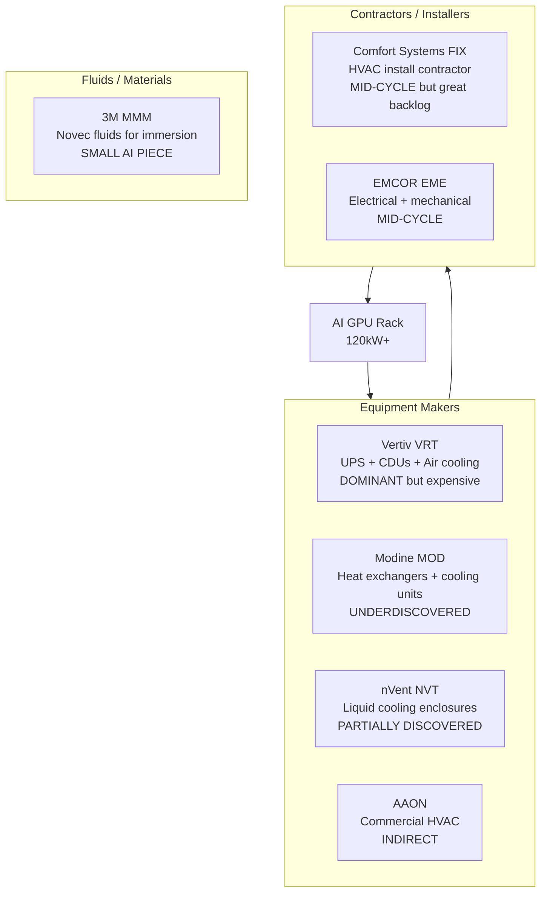

# Chapter 02: Cooling — The Undiscovered Layer

## Why Cooling Is the Sleeper Trade

Everyone knows about Vertiv (VRT). It's up 170%+ and trades at 53x forward P/E. It's no longer "undiscovered." But the cooling category has several names the market hasn't fully found yet — companies where data center cooling is rapidly becoming the core business but the stock still trades at an industrial multiple.

The tailwind is structural and accelerating: NVIDIA's GB200 NVL72 rack draws 120 kW, making liquid cooling **mandatory** rather than optional. Every new AI cluster being built today requires liquid cooling infrastructure. Demand for the next several years is already contracted.

---

## Modine Manufacturing (MOD) — The Most Compelling Undiscovered Story

### What Modine Does

Modine makes thermal management systems — heat exchangers, cooling units, fluid management. They serve automotive, HVAC, and industrial markets. Historically: boring industrial company.

**What changed**: Hyperscalers started buying massive quantities of their data center cooling products. Data center as a share of Modine revenue went from 4% to 25% in two years. Now management is spinning off the legacy auto business to become a **pure-play AI data center cooling company**.

### The Numbers

| Metric | Value |
|--------|-------|
| Data center revenue share | 4% (2022) → 25% (2024) → growing |
| Data center revenue growth guidance | 50–70% annually for 2 fiscal years |
| Q3 FY2026 data center sales | +31% sequentially |
| Record single order | $180M (February 2025) |
| Revenue target (data center alone) | Path to $3B+ |
| Operating margin target (Climate Solutions) | 20–23% by FY2027 |

### The Spinoff Catalyst

Modine is separating its legacy **Performance Technologies** segment (auto/industrial) via a **Reverse Morris Trust** transaction with Gentherm. What remains will be a pure-play **Climate Solutions** company focused entirely on thermal management for data centers, HVAC, and related markets.

**Why this matters for the stock**: When the legacy business is removed, analysts who cover Modine as an "auto-parts industrial" will need to re-categorize it. New coverage from data center infrastructure analysts will begin. The multiple should expand from industrial (10–15x) to infrastructure/growth (20–30x+). That re-rating alone — independent of revenue growth — is significant upside.

### Why the Market Is Slow

1. **Legacy identity**: Most analysts cover MOD as an auto-parts industrial — the wrong peer group
2. **Mixed revenue**: The auto business obscures the data center growth rate in consolidated numbers
3. **Spinoff complexity**: Reverse Morris Trust mechanics are not well understood by generalist investors
4. **Small/mid cap**: Less institutional coverage than VRT or ETN

**The opportunity**: Buy the transformation before the identity changes. When MOD is reclassified as a data center cooling company, the multiple should expand even if earnings stay flat — and earnings are growing 50–70% annually.

---

## nVent Electric (NVT) — Liquid Cooling Under the Radar

### What nVent Does

nVent makes electrical enclosures, thermal management, and cable management for industrial and data center applications. Their **Hoffman** brand makes the metal enclosures that house networking equipment; their **Schroff** brand makes rack systems. Their **thermal management** division makes liquid cooling enclosures specifically for AI data centers.

### The AI Data Center Story

| Metric | Value |
|--------|-------|
| Q3 2025 organic orders | +65% from hyperscaler liquid cooling |
| Liquid cooling already deployed | 1 GW of cooling capacity |
| New manufacturing facility | 117,000 sq ft in Blaine, MN (for scale-up) |
| 2025 EPS growth | ~33.7% |
| 2026 EPS growth (est.) | ~19.5% |

**Key product**: Liquid cooling distribution units (CDUs), rack-integrated cooling systems, cold door solutions — exactly what's needed for 70–120 kW AI racks.

### Comparison to Vertiv

| | VRT (Vertiv) | NVT (nVent) |
|--|-------------|------------|
| Market cap | ~$40B | ~$12B |
| Primary AI cooling | Yes (dominant) | Yes (growing) |
| Forward P/E | ~53x | ~25x |
| Analyst coverage | Heavy | Moderate |
| AI trade "discovery" | Fully discovered | Partial |
| Other business | Also power infra | Also industrial enclosures |

nVent is not as pure a cooling play as Vertiv, but at roughly half the P/E with 65% organic order growth, the valuation gap is notable.

---

## Comfort Systems USA (FIX) — The HVAC Contractor Inside Every Data Center

### What Comfort Systems Does

Comfort Systems doesn't make cooling *equipment* — they *install* it. They're a mechanical, electrical, and plumbing (MEP) contractor that builds the HVAC and cooling systems inside commercial buildings. Data centers have become their biggest customer.

### The Numbers

| Metric | Value |
|--------|-------|
| 2025 revenue | $9.1B (+30% YoY) |
| EPS growth 2025 | +98% YoY |
| Q4 2025 revenues | +42% YoY |
| Backlog | $11.9B (doubled from prior year) |
| Data center/tech % of revenue | 45% (up from 33%) |

**The backlog is the key**: $11.9B in backlog means roughly 12+ months of future revenue is already signed. FIX doesn't have to win new business to grow — they just have to execute on what's already contracted.

### Why This Is Different from Equipment Makers

FIX is a services/labor business, not a product company. This means:
- **Higher switching costs**: Once you're the contractor on a campus, you're the contractor for all expansions
- **Backlog visibility**: Contract-based revenue is more predictable than product sales
- **Scale advantages**: Their workforce and subcontractor relationships are hard to replicate quickly

---

## The Cooling Landscape: Who Does What

---

## Investment Angle

| Company | Ticker | Why Interesting | Key Risk |
|---------|--------|----------------|---------|
| Modine | MOD | Transformation to pure-play; spinoff re-rating catalyst | Legacy auto drags until spinoff completes |
| nVent | NVT | Half Vertiv's P/E, 65% organic order growth | Enclosures are commoditizing |
| Comfort Systems | FIX | $11.9B backlog, 45% data center revenue | Labor constraints, execution risk |
| Vertiv | VRT | Still compounding but expensive | 53x P/E requires perfection |

**The most interesting risk/reward in cooling today**: Modine (MOD). The transformation is real, the data is there, and the market hasn't assigned the identity yet.
