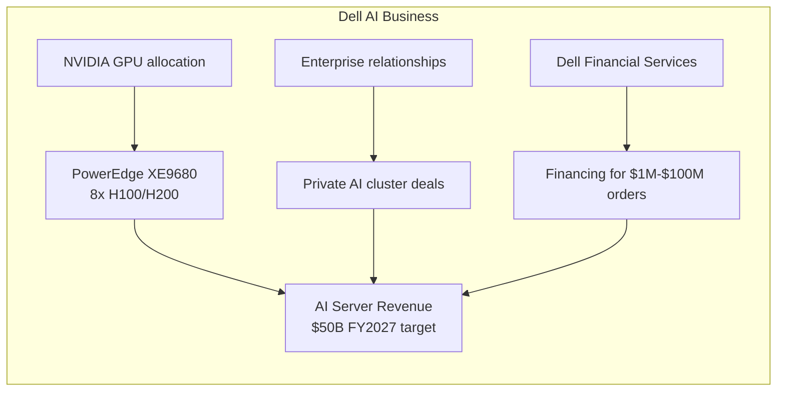
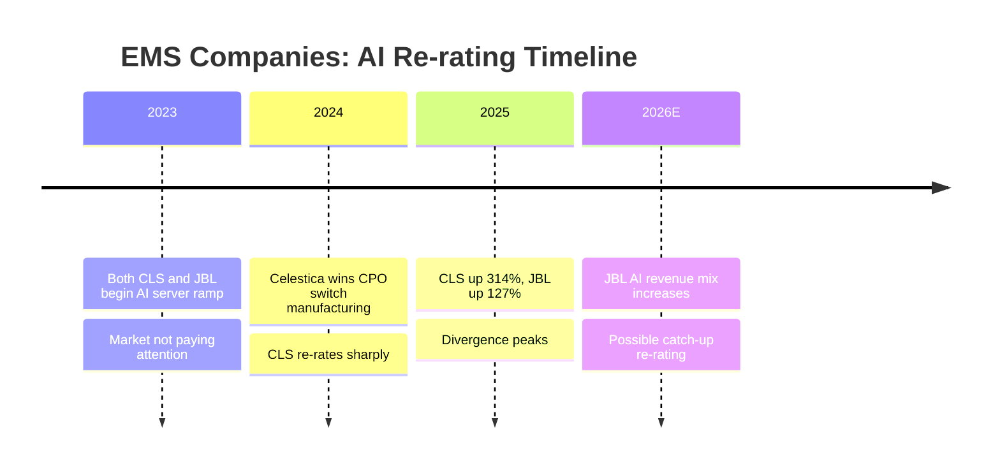
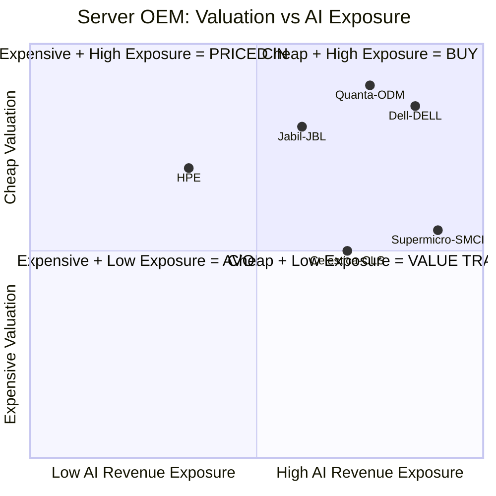

# Chapter 03: AI Servers — Best Value in the Stack

## The Server Paradox

NVIDIA trades at ~47x forward P/E. Arista trades at ~38x. Vertiv at ~53x. The AI server ecosystem has enormous valuation premiums across the board.

**Except for the companies that actually assemble the servers.**

Dell Technologies — whose AI server revenue grew **342% year-over-year** in Q4 FY2026 — trades at **14x forward P/E**. This is one of the most striking valuation disconnects in the entire AI supply chain.

---

## Dell Technologies (DELL) — The Most Contrarian Large-Cap Call

### Why the Market Undervalues Dell

Dell's legacy identity is:
- Consumer PCs (declining market)
- Enterprise laptops
- Printers (sold off)

The market still partially prices Dell as a "PC hardware company" even as AI server revenue becomes the dominant growth engine.

### The AI Server Numbers

| Metric | Value |
|--------|-------|
| Q4 FY2026 AI server revenue | $8.95B (+342% YoY) |
| AI server backlog (FY2027) | $43B |
| FY2027 AI server revenue target | ~$50B |
| Forward P/E | **~14x** |
| AI server gross margins | ~20–25% (below traditional servers but on massive volume) |

**For context**: $50B in AI server revenue at ~14x earnings multiple vs. NVIDIA at $130B+ revenue at 47x multiple. The market is pricing NVIDIA's *platform* premium (CUDA, software moat) into NVIDIA, but not pricing Dell's *execution* into Dell.

### Dell's Competitive Position

Dell's AI server moat:
1. **Direct NVIDIA partnership**: Dell builds and sells NVIDIA DGX/HGX-based systems with go-to-market agreements
2. **Enterprise relationships**: Fortune 500 companies building private AI clusters call Dell first
3. **Financing and services**: Dell Financial Services can finance a $10M AI cluster — ODMs can't do that
4. **Professional services**: Dell Apex (hybrid cloud), deployment services, multi-year support

### The Key Question

Why does Dell trade at 14x forward P/E?

1. **PC overhang**: The market still models PC revenue decline as Dell's primary story
2. **Margin concern**: AI server margins (~20%) are lower than traditional server margins (~30–35%)
3. **NVIDIA dependency**: If NVIDIA raises GPU prices or changes allocation, Dell is exposed
4. **ODM threat**: Hyperscalers buy direct from ODMs — Dell's enterprise mix matters

**The bull case**: Dell's $43B AI server backlog is real, contracted revenue. At 14x earnings, the market is not pricing in the magnitude of this growth. If Dell's multiple re-rates to even 20x (still cheap for AI infrastructure), the stock has significant upside.

---

## Supermicro (SMCI) — Recovery Play or Value Trap?

### The Rise and Fall

Supermicro was one of the most dramatic AI stories:
- Stock went from ~$100 to ~$1,229 (12x) between 2023 and March 2024
- Then fell ~90% after accounting investigation (failure to file 10-K on time, auditor resignation)
- Stock recovered to ~$40–50 range by mid-2026

### What the Accounting Issues Mean

Supermicro had to restate financials and bring on a new auditor. This is serious — it raises questions about:
- Revenue recognition (were AI server sales properly recorded?)
- Internal controls
- Management credibility

However, the **product** is not in question. Supermicro is still NVIDIA's preferred liquid cooling partner and builds some of the most advanced AI racks in the world.

### Current State

| Metric | Value |
|--------|-------|
| Forward P/E | ~19x |
| Gross margin | ~6.4% (compressed — pricing to win business) |
| YTD 2026 | -7% (recovering) |
| April 2026 recovery | +20% in single month |
| Key risk | Accounting + margin compression |

**The bear case**: 6.4% gross margins are unsustainable. The company is pricing aggressively to win back customers after the accounting debacle. If margins don't recover, the earnings story doesn't work.

**The bull case**: If accounting issues are resolved and margins recover to historical ~15%, the earnings power is significant. At 19x on recovered earnings, SMCI would be cheap.

**Verdict**: High-risk recovery play. Not the same quality of opportunity as Dell. Only appropriate for investors who are comfortable with governance risk.

---

## Jabil (JBL) vs. Celestica (CLS) — The Contract Manufacturer Trade

### What They Do

Both are **EMS (Electronics Manufacturing Services)** companies — they build electronic products for other companies. Both have significant AI server and AI infrastructure manufacturing.

### The Divergence

| | Celestica (CLS) | Jabil (JBL) |
|--|----------------|------------|
| 2025 return | **+314%** | +127% |
| Forward P/E | 15.74x | **13.57x** |
| 2026 revenue guidance | $16B | Larger/more diversified |
| Key AI wins | CPO Ethernet switch win | AI server manufacturing expansion |
| AI share of business | Higher % | Lower % (more diversified) |

**The thesis**: Celestica ran nearly 3x in 2025 while Jabil ran about half as much. Both are doing similar work. Jabil trades cheaper. If the AI manufacturing buildout continues (which is contracted multi-year), Jabil may be the catch-up trade.

**Why Jabil lagged**: Jabil is more diversified — healthcare, automotive, consumer electronics — so the AI revenue is a smaller percentage of total. The market rewards pure-plays. But as AI manufacturing becomes a larger share of Jabil's mix, the multiple should expand.

---

## The Server OEM Landscape

---

## HPE — The Laggard

HPE is up only +20% YTD in 2026 vs. Dell's +67%. Their AI server business is smaller and more enterprise/HPC-focused. The Juniper acquisition (networking) broadens their portfolio but also complicates the story. 

HPE could be a **catch-up trade** if their AI server wins accelerate — or it could be a **value trap** if Dell and Supermicro continue taking share. The AI server race is not winner-take-all, but scale matters.

---

## Investment Summary

| Company | Ticker | Opportunity | Risk Level |
|---------|--------|-------------|-----------|
| Dell | DELL | Best large-cap value in AI — 14x P/E, $43B backlog | Medium (margin, NVDA dependency) |
| Jabil | JBL | Catch-up vs. Celestica; 13.57x P/E | Medium (diversification means slower re-rating) |
| Supermicro | SMCI | High-risk recovery; product is great, governance is not | High (accounting, margins) |
| HPE | HPE | Possible catch-up; enterprise AI buildout | Medium-High (lagging in AI server share) |
