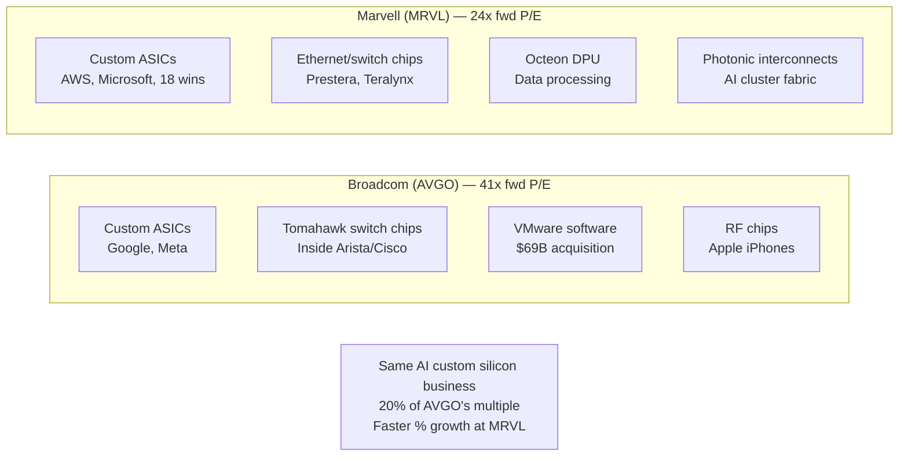
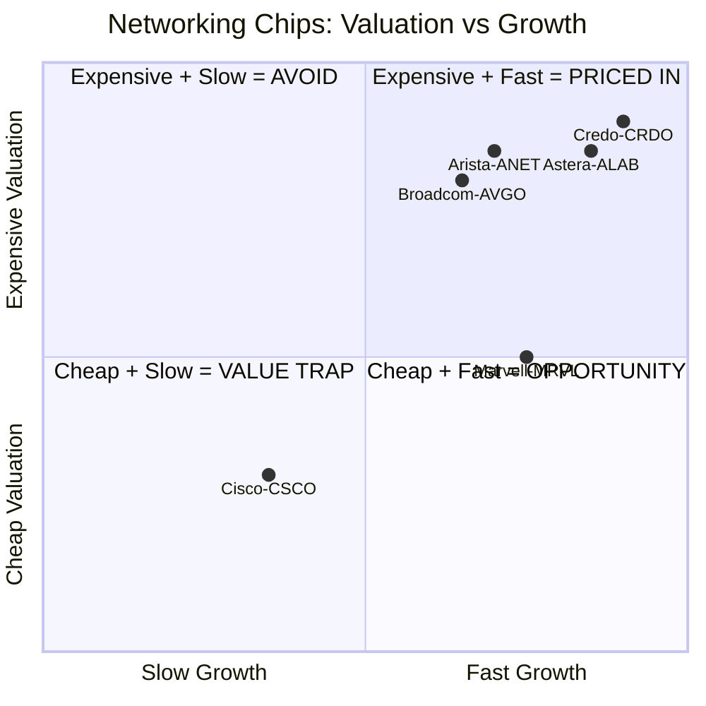

# Chapter 04: Networking — Relative Value in a Re-rated Sector

## The Networking Re-rating Has Happened — But Unevenly

Arista Networks is up 335% over three years. Broadcom is up 124% in 2024 alone. The AI networking trade is no longer "undiscovered." But within networking, there are significant valuation disparities that create relative value opportunities.

The key insight: **the same AI exposure commands very different multiples depending on how the market has categorized each company.**

---

## Marvell (MRVL) vs. Broadcom (AVGO) — The Core Relative Value Trade

Both companies:
- Make custom AI ASICs for hyperscalers (Google, AWS, Microsoft, Meta)
- Make networking chips (switches, NICs, PHYs)
- Have deep relationships with every major cloud customer
- Are benefiting from the shift away from NVIDIA-only AI infrastructure

| Attribute | Broadcom (AVGO) | Marvell (MRVL) |
|-----------|----------------|----------------|
| Market cap | ~$1.8T | ~$80B |
| Forward P/E | **41x** | **24x** |
| Custom AI chip market share | 55–60% | 13–15% |
| Revenue growth rate | Strong | **Faster % growth** |
| AI chip revenue (FY2024) | $11B+ | Ramping |
| Hyperscaler design wins | Google, Meta, others | AWS, Microsoft + 18 total |
| Analyst view | "Dominant" | "Faster growth profile for 2026" |
| NVIDIA co-development | No | Yes (NVLink-compatible interconnect) |

**The thesis**: Marvell trades at 41% of Broadcom's P/E multiple despite being in the exact same business with faster percentage growth. As Marvell's custom AI silicon revenue ramps in 2026–2027, the market should re-rate it closer to AVGO's multiple. At parity, MRVL would be worth dramatically more.

**Why the discount exists**: Broadcom is larger, more diversified (also has software via VMware), and has a longer track record. Marvell is mid-cap and still proving out its hyperscaler ASIC wins in financial results.

---

## Credo Technology (CRDO) — High Conviction but No Longer Early

### What Credo Does

Credo dominates **Active Electrical Cables (AECs)** — short copper links (1–3 meters) between GPU servers and top-of-rack switches inside AI clusters. At 400G and 800G speeds, these copper links need active signal conditioning chips to work. Credo makes those chips.

They're also moving into 1.6T connectivity, optical DSPs, and high-speed SerDes.

### The Numbers

| Metric | Value |
|--------|-------|
| FY2025 revenue | $436.8M (+126% YoY) |
| Most recent quarter | Revenue tripled vs year-ago |
| 1-year return | ~140%+ |
| Since 2022 IPO | ~1,000%+ |
| Current valuation | Expensive |
| 1-month return (April 2026) | +52.8% |

**Honest assessment**: Credo is not "undiscovered." The 1,000%+ gain since IPO tells you the market has found it. At current valuations, you're paying for substantial future growth. The product is excellent and the TAM is real, but the entry point matters enormously.

**When to look**: Pullbacks. Credo pulled back from ~$150 all-time high to ~$117. These are where risk/reward improves — but it's still not cheap.

---

## Astera Labs (ALAB) — Intelligent Connectivity Silicon

### What Astera Does

Astera makes the "smart glue" inside AI racks:
- **PCIe retimers**: Extend PCIe signals between CPU and GPU over longer distances
- **CXL memory controllers**: Enable CXL memory expansion (growing trend)
- **Ethernet smart cable modules**: Active cables for AI fabric

Think of them as the company that makes AI servers work *as a system* rather than just as individual components.

### Why Astera Stands Out

| Metric | Value |
|--------|-------|
| FY2025 revenue | $852.5M (+115% YoY) |
| Gross margins | **>75%** (exceptional for semiconductors) |
| Cash | $1.19B |
| 1-month return (April 2026) | +40.5% |
| Valuation | Premium — but quality earns it |

**The gross margin story**: >75% gross margins means this is true IP-driven semiconductor business, not commodity hardware. That's Apple/NVIDIA territory. High margins + high growth = premium multiple justified.

**The CXL wildcard**: CXL (Compute Express Link) is an emerging standard that allows memory expansion beyond what fits on a GPU or CPU. As AI models get larger, the need to address more memory grows. Astera's CXL controllers could become critical infrastructure.

---

## Arista Networks (ANET) — Still Compounding But Not Cheap

Arista is the clearest pure-play on AI Ethernet networking. Microsoft, Meta, Google, and Amazon all use Arista switches for their AI cluster fabrics.

| Metric | Value |
|--------|-------|
| 3-year return | +335% |
| 2025 revenue | $9.01B (+28.6%) |
| 2026 AI networking target | Raised from $2.75B to $3.25B |
| Trailing P/E | ~65x |
| Forward P/E | ~38x |
| Analyst consensus | 17 "Strong Buy"; PT ~$181 (33% upside) |

**The honest view**: Arista is an excellent business. But at 65x trailing P/E, the AI trade has been priced in for years. This is a high-quality compounder, not a mispriced value. Own it for quality, not for undiscovered value.

---

## The Networking Chip Value Map

---

## Cisco — The Value Trap Watch

Cisco trades at a low multiple and has been trying to transform into an AI networking story. They have:
- **Nexus 9000** switches competing with Arista
- **Silicon One** custom ASIC strategy
- **Splunk** (acquired 2024) for observability

But Arista has been taking enterprise share from Cisco for a decade, and Cisco's growth is modest. **Low multiple is warranted**, not a hidden opportunity. Be careful not to confuse "cheap" with "value."

---

## Investment Summary for Networking

| Company | Ticker | Opportunity Type | Forward P/E | Verdict |
|---------|--------|----------------|-------------|---------|
| Marvell | MRVL | Relative value vs AVGO | 24x | Best risk/reward in custom silicon |
| Astera | ALAB | High-quality growth, CXL optionality | Premium | Own for quality, not cheapness |
| Credo | CRDO | Excellent product, not cheap anymore | Expensive | Wait for pullback |
| Arista | ANET | Quality compounder | 38x fwd | Own for quality |
| Broadcom | AVGO | Dominant but fully valued | 41x fwd | Core holding, not upside bet |
| Cisco | CSCO | Cheap but not a great AI story | Low | Value trap risk |

**Top pick**: MRVL. The 20-percentage-point P/E discount to AVGO for the same underlying AI custom silicon business does not reflect fundamental reality. As Marvell's hyperscaler ASIC revenue ramps in 2026–2027, that gap should narrow.
