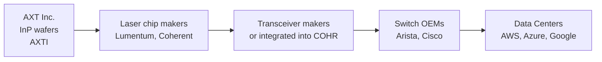

# Chapter 05: Optics & Materials — What's Left After the Run

## The Optics Situation

Optics had some of the biggest runs in the entire AI supply chain:

| Stock | Return |
|-------|--------|
| Lumentum (LITE) | +339% in 2025 alone |
| Coherent (COHR) | +435% over 1 year |
| Corning (GLW) | +300%+ over 1 year |
| Applied Optoelectronics (AAOI) | +1,264% over 1 year |

The catalyst: NVIDIA invested $2B into both Coherent and Lumentum (March 2026), and $3.2B into Corning (May 2026), with multi-year supply agreements to the end of the decade. These Nvidia investments validated the optics story and sent stocks parabolic.

The honest question: **is there anything left in optics, or is it over?**

---

## The Optics Volatility Problem

Even after the big runs, optics stocks are wildly volatile:

In a single week in May 2026:
- Monday: AAOI -14%, COHR -10%, LITE -7% ("optics trade cools")
- Thursday: AAOI +24%, LITE +17%, COHR +13% ("optics trade catches fire")

This tells you these are **momentum-driven, sentiment-driven trades** — not fundamental value plays. The underlying demand is real, but the stocks are priced for years of perfect execution.

**For investors who missed the run**: The best remaining opportunities in optics are *upstream* and *contract manufacturing* — less exciting, less volatile, more durable.

---

## AXT Inc. (AXTI) — The Upstream Materials Play

### What AXT Does

AXT makes **compound semiconductor substrates** — the wafers that are the raw material for optical components. Specifically:

| Substrate | Material | What It's Used In |
|-----------|---------|------------------|
| Indium Phosphide (InP) | III-V semiconductor | High-speed lasers for optical transceivers |
| Gallium Arsenide (GaAs) | III-V semiconductor | VCSELs, RF chips, solar cells |
| Germanium (Ge) | Semiconductor | Solar cells, fiber optic detectors |

**The AI connection**: Every high-speed optical transceiver (400G, 800G, 1.6T) needs InP-based lasers. The laser component goes inside the transceiver. The laser chip is grown on an InP wafer. AXT makes the InP wafers.

### The Supply Chain Position

AXT is **two steps upstream** of the transceiver companies. The re-rating of LITE and COHR from NVIDIA's investment should also pull up AXT — but it hasn't happened as dramatically yet.

### The Numbers

| Metric | Value |
|--------|-------|
| InP wafer backlog | **Record $60M** (hyperscalers locking in supply) |
| Business model | Substrate wafer supplier — upstream, lower risk |
| Valuation | Small cap, less coverage |
| AI discovery | Still early vs. COHR/LITE |

**The risk**: AXT is a small company. Lower liquidity, binary outcomes on customer concentration, and the fact that $60M backlog is meaningful for a small company but not huge in absolute terms.

**The opportunity**: The InP wafer backlog records are a leading indicator that COHR and LITE transceiver demand is real and growing. AXT benefits as the raw material supplier regardless of which transceiver company wins.

---

## Fabrinet (FN) — The Safest Optics Play

### What Fabrinet Does

Fabrinet is the **contract manufacturer of the optics world** — they make components for other companies, similar to how TSMC makes chips designed by others.

Their customers include:
- Coherent (COHR)
- Lumentum (LITE)
- Ciena (networking optical systems)
- Cisco (optical networking)
- NVIDIA (NVLink laser modules)

### Why Fabrinet Is Different from COHR and LITE

Fabrinet is **customer-agnostic**. They don't care which optical company wins — they manufacture for all of them. If Coherent gains share vs. Lumentum, Fabrinet still wins. If a new entrant emerges, Fabrinet might manufacture for them too.

This is the "picks and shovels" logic applied within optics.

| Metric | Value |
|--------|-------|
| Revenue (2024E) | ~$2.9B |
| Revenue from Nvidia | ~20%+ (growing fast) |
| 2025 → 2026 forecast | 800G+ transceiver units from 24M → 63M units |
| Business model | Contract manufacturing — stable margins |
| Valuation | More moderate than COHR/LITE |

**The 800G unit ramp**: If 800G transceiver shipments go from 24M to 63M units, Fabrinet assembles a growing share of those. Revenue grows roughly in line with unit volumes.

---

## Corning (GLW) — Transformed but Priced That Way

### The Old Corning vs. The New Corning

Old Corning (2020): ~50% of revenue from Gorilla Glass (iPhone screens). Boring industrial company. Low multiple.

New Corning (2026): Largest optical fiber manufacturer in the world. NVIDIA investing $3.2B for new US fiber factories. Meta committing $6B for a North Carolina plant.

| Metric | Value |
|--------|-------|
| 2026 revenue target | $20B annualized run rate |
| 2030 revenue target | $40B |
| Nvidia investment | $3.2B |
| Meta investment | $6B |
| 1-year return | +300%+ |
| Analyst consensus | Most targets now **below** current price |

**The problem**: The transformation is real. The NVIDIA and Meta investments are real. But the stock has already discounted most of it. When analyst consensus price targets are below the current price, that's a signal the near-term upside is limited.

**The long-term hold case**: If Corning hits the $40B revenue by 2030 target, the stock at current prices might still be cheap on a 4-year view. But there's limited short-term catalyst.

---

## Applied Optoelectronics (AAOI) — The Warning Sign

AAOI is up 1,264% in one year. The analyst consensus price target is **44% below the current stock price**.

That is a massive red flag. When a stock trades 44% above what every professional analyst models as fair value, one of two things is true:
1. The analysts are all wrong and the stock is still undervalued
2. The stock is a momentum trade that has disconnected from fundamentals

History suggests option 2 is more common. AAOI makes 800G transceivers — real product, real revenue. But the stock pricing implies perfection for years.

**The volatility story says it all**: -14% one day, +24% three days later. This is not a stock for investors who want to understand a business — it's a sentiment vehicle.

---

## Silicon Photonics: The Future of Optics (Not a Trade Today)

Silicon photonics integrates optical components onto standard silicon chips, using CMOS fab processes instead of exotic III-V semiconductors. Long-term, this could disrupt the entire pluggable transceiver market.

| Company | Approach | Timeline |
|---------|---------|----------|
| Broadcom | Co-packaged optics (CPO) for switches | 2026–2028 |
| Intel | IXL photonics platform | 2026+ |
| Ayar Labs | In-package optical I/O chiplets | 2027+ |
| Marvell | Custom silicon photonics for cloud | 2026+ |

**The risk to COHR, LITE, AXTI**: If CPO (co-packaged optics) takes off, it eliminates the pluggable transceiver entirely. Laser chips would be integrated directly into switch packages. This would reduce demand for standalone transceivers — and therefore InP wafer demand from AXT.

**The timeline**: CPO is 2–5 years from mass deployment. Not an immediate threat, but a long-term headwind to understand.

---

## Investment Summary for Optics

| Company | Ticker | Opportunity | Risk |
|---------|--------|-------------|------|
| AXT Inc. | AXTI | Upstream InP materials; still early | Small cap, illiquid |
| Fabrinet | FN | Contract mfg; diversified across all optics winners | Lower growth rate than COHR/LITE |
| Corning | GLW | Real transformation; long-term $40B story | Fully priced near-term |
| Coherent | COHR | Nvidia investment = multi-year contract | Stock priced for perfection |
| Lumentum | LITE | Same; largest gainer in 2025 | Late stage; brutal volatility |
| AAOI | AAOI | Not an investment — a momentum trade | Analyst consensus -44% below price |

**Best remaining risk/reward in optics**: AXTI (upstream material, still early) and FN (contract manufacturing, customer-agnostic). Both are more durable and less speculative than the transceiver companies that have already run.
