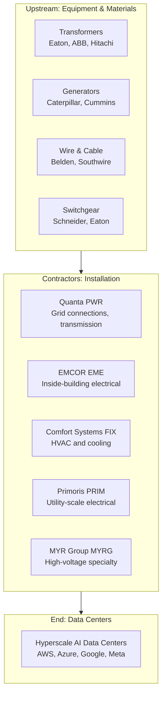

# Chapter 06: Electrical Contractors — The Unglamorous Backbone

## Why Electrical Contractors Are the Real Picks and Shovels

Every $1 spent on AI chips requires spending on physical infrastructure to power, cool, and connect those chips. You cannot rack a GPU without:
- High-voltage electrical connections from the grid to the building
- Transformers and switchgear inside the building
- HVAC, cooling, and mechanical systems
- Fire suppression, cable trays, conduit

**Electrical and mechanical contractors install all of it.** And they don't care whether it's NVIDIA H100s or AMD MI300s or Google TPUs in the racks — they get paid to build the facility regardless.

This "contractor picks and shovels" thesis is real, but the market has been slow to re-rate these companies because they don't have the "AI" label.

---

## How to Think About Contractor Valuation

Traditional industrials trade at 15–20x earnings. AI-flavored technology companies trade at 30–65x. **Contractors with 40–50% of revenue from AI data centers are still trading at 20–25x** — a significant discount to the AI infrastructure identity they're rapidly earning.

The re-rating happens when:
1. Analysts update their earnings models for backlog visibility
2. Data center revenue mix crosses 50%+ threshold
3. Institutional investors reclassify the company from "industrial" to "AI infrastructure"

---

## Quanta Services (PWR) — The Large-Cap Leader

### What Quanta Does

Quanta is the largest electrical and telecom infrastructure contractor in the US. They connect power plants to the grid, build high-voltage transmission lines, and connect data centers to utility substations.

| Metric | Value |
|--------|-------|
| Revenue (2025) | $28.5B (+20% YoY) |
| Backlog | **$48.5B** (record) |
| Q1 2026 adjusted EPS | $2.68 vs $2.03 expected (+32% beat) |
| FY2026 EPS guidance | $12.65–$13.35 |
| Market cap | ~$45B |
| AI/data center exposure | Grid connections, power infrastructure |

**The grid connection play**: Every new data center needs a high-voltage connection from a utility substation. That connection requires specialized engineering and construction that Quanta does. As data centers proliferate, so does Quanta's pipeline.

**The backlog is the story**: $48.5B in backlog means roughly 18 months of forward revenue is already under contract. The visibility here is extraordinary — much better than software or semiconductor companies.

**Is it still early?** Partially. Quanta's AI story has been recognized and the stock has had a meaningful run. But the backlog continues to grow as hyperscaler capex expands, suggesting continued earnings growth through 2027–2028.

---

## EMCOR Group (EME) — The Data Center Builder

### What EMCOR Does

EMCOR installs electrical systems, mechanical systems (HVAC, plumbing), and fire protection for commercial construction. They're one of the largest MEP (Mechanical, Electrical, Plumbing) contractors in the US.

**The AI angle**: Data centers require massive electrical work — switchgear, transformers, PDUs, UPS systems, cable trays, high-density power distribution. EMCOR installs all of it.

| Metric | Value |
|--------|-------|
| 3-month return | +33.6% |
| Backlog | $13.25B (+31%) |
| Network/communications revenue | 48% of electrical construction revenues |
| 2025 data center revenue | $2.46B (within electrical segment) |
| Backlog composition | Data centers are the primary driver |

**Why EMCOR**: Unlike Quanta (mostly outdoor grid and transmission), EMCOR does the **inside-the-building** electrical work. As data centers become more complex (liquid cooling, higher power density, more redundant power paths), the complexity and value of the electrical work increases.

---

## Comfort Systems USA (FIX) — The HVAC Specialist

### What FIX Does

Comfort Systems is a specialized HVAC contractor — they install air conditioning, ventilation, and increasingly, liquid cooling systems inside commercial buildings. Data centers have become 45% of their total revenue.

| Metric | Value |
|--------|-------|
| 2025 revenue | $9.1B (+30%) |
| EPS growth 2025 | **+98% YoY** |
| Q4 2025 revenue | +42% YoY |
| Backlog | $11.9B (doubled) |
| Data center/tech revenue mix | **45%** (up from 33%) |

**Why FIX is different from traditional HVAC contractors**: Cooling systems for AI data centers are increasingly complex (liquid cooling CDUs, rear-door heat exchangers, custom fluid routing). This requires specialized engineering and certification — not something any general HVAC contractor can do. Comfort Systems has invested in the expertise.

**The 45% mix threshold**: When nearly half your revenue is from AI data centers, your business *is* an AI infrastructure business. The market is slowly recognizing this.

---

## The Less Discovered Contractors

### Primoris Services (PRIM)

Primoris is a mid-cap infrastructure contractor focused on utility-scale electrical work, pipelines, and industrial construction. They've identified AI data centers as a major growth opportunity.

| Metric | Value |
|--------|-------|
| AI data center pipeline | $1.7B under evaluation |
| Total backlog | $11.5B |
| EPS growth 2025 | +20.7% |
| EPS growth 2026E | +12.1% |
| Coverage | **Less followed than Quanta or EMCOR** |

**Why Primoris is interesting**: Same thesis as Quanta/EMCOR but smaller, less covered, and therefore the AI re-rating has been smaller. The $1.7B data center pipeline is meaningful for a company of their size.

### MYR Group (MYRG)

MYR Group is a specialty electrical contractor focused on **high-voltage transmission and distribution** work — exactly the type of work needed to connect new data centers to the grid.

| Metric | Value |
|--------|-------|
| Stock | ~$458 |
| Market cap | ~$7.1B |
| Specialty | High-voltage electrical construction |
| AI angle | Grid connections for data centers |
| Coverage | **Less followed than Quanta** |

**Why MYRG**: When a new 100 MW data center needs to connect to the 138 kV utility grid, that requires specialty high-voltage contractors. MYR Group does this work. The company is smaller and less publicized than Quanta, which means the AI re-rating hasn't happened as dramatically.

---

## The Electrical Contractor Supply Chain

---

## Backlog as a Leading Indicator

The most important metric for contractors is **backlog** — contracts signed but not yet converted to revenue. A growing backlog with multi-year duration is the most reliable indicator of future earnings.

| Company | Backlog | Duration | YoY Change |
|---------|---------|----------|------------|
| Quanta | $48.5B | 12–18 months | Record |
| EMCOR | $13.25B | 12 months | +31% |
| Comfort Systems | $11.9B | 12 months | Doubled |
| Primoris | $11.5B | 12–18 months | Growing |

**All backlogs growing simultaneously** tells you the buildout isn't slowing. This is contracted work that must be executed regardless of what AI stocks do in the interim.

---

## Investment Summary

| Company | Ticker | Size | AI Discovery Status | Key Metric |
|---------|--------|------|--------------------|-|
| Quanta | PWR | Large cap | Partially discovered | $48.5B backlog |
| EMCOR | EME | Mid cap | Partially discovered | 48% data center electrical |
| Comfort Systems | FIX | Mid cap | Growing recognition | 45% data center, +98% EPS |
| Primoris | PRIM | Small-mid | **Less covered** | $1.7B DC pipeline |
| MYR Group | MYRG | Small-mid | **Less covered** | HV specialty |

**The opportunity**: Primoris and MYR Group are doing the same work as Quanta but are smaller and less covered. The AI premium that Quanta has started to earn has not yet been applied to PRIM and MYRG. The backlog data for these smaller companies tells a similar story.

**The thesis**: Electrical contractors are the most durable AI picks-and-shovels play because their revenue is **contracted** (not speculative), grows regardless of which GPU wins, and is driven by physical infrastructure that takes years to build. The market is still slowly figuring out which contractor names to assign the AI premium to.
