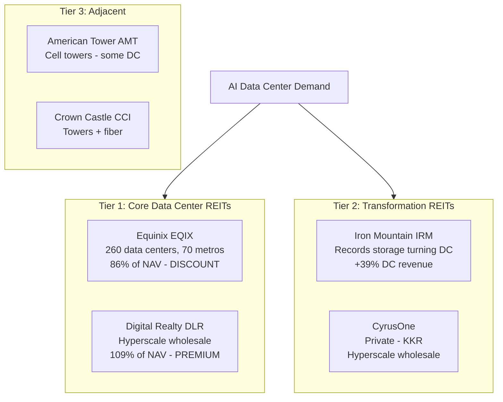

# Chapter 07: Data Center REITs — The Real Estate Layer

## Why Data Center REITs Matter

Data centers are permanent infrastructure. Once a hyperscaler signs a 10-year lease for 100 MW of data center space, that revenue is locked in. Data center REITs own and operate the buildings, collect rent, and expand capacity to meet demand.

This is **the lowest-risk way to get AI infrastructure exposure** — you're not betting on which chip wins or which cooling technology dominates. You're collecting rent from whoever wins.

But not all data center REITs are created equal, and the current valuation spread between them is significant.

---

## The Key Metric: NAV (Net Asset Value)

For REITs, the most important valuation metric is **Price-to-NAV** — the ratio of the stock price to the appraised value of the underlying real estate.

- **Below NAV (< 1.0x)**: Stock is cheaper than the replacement cost of the buildings. You're buying real estate at a discount.
- **At NAV (1.0x)**: Fair value
- **Above NAV (> 1.0x)**: Premium — market is pricing in future growth beyond current assets

| REIT | Price-to-NAV | What It Means |
|------|-------------|---------------|
| Equinix (EQIX) | **0.86x** | Trading at a **14% discount** to asset value |
| Digital Realty (DLR) | 1.09x | Trading at a 9% **premium** |
| Iron Mountain (IRM) | Moderate | Depends on segment mix |

This is remarkable: Equinix — the higher-quality, better-located data center REIT — is actually cheaper than Digital Realty relative to the underlying assets.

---

## Equinix (EQIX) — The Quality REIT at a Discount

### What Equinix Does

Equinix operates **260+ data centers across 70 metros worldwide**. They're the premier **neutral colocation** provider — companies pay to put their servers in Equinix buildings and connect to other networks, clouds, and customers who also have equipment there.

The key differentiator: **interconnection**. Equinix runs the physical hubs where the internet connects — where AWS, Azure, Google Cloud, financial firms, telcos, and CDNs all plug into each other. Once a company is in an Equinix facility and connected to 10 other Equinix customers, leaving is expensive.

### The Numbers

| Metric | Value |
|--------|-------|
| Data centers | 260+ across 70 metros |
| Price-to-NAV | **0.86x** (rare discount for this asset) |
| 2026 AFFO guidance | $4.20–4.28B |
| AFFO growth | +9–11% annually |
| Forward AFFO multiple | 18.4x |
| Dividend yield | ~2.1% |

**Why is it at a discount?**: Equinix's growth rate (~10% AFFO) is lower than the hypergrowth hyperscaler spending numbers that dominate AI headlines. Some investors have rotated from "slow and steady" EQIX to higher-beta names. This creates the discount opportunity.

**Why the discount is a gift**: Equinix's interconnection moat is unmatched. Their 260+ facilities with 10,000+ customers interconnected cannot be replicated. The franchise value far exceeds a simple asset value calculation.

---

## Digital Realty (DLR) — The Hyperscale Wholesale Player

### What Digital Realty Does

Digital Realty operates **hyperscale wholesale data centers** — massive shell spaces leased to Microsoft, AWS, Google, and Meta. These are typically long-term (10–15 year) leases for 10–100 MW of space.

| Metric | Value |
|--------|-------|
| Price-to-NAV | **1.09x** |
| Primary customers | Microsoft, AWS, Google, Meta |
| Lease structure | Long-term wholesale |
| AFFO growth | Growing |

**The comparison**: DLR trades at a *premium* to NAV while EQIX trades at a *discount*. Yet Equinix has the better interconnection moat and more defensible business model. This creates a clear relative value: own EQIX over DLR.

**DLR's advantage**: Direct hyperscaler relationships for massive new campus builds. As Microsoft and Google announce huge data center expansions, DLR signs the leases. This is pure AI capex flow-through.

---

## Iron Mountain (IRM) — The Transformation Story

### Old Iron Mountain vs. New Iron Mountain

**Old**: Physical records storage — companies stored their paper files in Iron Mountain warehouses. Boring, slow-growth utility.

**New**: Iron Mountain has been converting warehouse space into data centers and expanding aggressively into digital infrastructure.

| Metric | Value |
|--------|-------|
| Q4 2025 revenue | +16.6% YoY |
| Data center revenue | **+39.1%** YoY |
| Asset lifecycle management | +70% YoY |
| Business mix shift | Physical records → digital infrastructure |

**Why this is interesting**: Iron Mountain has existing relationships with thousands of enterprise customers who stored records with them. These same companies now need data center space. Iron Mountain is converting the relationship from "store your paper" to "store your data." The trust relationship is already there.

**The risk**: They're a late entrant to data centers vs. EQIX or DLR. Their properties are in locations that were chosen for physical records storage, not necessarily optimal for data centers (power, fiber, cooling access). The transformation is real but uneven.

---

## The REIT Landscape for AI

---

## Why Data Center REITs Are Lower Risk

Compared to equipment and semiconductor plays in the AI space:

| Risk Factor | Chip Company (e.g., NVDA) | Data Center REIT (e.g., EQIX) |
|-------------|--------------------------|-------------------------------|
| Product obsolescence | High (next chip generation) | Very low (buildings last 30+ years) |
| Revenue predictability | Lumpy (large orders) | Highly predictable (long-term leases) |
| Customer concentration | Hyperscalers control pricing | Diversified across 10,000+ customers |
| Inflation impact | Mixed | **Positive** — lease escalators |
| Recession sensitivity | High | Low (cloud spending is non-discretionary) |
| Competition | Intense | Moderate (location/interconnection moats) |

REITs trade at lower P/Es but offer much more stable cash flows. For investors who want AI exposure without the volatility of high-beta tech, data center REITs are the answer.

---

## The Valuation Reality Check

EQIX at 0.86x NAV means:

**If you bought all of Equinix's buildings at today's stock price, you'd be paying 86 cents for every dollar of appraised value.** 

In normal real estate terms, this is a discount that would attract buyers immediately. The fact that it's available in a stock with growing AFFO and a unique interconnection moat makes it one of the more interesting setups in AI infrastructure.

**Why this discount can persist**: REITs compete for capital with bonds. When interest rates are high, the "income premium" of REITs vs. bonds compresses, pushing REIT multiples down. As rates eventually fall, EQIX's multiple should expand.

---

## Investment Summary

| REIT | Ticker | Opportunity | Risk |
|------|--------|-------------|------|
| Equinix | EQIX | **Best value** — 0.86x NAV, 10% AFFO growth, moat | Interest rate sensitivity |
| Digital Realty | DLR | Hyperscale exposure, Microsoft/Google tenant base | 1.09x NAV — not cheap |
| Iron Mountain | IRM | Transformation story, enterprise customer base | Uneven execution, late entrant |

**Top call**: Equinix (EQIX) is the rare case where quality and value overlap. You're buying the best-located, most-interconnected data center network in the world at a discount to asset value. That combination is uncommon.
