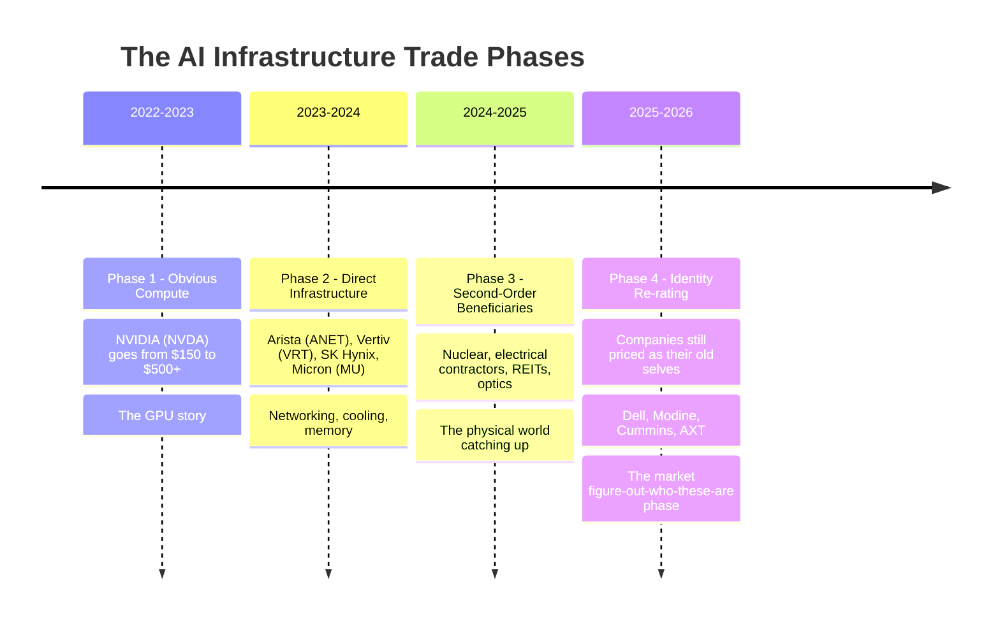
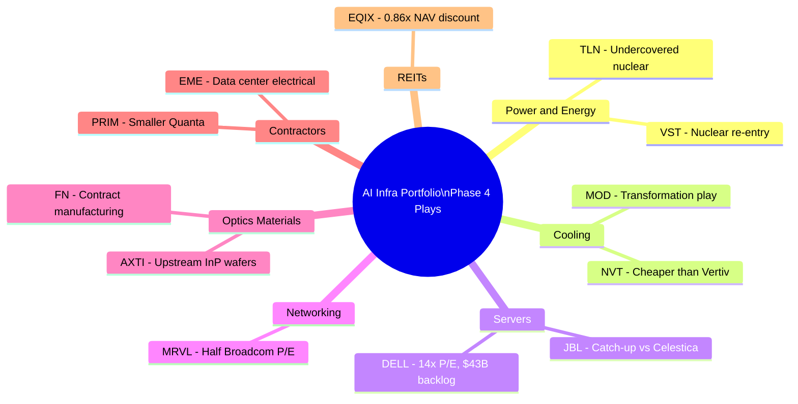

# Chapter 08: Portfolio Watchlist — Putting It All Together

## The Core Framework Revisited

The AI infrastructure trade has three phases:

**We are in Phase 4.** The stocks that remain interesting are those where the business has already transformed but the market still prices the old identity.

---

## Tier 1: Highest Conviction — Clear Value Gap

These are stocks where the AI revenue is real, growing, and not yet reflected in the valuation.

### Dell Technologies (DELL)
- **Why**: $43B AI server backlog. $8.95B AI server revenue last quarter (+342% YoY). Trading at **14x forward P/E**.
- **The gap**: AI server company priced as a PC company.
- **Catalyst**: When FY2027 guidance shows $50B+ AI server revenue, analysts will rerate.
- **Risk**: Margins could compress further; NVIDIA allocation risk.

### Vistra Energy (VST)
- **Why**: Best nuclear power operator in the US after CEG. Had huge 2024 run (+264%), pulled back ~19%, now at **16x forward P/E** with 49% expected EPS growth.
- **The gap**: Still partially priced as a merchant power utility, not as a nuclear AI energy provider.
- **Catalyst**: 2026–2027 nuclear PPA contracts start delivering in revenue; earnings beat cycle begins.
- **Risk**: Wholesale power price volatility; regulatory.

### Equinix (EQIX)
- **Why**: Best data center REIT. 260+ locations, 10,000+ interconnected customers, irreplaceable network. Trading at **0.86x NAV** — a discount to asset value.
- **The gap**: Moderate AFFO growth (~10%) doesn't excite momentum investors, so stock is at discount while peers trade at premium.
- **Catalyst**: Rate cuts compress the bond alternative premium and rerate REITs upward.
- **Risk**: High interest rates, macro recession cuts enterprise IT spending.

---

## Tier 2: Strong Thesis — Earlier Stage or Slightly More Risk

### Marvell Technology (MRVL)
- **Why**: Same custom AI silicon business as Broadcom but at **24x forward P/E** vs. AVGO's 41x. 18 hyperscaler design wins. Faster % growth profile.
- **The gap**: Broadcom's VMware acquisition and larger size command a premium; Marvell hasn't fully proven its custom ASIC revenue at scale.
- **Catalyst**: 2026 earnings reports showing hyperscaler ASIC ramp; possible upside surprises.
- **Risk**: Hyperscalers could consolidate to fewer ASIC vendors; execution risk.

### Modine Manufacturing (MOD)
- **Why**: Data center cooling is 25% of revenue growing 50-70% annually. Spinning off legacy auto business to become pure-play. Market still prices it as an industrial.
- **The gap**: Analysts cover it as auto-parts industrial. Post-spinoff, new coverage begins from data center infrastructure analysts.
- **Catalyst**: Reverse Morris Trust spinoff completion; first earnings as pure-play Climate Solutions company.
- **Risk**: Spinoff complexity; auto business drag until complete.

### Talen Energy (TLN)
- **Why**: Same nuclear/AI thesis as VST and CEG but **less followed and less re-rated**. Has a unique co-location deal: Amazon AWS data center physically on Susquehanna nuclear plant campus. 1,920 MW PPA through 2042.
- **The gap**: Small-cap, low coverage — CEG and VST got the attention.
- **Catalyst**: More coverage initiation; additional co-location or PPA deals.
- **Risk**: Lower liquidity; power price exposure on non-PPA portion.

### Jabil (JBL)
- **Why**: Contract manufacturer for AI servers. Celestica (CLS) ran +314% in 2025; Jabil ran only +127%. Both do the same work. Jabil trades at **13.57x forward P/E** vs Celestica's 15.74x.
- **The gap**: Jabil is more diversified (healthcare, auto), so less recognized as AI pure-play.
- **Catalyst**: AI manufacturing becomes >50% of revenue; re-categorization by analysts.
- **Risk**: Diversification means slower multiple expansion; margin pressure in contract manufacturing.

---

## Tier 3: Speculative / Early Stage — Higher Risk/Reward

### AXT Inc. (AXTI)
- **Why**: Makes indium phosphide wafers — the raw material for AI optical lasers. Record $60M InP backlog. Two steps upstream of COHR and LITE.
- **The gap**: Almost no one knows this company. Zero AI narrative coverage.
- **Catalyst**: InP supply becomes a headline bottleneck; analyst initiation.
- **Risk**: Small cap, illiquid; concentrated customer exposure; silicon photonics CPO long-term threat.

### Primoris Services (PRIM)
- **Why**: Same electrical contractor thesis as Quanta but smaller and less covered. $1.7B in data center work under evaluation.
- **The gap**: Quanta (PWR) has gotten the AI contractor premium; Primoris hasn't.
- **Catalyst**: Data center revenue hits milestones; project wins announced.
- **Risk**: Smaller company, less resources; execution risk on large data center projects.

### BWX Technologies (BWXT)
- **Why**: Makes nuclear reactor components. Revenue +18%, backlog $7.26B. The commercial nuclear renaissance is option value on top of stable government (Navy) contracts.
- **The gap**: Primarily viewed as a defense/government contractor. Commercial nuclear upside not priced.
- **Catalyst**: SMR orders, utility nuclear expansion contracts.
- **Risk**: SMR timelines are speculative; government contracting concentration.

---

## What to Watch For: Red Flags

| Warning Sign | What It Means |
|-------------|---------------|
| Analyst consensus PT >20% below stock price | Momentum trade, not value — AAOI is the example |
| Gross margins compressing despite revenue growth | SMCI warning sign — pricing to win, not to earn |
| "AI" mentioned on earnings call for first time | Often a sign of chasing the narrative, not real exposure |
| Stock ran 300%+ in < 1 year | Discovery is done; next move is mean reversion or another catalyst |
| Valuation requires 10+ years of perfect execution | Fine for venture, not appropriate for infrastructure |

---

## The Caterpillar (CAT) Special Case

Caterpillar is worth a note because it sits in a unique position:

- **Prime-power generators**: CAT generator sets are standard for data center backup power. They've won 1 GW+ orders from major data center projects, including a 2 GW order for a single campus.
- **NVIDIA partnership**: NVIDIA and CAT have a partnership around physical AI (using AI to make construction equipment smarter). This is early-stage.
- **Construction equipment**: CAT equipment does the earthwork for every data center site.

**The issue**: CAT is a $150B company. The data center generator business is meaningful but not company-defining. CAT's stock also moves on China construction activity, mining cycles, and commodity prices — all of which swamp the data center signal.

CAT is a solid company with an AI data center tailwind, but it's not the "next Nvidia" because the AI revenue doesn't dominate the business the way it does for Modine or Dell.

---

## Building a Portfolio: Diversification Across the Stack

A portfolio capturing the "what hasn't run yet" theme might look like:

---

## The Most Important Principle

**The best remaining AI trades are where the business has already transformed but the market hasn't changed the label yet.**

When the market says "Dell is a PC company" and Dell's biggest business is now AI servers — that's the gap.

When the market says "Modine makes auto parts" and 50–70% of their data center cooling revenue is growing annually — that's the gap.

When the market says "Cummins makes truck engines" and their fastest-growing segment is data center generators with orders booked through 2029 — that's the gap.

The label changes slowly. The business changes fast. The opportunity lives in between.

---

## Disclaimer

This is an educational document for learning about the AI ecosystem, not investment advice. Stock prices, valuations, and company situations change rapidly. All data is as of May 2026 research. Always do your own due diligence before investing, and consider consulting a financial advisor for personal investment decisions.
