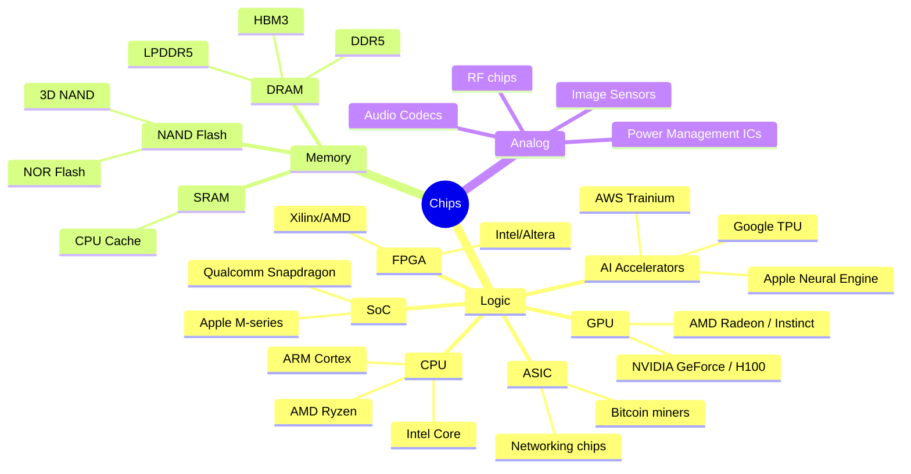
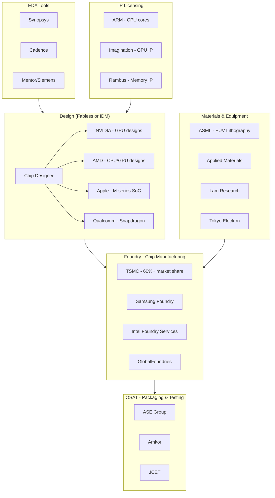
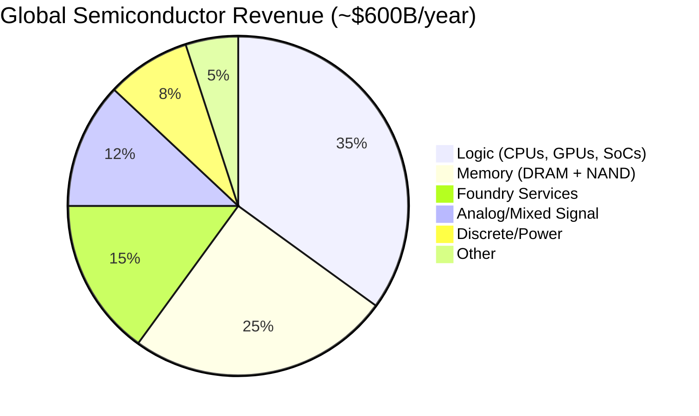
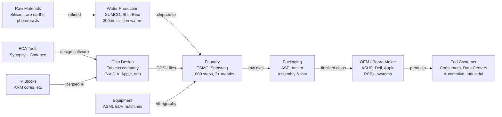

# Chapter 00: The Semiconductor Industry

## What Is a Semiconductor?

A **semiconductor** is a material — usually silicon — whose electrical conductivity sits between a conductor (copper wire) and an insulator (rubber). By precisely introducing impurities ("doping"), engineers can control how electrons flow through it. This is the foundation of every transistor.

A **transistor** is the fundamental building block of all modern chips. It's a tiny electronic switch — on or off, 1 or 0. Modern chips contain **billions** of them on a piece of silicon smaller than your fingernail.

| Node | Year | Transistors per chip (example) |
|------|------|-------------------------------|
| 10 µm | 1971 | 2,300 (Intel 4004) |
| 250 nm | 1997 | 7.5 million |
| 14 nm | 2014 | ~1.3 billion |
| 5 nm | 2020 | ~11.8 billion (Apple A14) |
| 3 nm | 2022 | ~15-20 billion (Apple A16) |
| 2 nm | 2025 | ~20-30 billion (Apple A16 class) |

---

## Types of Chips

---

## Industry Structure

The semiconductor industry has a distinct separation of concerns: **design**, **manufacturing**, and **packaging** are often done by different companies.

### Company Types Explained

| Type | Definition | Examples |
|------|-----------|---------|
| **IDM** (Integrated Device Manufacturer) | Designs AND manufactures chips | Intel, Samsung, Micron |
| **Fabless** | Designs chips, outsources manufacturing | NVIDIA, AMD, Apple, Qualcomm |
| **Foundry** | Manufactures chips for others | TSMC, Samsung Foundry, Intel Foundry |
| **OSAT** | Packages and tests chips after manufacturing | ASE, Amkor |
| **EDA** | Software tools to design chips | Synopsys, Cadence |
| **IP** | Sells reusable chip design blocks | ARM, Synopsys, Imagination |

---

## Market Segments

---

## The Supply Chain

Making a chip requires a global supply chain. Here's what has to happen before a chip reaches your computer:

---

## Why This Industry Is Hard

1. **Capital intensity**: A single TSMC fab costs $15-20B to build.
2. **Physics limits**: We're approaching atomic-scale transistors. Can't shrink forever.
3. **Supply chain fragility**: One Dutch company (ASML) makes the only EUV machines. No substitutes exist.
4. **Long lead times**: Designing a chip takes 2-4 years. Manufacturing takes 3+ months per wafer.
5. **Geopolitical risk**: Most advanced manufacturing is in Taiwan. DRAM is concentrated in South Korea.
6. **Talent scarcity**: Semiconductor engineers take a decade to develop expertise.

---

## Key Terms Glossary

| Term | Meaning |
|------|---------|
| **Die** | The individual chip cut from a silicon wafer |
| **Wafer** | A thin silicon disk from which hundreds of dies are cut |
| **Node / Process** | Manufacturing generation (5nm, 3nm, etc) — smaller = more transistors |
| **Yield** | % of dies on a wafer that work correctly — critical for economics |
| **TDP** | Thermal Design Power — how much heat a chip produces (watts) |
| **IPC** | Instructions Per Clock — efficiency of a CPU architecture |
| **FLOPS** | Floating Point Operations Per Second — GPU/AI performance measure |
| **Bandwidth** | How fast data moves between chip and memory (GB/s) |
| **Latency** | How long it takes to access data — low is better |
| **HBM** | High Bandwidth Memory — stacked DRAM next to GPU for AI workloads |

---

## Next Steps

- **[Chapter 01](./Chapter_01_GPU_NVIDIA_vs_AMD.md)** — GPUs: NVIDIA vs AMD
- **[Chapter 02](./Chapter_02_CPU_Landscape.md)** — CPUs: Intel, AMD, ARM
