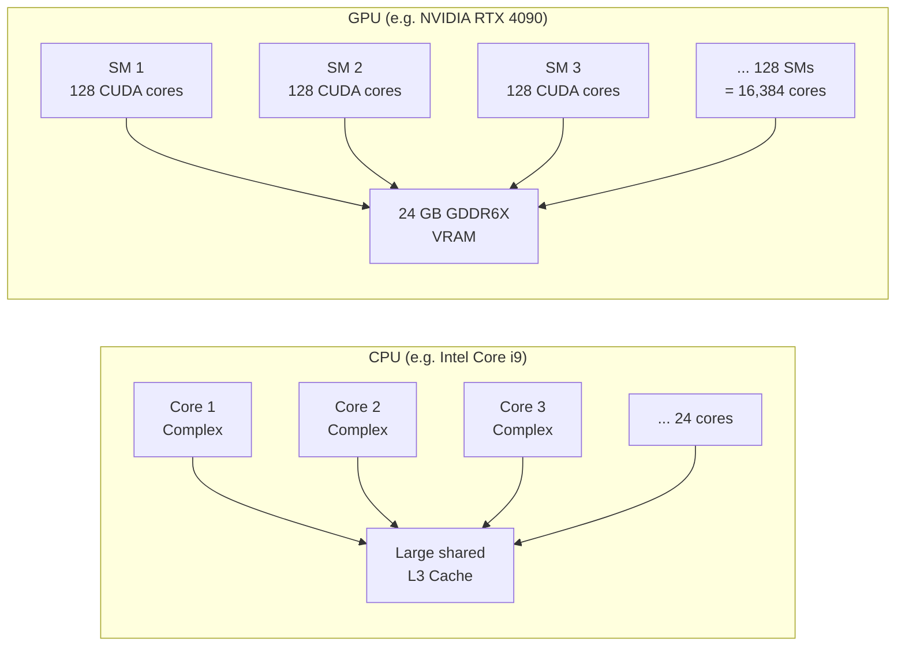
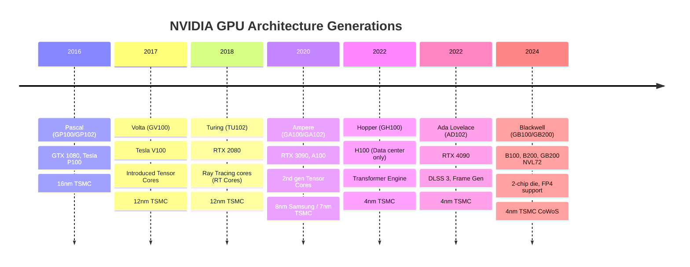
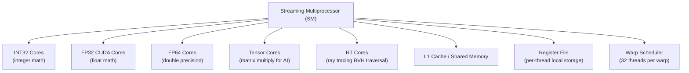
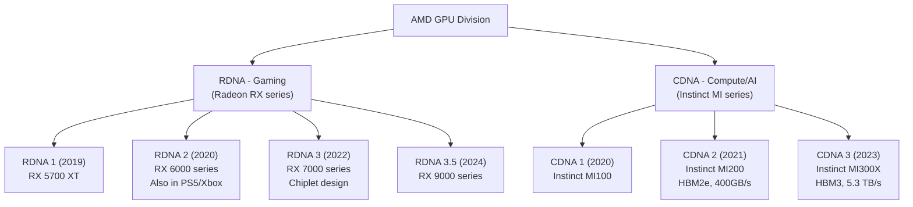
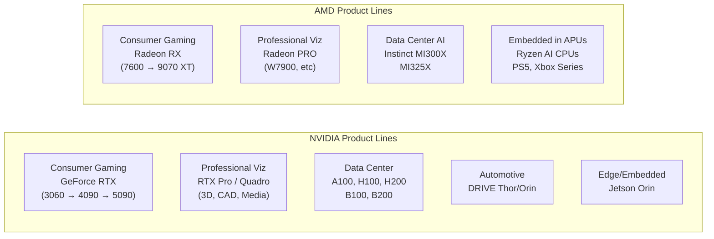
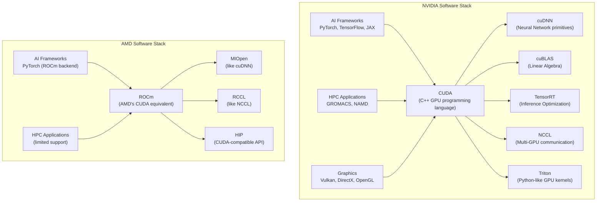
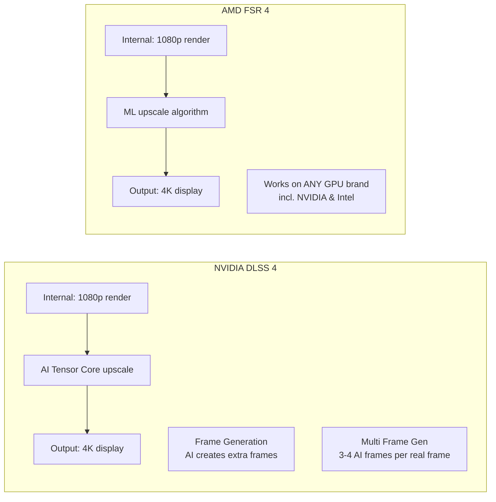

# Chapter 01: GPUs — NVIDIA vs AMD

## What Is a GPU?

A **GPU (Graphics Processing Unit)** was originally designed to render pixels on a screen — a massively parallel task. Rendering a 4K frame means computing the color of 8 million pixels simultaneously, every 16ms. That requires a fundamentally different architecture than a CPU.

### CPU vs GPU: A Mental Model

| Aspect | CPU | GPU |
|--------|-----|-----|
| Cores | 8–128 powerful cores | Thousands of simpler cores |
| Design goal | Low latency, complex tasks | High throughput, parallel tasks |
| Memory | ~64 MB L3 cache | 24–80 GB VRAM (GPU-local) |
| Analogy | A few expert surgeons | An army of factory workers |
| Best for | Serial code, OS, apps | Rendering, AI training, simulation |

---

## NVIDIA Architecture

NVIDIA names its GPU microarchitectures after scientists:

### Inside an NVIDIA GPU: SM Architecture

The **Streaming Multiprocessor (SM)** is NVIDIA's fundamental compute unit:

**Tensor Cores** are the key innovation for AI. They perform matrix multiply-accumulate (MMA) operations at massive speed — critical for training neural networks (which are essentially giant matrix multiplications).

---

## AMD Architecture

AMD splits its GPU line into **two separate architectures**:

AMD's compute unit is called a **CU (Compute Unit)**, equivalent to NVIDIA's SM but structured differently:

| Feature | NVIDIA (Ampere SM) | AMD (RDNA 3 CU) |
|---------|-------------------|-----------------|
| SIMD width | 32 threads/warp | 64 threads/wavefront |
| FP32 ALUs | 128 | 128 (2x64 SIMD) |
| Matrix units | Tensor Cores | Matrix Cores |
| Cache | L1 + Shared Mem | L0 + L1 |
| Clock speed | ~1.5–2.5 GHz | ~2.5–3.0 GHz |

---

## Product Line Comparison

---

## NVIDIA vs AMD: Direct Comparison

### Gaming GPUs (Consumer)

| Spec | NVIDIA RTX 5090 (2025) | AMD RX 9070 XT (2025) |
|------|------------------------|------------------------|
| Architecture | Blackwell | RDNA 4 |
| VRAM | 32 GB GDDR7 | 16 GB GDDR6 |
| Memory BW | ~1,800 GB/s | ~640 GB/s |
| TDP | ~575W | 304W |
| Price | ~$2,000 | ~$600 |
| Upscaling | DLSS 4 (AI-based) | FSR 4 (AI-based) |

**NVIDIA's advantages in gaming:**
- DLSS (Deep Learning Super Sampling) — uses AI to upscale, better quality
- Frame Generation — AI-generated intermediate frames
- Better ray tracing RT cores
- Larger VRAM on high-end cards
- CUDA for game physics/compute

**AMD's advantages in gaming:**
- Better price/performance at mid-range
- Open-source FSR works on ANY GPU (including NVIDIA)
- Infinity Cache on RDNA chips (reduces need for bandwidth)
- AMD CPUs + AMD GPUs can use Smart Access Memory (SAM)

### Data Center / AI GPUs

This is where the real money is:

| Spec | NVIDIA H100 SXM | AMD MI300X |
|------|-----------------|------------|
| Architecture | Hopper | CDNA 3 |
| FP8 TFLOPS (AI) | 3,958 | 2,614 |
| BF16 TFLOPS | 1,979 | 1,307 |
| VRAM | 80 GB HBM3 | 192 GB HBM3 |
| Memory BW | 3.35 TB/s | 5.3 TB/s |
| TDP | 700W | 750W |
| Price | ~$30–40K | ~$15–20K |
| Key Advantage | CUDA ecosystem | Larger VRAM |

> **Why does AMD's MI300X have more VRAM?** The MI300X is a **chiplet** design — it combines CPU chiplets + GPU chiplets + HBM memory all in one package. This allowed AMD to stack more HBM for less cost. For very large AI models that need to fit in a single GPU, MI300X can hold models that won't fit in an H100.

---

## Software Ecosystems: The Critical Difference

This is where NVIDIA **dominates**:

**Why CUDA is a moat:**
- Launched in 2006 — NVIDIA had 15+ years of head start
- Millions of engineers know CUDA
- Every major AI framework (PyTorch, TensorFlow) was built on CUDA first
- Thousands of optimized libraries (cuDNN, cuBLAS, TensorRT)
- HIP (AMD's compatibility layer) can translate CUDA code, but with performance penalties and compatibility gaps
- Most research papers release CUDA code, not ROCm code

---

## Upscaling Wars: DLSS vs FSR

Both companies have AI-powered upscaling that lets games run at lower resolution internally but display at higher resolution — more frames per second for "free":

**DLSS** uses AI (Tensor Cores) — produces better image quality but only works on NVIDIA GPUs.
**FSR** is open-source and hardware-agnostic — less quality but broader reach.

---

## Summary: When to Use Which

| Use Case | NVIDIA | AMD |
|----------|--------|-----|
| AI/ML Training | **Best choice** (CUDA ecosystem) | Good for large models (more VRAM) |
| AI Inference | **Best** (TensorRT) | Catching up |
| 4K Gaming | Best RT, DLSS | Better price/perf at $400-600 |
| 1080p/1440p Gaming | Overkill at high end | Great value |
| Professional 3D/VFX | Quadro/RTX Pro | Radeon PRO (cheaper) |
| Cloud / Hyperscaler | H100/H200/B200 | MI300X (growing) |
| Automotive | DRIVE platform | Less presence |

---

## Next: [Chapter 02 — CPUs](./Chapter_02_CPU_Landscape.md) | [Chapter 04 — NVIDIA's Full Ecosystem](./Chapter_04_NVIDIA_Ecosystem.md)
