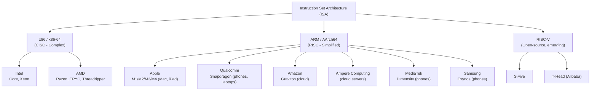
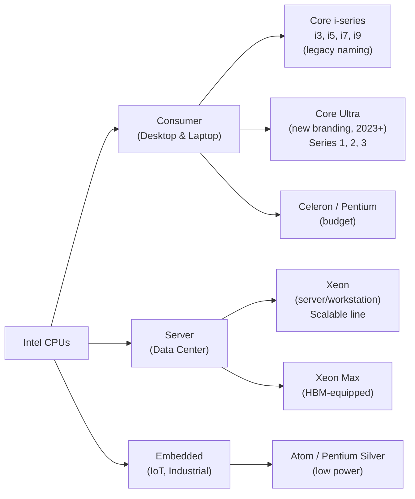
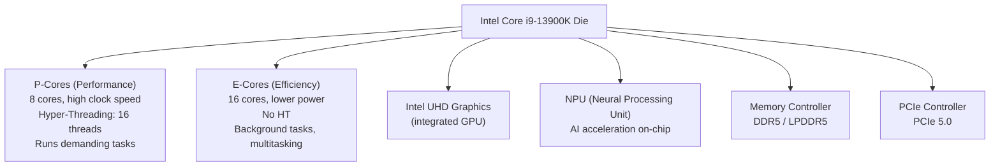
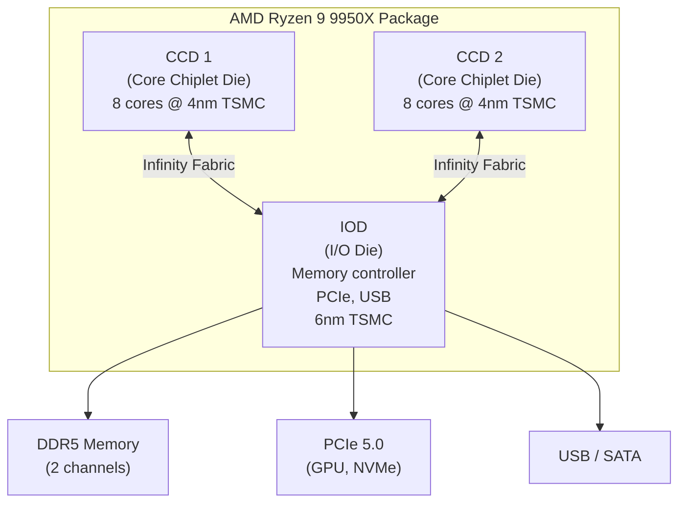
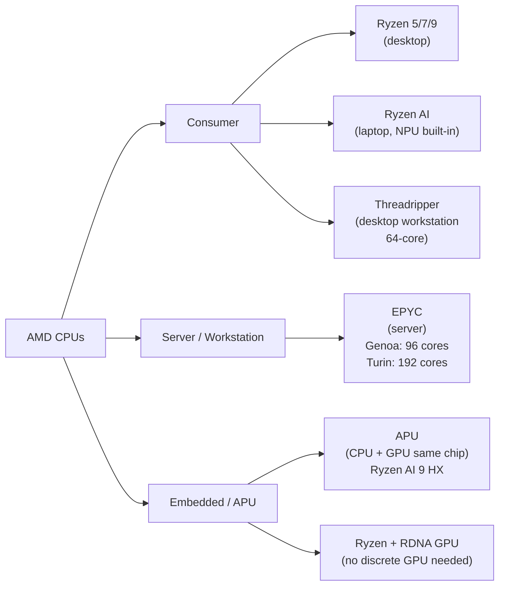
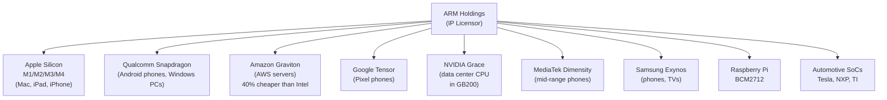
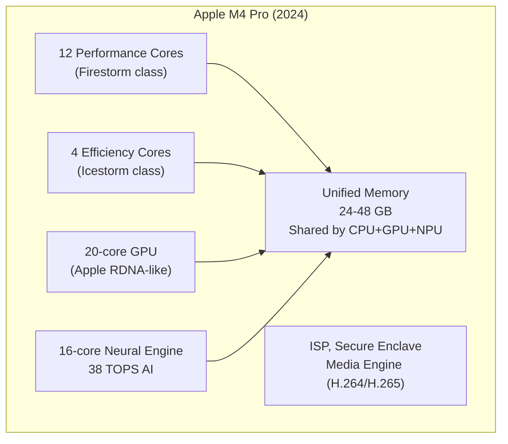
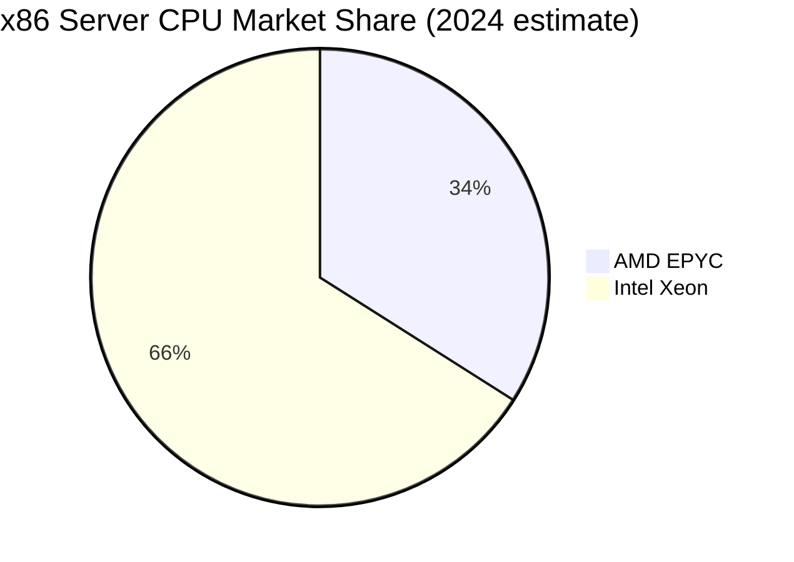
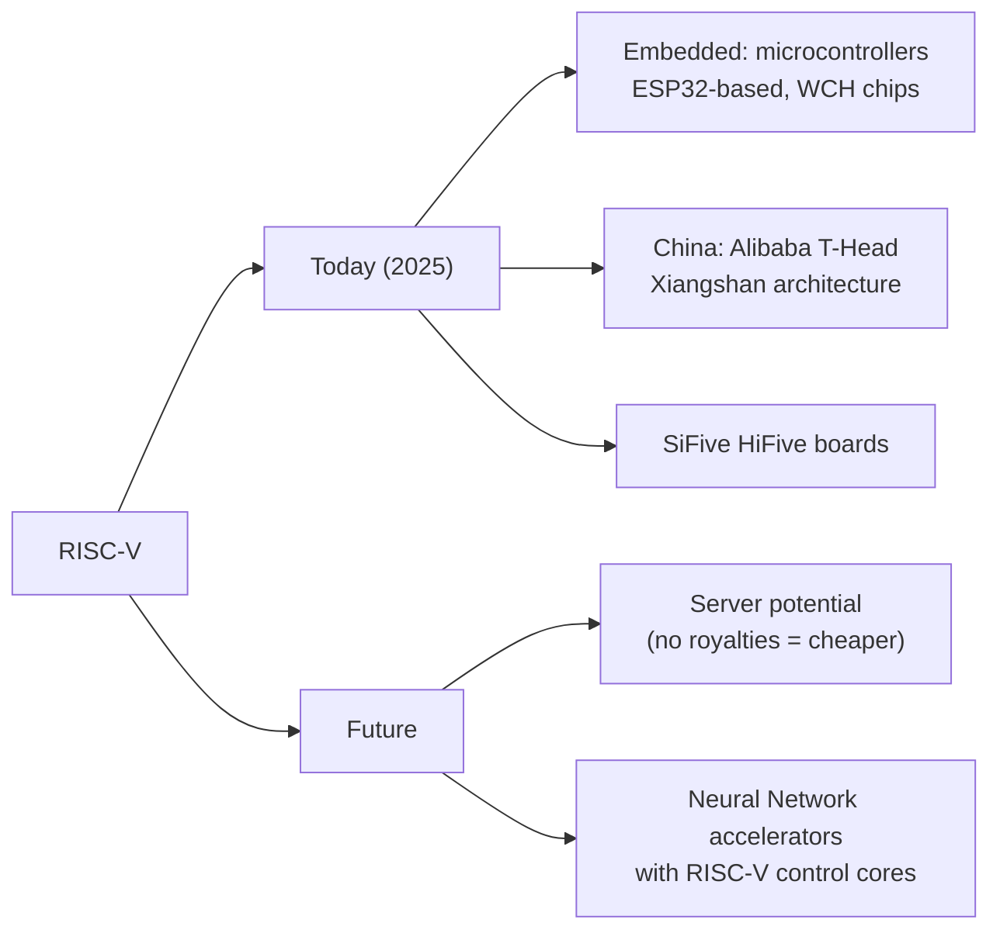

# Chapter 02: CPUs — Intel, AMD, and the ARM Revolution

## What Is a CPU?

The **CPU (Central Processing Unit)** is the "brain" of a computer. Unlike a GPU's thousands of simple cores, a CPU has fewer but far more powerful cores — each capable of handling complex, branching logic quickly. It runs your operating system, applications, and coordinates all other hardware.

---

## Two Instruction Sets: x86 vs ARM

Almost every CPU in the world uses one of two instruction set architectures (ISAs). This is the "language" the hardware speaks:

### CISC vs RISC: The Key Difference

| Aspect | CISC (x86) | RISC (ARM) |
|--------|-----------|-----------|
| Instructions | Complex, variable-length | Simple, fixed-length |
| Power consumption | Higher | Lower |
| Performance/watt | Lower | Higher |
| Compatibility | Windows/Linux ecosystem | Mobile + growing PC |
| Backwards compat | 40+ years (from 8086!) | Newer, less legacy |

> **Why does backwards compatibility matter?** x86 software written in 1990 can still run on a modern Intel Core. That's a massive ecosystem lock-in. But it also means Intel carries 40 years of complexity "baggage" in every chip.

---

## Intel

Intel was the dominant CPU maker for decades, fabricating its own chips (IDM model).

### Product Lines

### Intel's Architecture Strategy: Hybrid Cores

Since **Alder Lake (12th Gen, 2021)**, Intel uses a hybrid design with two types of cores:

### Intel's Struggles (2015–2023)

Intel fell behind in process technology:
- **2015**: Intel announces 10nm, repeatedly delays
- **2019**: AMD releases 7nm Ryzen 3000, outperforms Intel
- **2021**: Intel finally ships 10nm (renamed "Intel 7"), competitive again
- **2022**: Intel launches 10nm "Intel 7" 12th Gen — competitive
- **2024**: Intel 3 (Intel 4 process, confusing naming) — Intel Gaudi 3, Lunar Lake
- **Problem**: Intel's own foundry is still catching up to TSMC's 3nm

---

## AMD

AMD went fabless in 2009, spinning off its fabs into what became **GlobalFoundries**. This was risky — but it freed AMD to use TSMC's leading-edge nodes.

### AMD's Chiplet Revolution

AMD's biggest strategic innovation was the **chiplet architecture** (2017+). Instead of making one giant die, they split the chip into smaller "chiplets" and link them together:

**Why chiplets are clever:**
- Smaller dies have higher yield (fewer defects per die)
- Can use different manufacturing nodes for different parts
- Mix and match: 4 CCDs = 64-core EPYC server chip; 1 CCD = 8-core desktop chip
- Same CCD design across product families — economics of scale

### AMD Product Lines

### AMD vs Intel CPU Comparison

| Area | AMD Ryzen 9000 | Intel Core Ultra 200 |
|------|----------------|----------------------|
| Manufacturing | 4nm TSMC | Intel 3 / TSMC N3 |
| Architecture | Zen 5 | Lion Cove + Skymont |
| Top cores | 16 (desktop) | 24 (8P + 16E) |
| Gaming | Excellent | Excellent |
| Multi-thread | Excellent | Excellent |
| Power efficiency | Better at load | Better at idle |
| Platform | AM5 socket | LGA1851 socket |
| Server | EPYC (market leader) | Xeon (declining share) |

---

## ARM: The Silent Winner

ARM Holdings (now owned by SoftBank, ~90% IPO'd in 2023) **does not make chips**. They design CPU core IP and license it to everyone else.

### Apple Silicon: The Gold Standard

Apple's M-series chips show what's possible when you control hardware + software + OS:

**Unified Memory Architecture (UMA)** — Apple's key innovation:
- CPU and GPU share the **same physical memory pool**
- No copying data between CPU RAM and GPU VRAM — zero copy overhead
- Memory bandwidth is incredibly high (~400 GB/s on M4 Max)
- This is why Apple Macs punch above their weight for AI inference

---

## Server CPUs: AMD EPYC Dominates

In data centers, AMD's EPYC has taken massive market share from Intel Xeon:

### Why EPYC Wins in Data Centers

- **More cores**: EPYC Genoa = 96 cores. Intel Xeon = 60 max (lower-end competition)
- **More memory bandwidth**: 12-channel DDR5 vs Intel's 8-channel
- **More PCIe lanes**: 128 PCIe 5.0 lanes (more GPUs/NVMe)
- **Lower price**: Often 20-40% cheaper for equivalent performance
- **Chiplets work perfectly here**: Servers don't have the same frequency demands as gaming

---

## Instruction Set Architecture Future: RISC-V

RISC-V is an **open-source ISA** — anyone can build a chip using it without paying royalties. It's growing fast in embedded systems, and China is investing heavily in it to reduce ARM dependence.

---

## Summary

| Dimension | Intel | AMD | ARM |
|-----------|-------|-----|-----|
| x86 compatibility | Yes | Yes | No |
| Market: Consumer | Competitive | Leading | Growing (laptops) |
| Market: Server | ~66% share | ~34% share | ~5% (Graviton, etc) |
| Market: Mobile | Irrelevant | Irrelevant | **Dominant (99%)** |
| Manufacturing | Own fabs (Intel 3/4/7) | TSMC 3/4nm | Via licensees |
| Efficiency | Moderate | High | Highest |
| GPU integration | Intel Arc (discrete) | RDNA in APUs | Apple: best iGPU |

---

## Next: [Chapter 03 — Memory (Micron, SanDisk)](./Chapter_03_Memory_Micron_SanDisk.md)
