# Chapter 03: Memory — DRAM, NAND Flash, Micron & SanDisk

## The Memory Hierarchy

Modern computers use several different types of memory arranged in a hierarchy. Speed goes up as you get closer to the CPU; capacity goes up as you move further away.

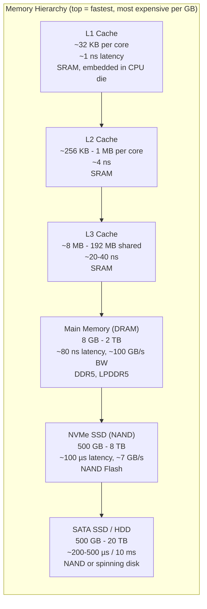

There are two fundamentally different memory technologies: **DRAM** and **NAND Flash**.

---

## DRAM: Dynamic RAM

**DRAM** is your computer's main working memory. Every program you run lives here while running.

### How DRAM Works

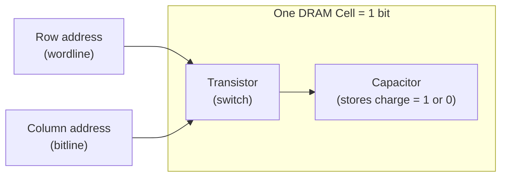

- **1 transistor + 1 capacitor per bit** — very dense, very cheap
- **Dynamic** = the capacitor slowly loses charge. Must be **refreshed** thousands of times per second (this is why DRAM consumes power even when idle)
- Much **denser** than SRAM (cache) but much **slower** to access
- **Volatile** = loses data when power is cut

### DRAM Generations

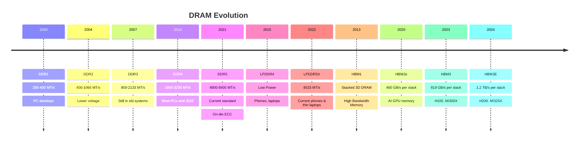

### HBM: High Bandwidth Memory (The AI Memory)

This is critical for AI chips. Instead of GDDR memory sitting on a separate chip connected by a bus, HBM **stacks memory dies vertically** right next to the GPU:

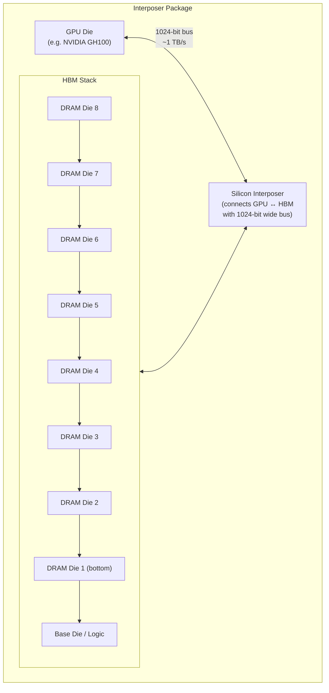

HBM delivers **10-15x more bandwidth** than GDDR at similar power consumption — essential for AI training where GPUs are constantly hungry for data.

---

## Micron Technology

**Founded**: 1978, Boise, Idaho  
**Type**: IDM (makes both DRAM and NAND Flash)  
**Revenue**: ~$30B (FY2024)  
**Headquarters**: Boise, Idaho, USA

Micron is the **only major US-based memory manufacturer**. The other two dominant DRAM makers (Samsung, SK Hynix) are Korean.

### Micron's Product Portfolio

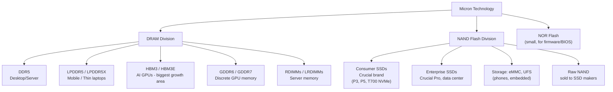

### Crucial — Micron's Consumer Brand

When you buy a **Crucial** RAM kit or SSD at Best Buy, that's Micron. Crucial is Micron's consumer-facing brand.

| Product | Type | Example |
|---------|------|---------|
| Crucial T700 | NVMe PCIe 5.0 SSD | Up to 7.4 GB/s read |
| Crucial P3 Plus | NVMe PCIe 4.0 SSD | Budget option |
| Crucial Pro DDR5 | DDR5 DRAM | Up to DDR5-6000 |
| Crucial Pro DDR4 | DDR4 DRAM | Legacy systems |

### Micron's HBM Business (Strategic)

Micron's HBM is critical to the AI boom. NVIDIA H200 and GB200 use HBM3E, and Micron is one of only three suppliers:

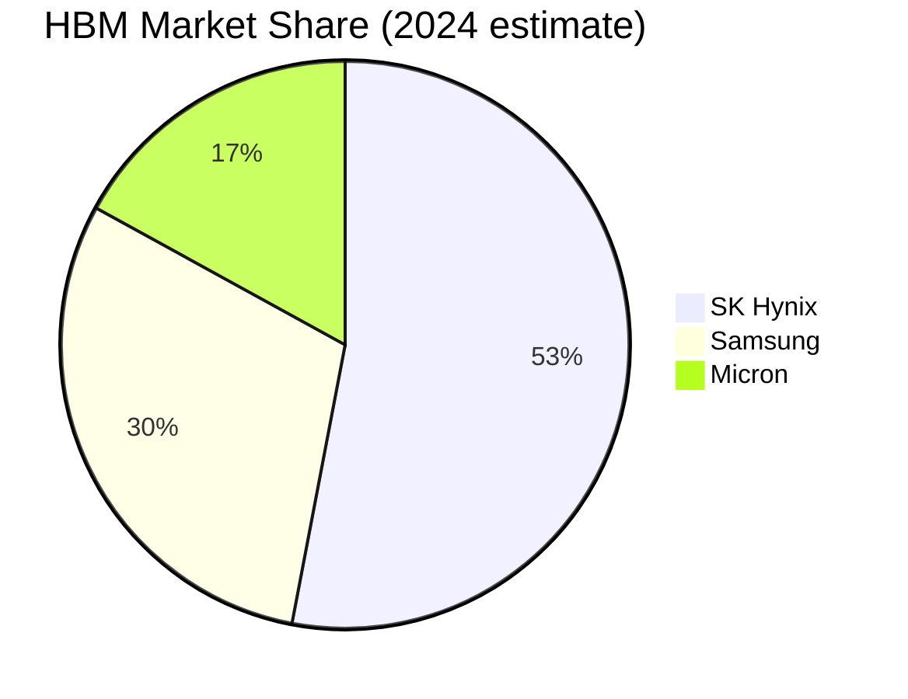

Micron is **ramping up HBM production aggressively** — it's their highest-margin product.

### The Memory Oligopoly

DRAM is controlled by 3 companies. This is intentional — the capital required to build a DRAM fab is so extreme that new entrants can't compete:

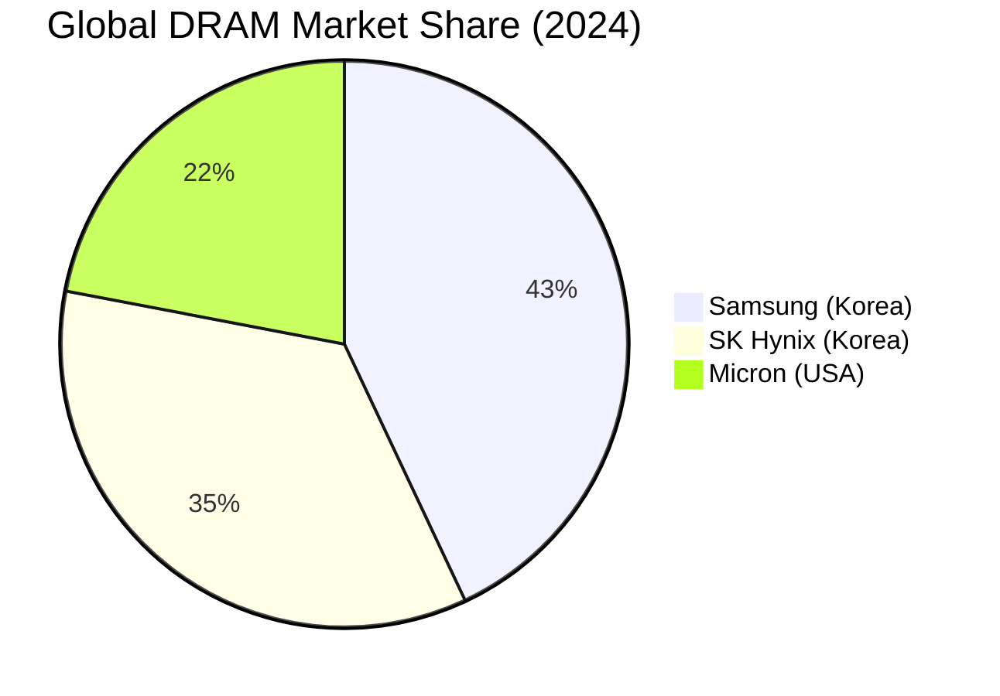

> **Geopolitical note**: If tensions with Korea escalated, the US and much of the world would face a severe DRAM shortage. This is why the US CHIPS Act (2022) invested heavily to encourage Micron to build fabs in New York ($100B+ planned over 20 years).

---

## NAND Flash: Non-Volatile Storage

Unlike DRAM, **NAND Flash retains data without power**. This is what's inside every SSD, phone, USB drive, and SD card.

### How NAND Works

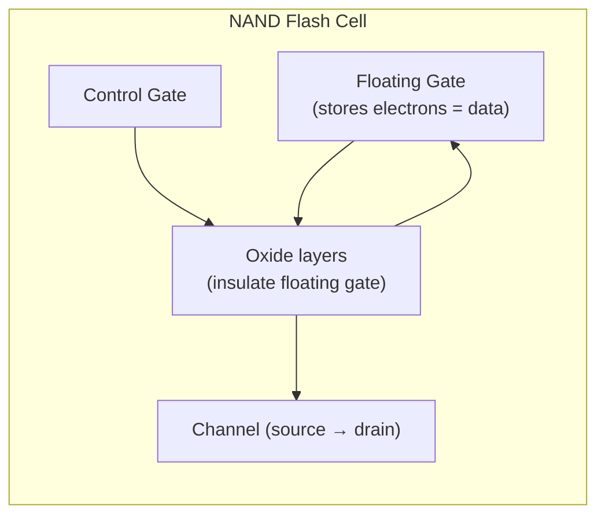

- Electrons are trapped in the floating gate by tunneling through oxide
- **No mechanical parts** — purely electronic (unlike HDDs)
- **Slow to erase** (must erase a full block before writing)
- **Wears out** over time (program/erase cycles)
- **Cheaper per GB than DRAM** — but much slower

### NAND Cell Types: Bits Per Cell

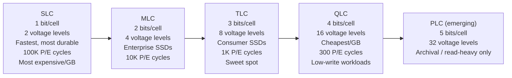

**Most consumer SSDs today use TLC**. The SSD controller compensates for TLC's limitations using:
- **SLC cache**: a fast buffer zone using TLC cells in SLC mode
- **Error correction (ECC)**: fixes bit errors
- **Wear leveling**: spreads writes across the entire drive

### 3D NAND: Stacking Layers

Scaling 2D NAND hit limits around 2015. The solution: **stack layers vertically** (like a skyscraper):

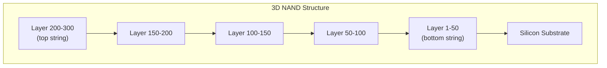

| Year | Technology | Layers |
|------|-----------|--------|
| 2015 | First 3D NAND | 24-32 layers |
| 2019 | 3rd gen | 64-96 layers |
| 2022 | 5th gen | 176-232 layers |
| 2024 | 7th gen | 232-300+ layers |
| 2025+ | Next gen | 400+ layers (emerging) |

More layers = more storage per unit area = cheaper GB.

---

## SanDisk: The Flash Pioneer

**Founded**: 1988, Sunnyvale, California  
**Founders**: Eli Harari (inventor of flash memory cell), Sanjay Mehrotra, Jack Yuan  
**Acquired by**: Western Digital (WD) in 2016 for $19B  
**Status**: Being spun out as independent company again (2024–2025)

SanDisk didn't just use flash memory — they **invented the commercial NAND flash storage industry**.

### SanDisk's History

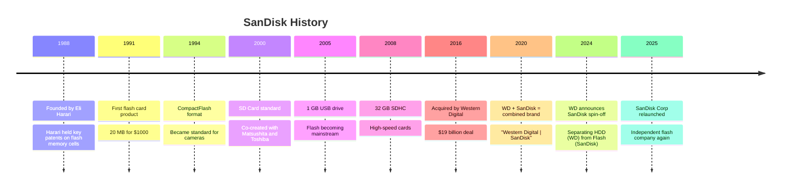

### SanDisk / WD NAND Operations

SanDisk/WD doesn't own its NAND fabs outright — it operates a joint venture with **Kioxia** (formerly Toshiba Memory):

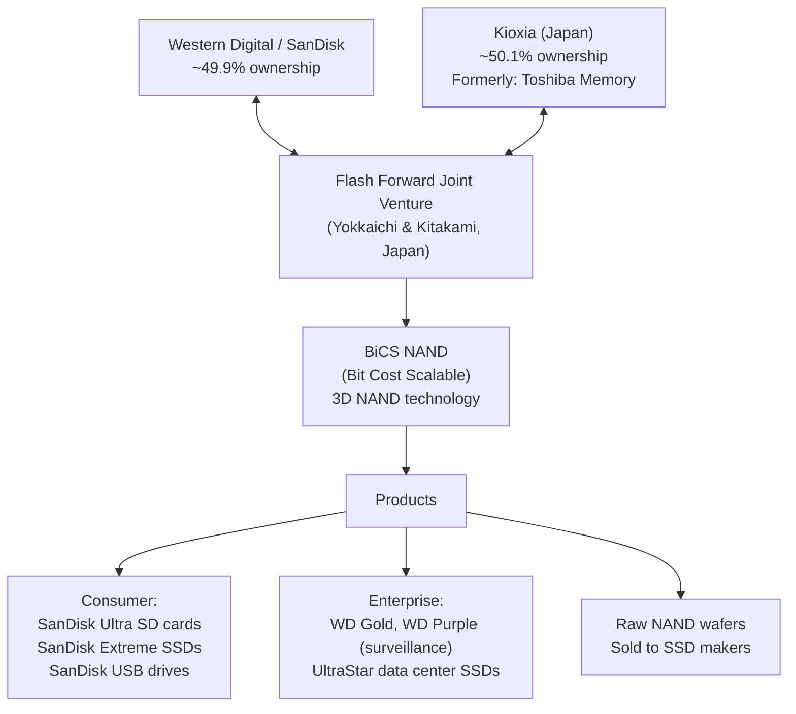

### SanDisk's NAND Technology: BiCS

SanDisk/Kioxia pioneered **BiCS (Bit Cost Scalable)** — their version of 3D NAND:

| Generation | Layers | Year | Key Feature |
|-----------|--------|------|-------------|
| BiCS 1 | 48 | 2015 | First 3D NAND |
| BiCS 3 | 64 | 2017 | TLC mainstream |
| BiCS 5 | 112 | 2020 | QLC viable |
| BiCS 6 | 162 | 2022 | Higher density |
| BiCS 8 | 218+ | 2024 | Current gen |

### SanDisk Consumer Products

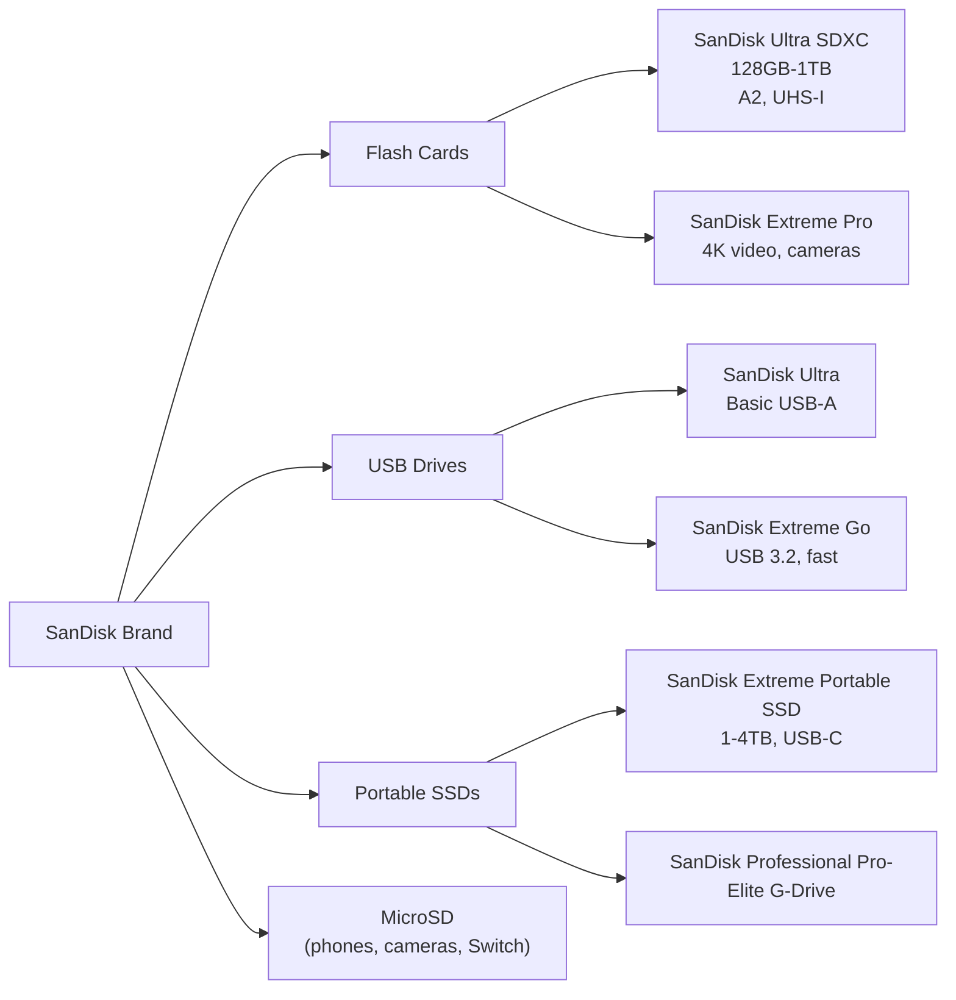

---

## NAND Market: The Other Oligopoly

Like DRAM, NAND is controlled by just a few companies:

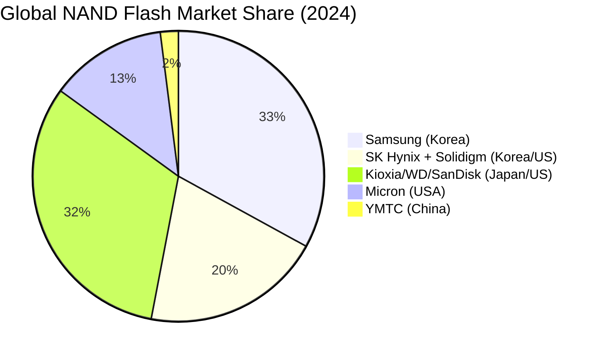

> **China's YMTC**: China's Yangtze Memory Technologies is aggressively building NAND capacity. They were added to the US Entity List in 2023, blocking them from buying US equipment and being used in US products. This is a major geopolitical flashpoint.

---

## Memory vs Storage: Quick Reference

| | DRAM (Main Memory) | NAND Flash (SSD) |
|-|--------------------|------------------|
| **Volatile?** | Yes (loses data on power off) | No (retains data) |
| **Speed (read)** | ~50 GB/s (DDR5) | ~7 GB/s (NVMe Gen5) |
| **Latency** | ~80 ns | ~100 µs (1000x slower) |
| **Cost/GB** | ~$3-5/GB | ~$0.05-0.10/GB |
| **Durability** | Effectively unlimited | Limited P/E cycles |
| **Use** | Running programs | Storing files |
| **Key makers** | Samsung, SK Hynix, Micron | Samsung, Kioxia/WD, Micron, SK Hynix |

---

## Next: [Chapter 04 — NVIDIA's Ecosystem](./Chapter_04_NVIDIA_Ecosystem.md) | [Chapter 07 — Storage Deep Dive](./Chapter_07_Storage_Deep_Dive.md)
