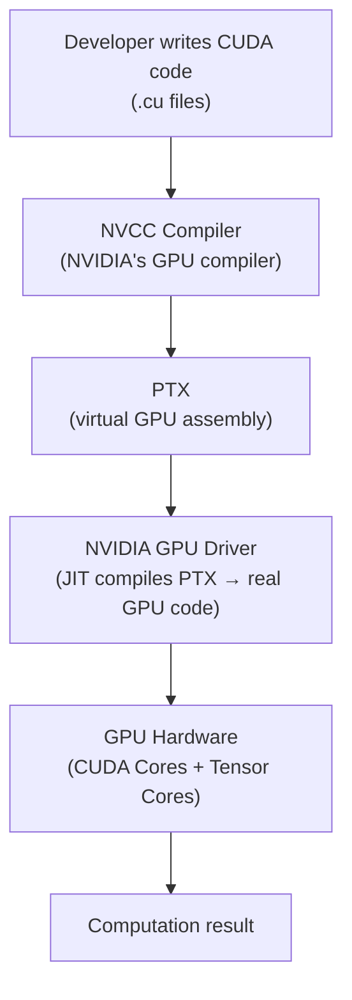
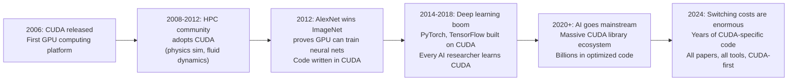
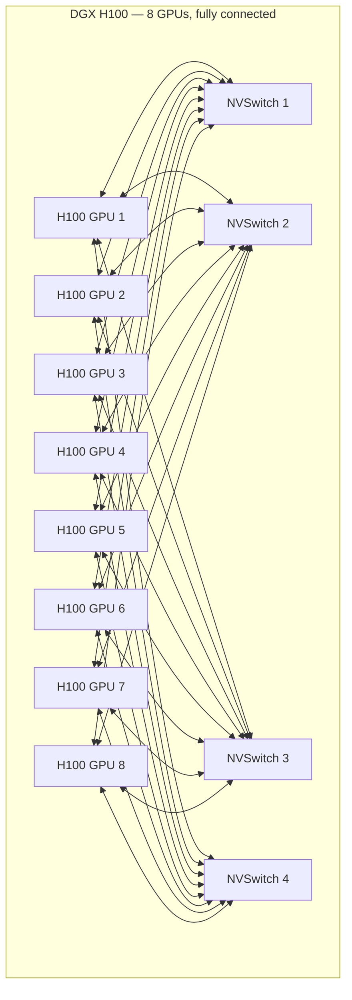
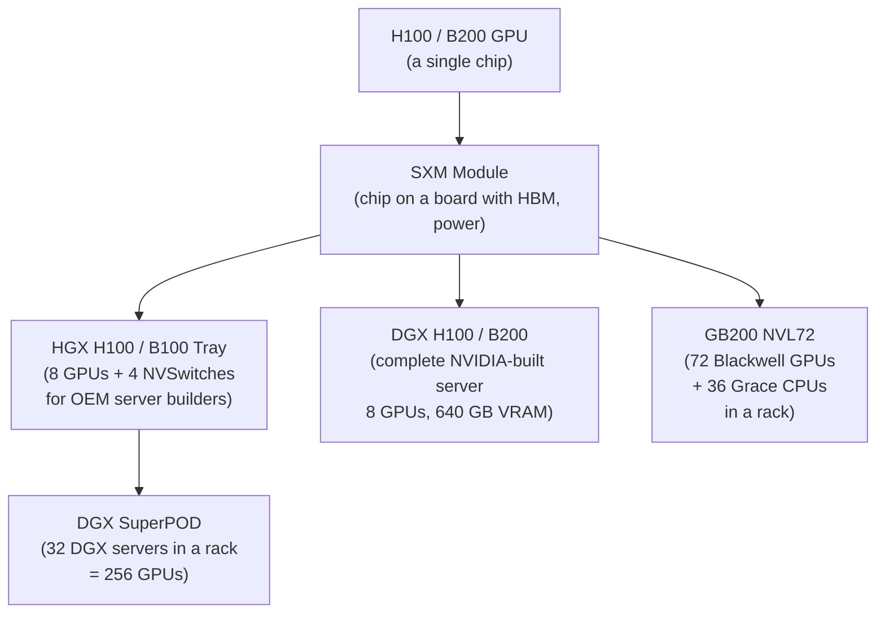
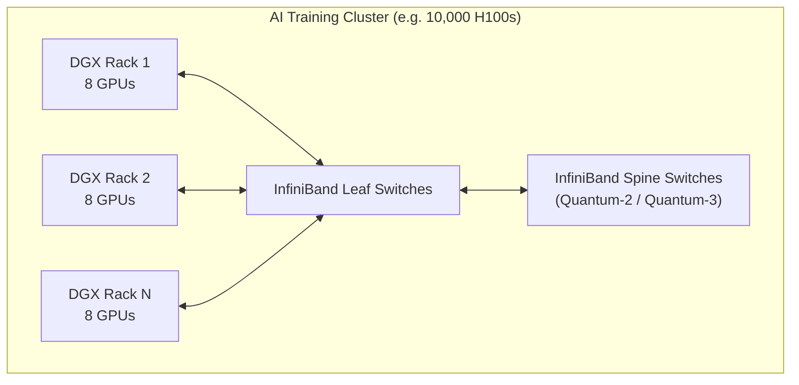
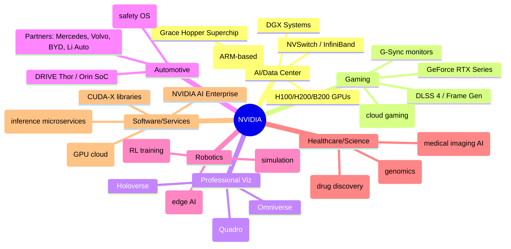
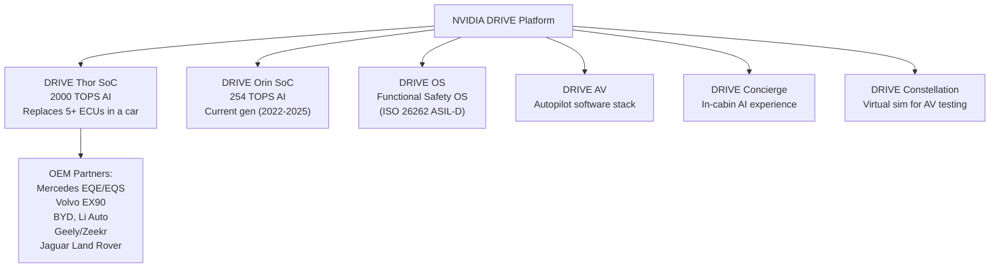
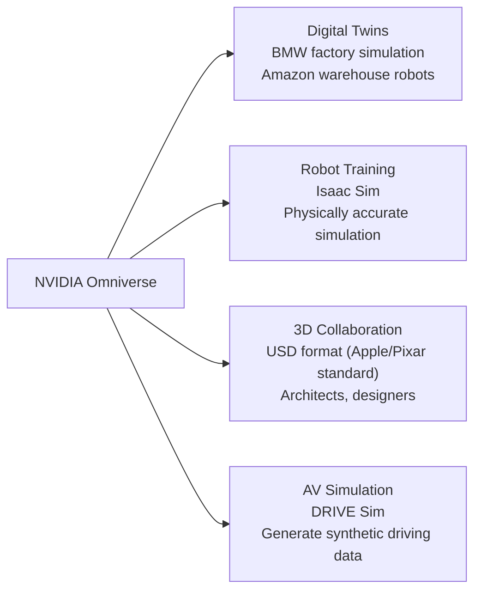
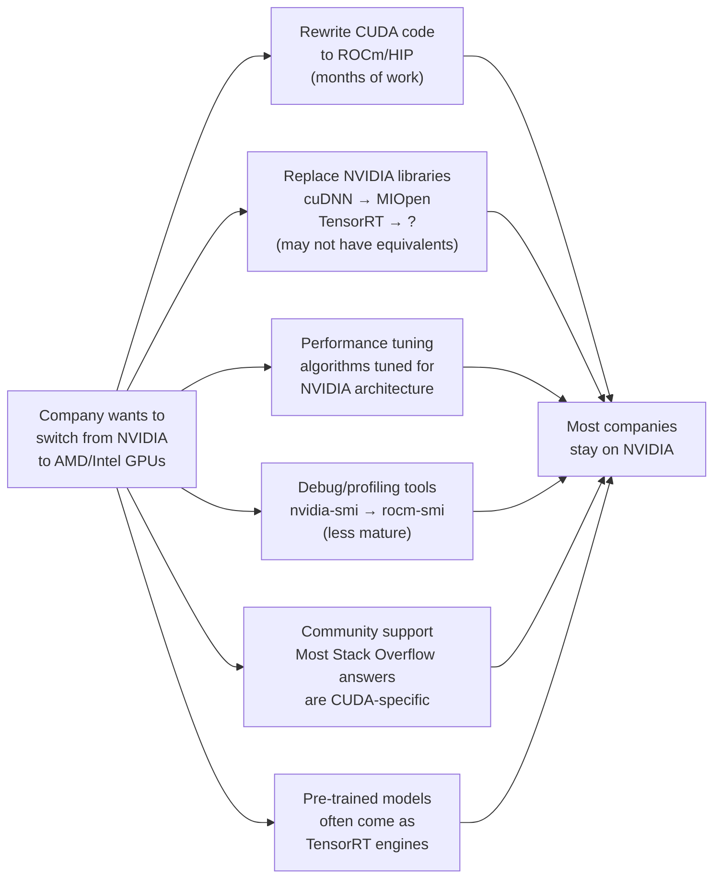

# Chapter 04: The NVIDIA Ecosystem — The Widest Moat in Tech

## Why NVIDIA Is More Than Just a Chip Company

NVIDIA's market cap hit $3.3 trillion in 2024, briefly making it the most valuable company in the world. That's not just because their GPUs are fast — AMD makes fast GPUs too. NVIDIA's power comes from a software ecosystem built over 20+ years that makes their hardware uniquely sticky.

> "CUDA is the Windows of AI computing." — common industry observation

---

## CUDA: The Foundation

**CUDA** (Compute Unified Device Architecture) was released in **2006** — 18 years before the AI boom it enabled. It lets developers write programs that run on NVIDIA GPUs using a C++ dialect.

Before CUDA, GPUs could only do graphics. CUDA opened them up for general computation.

### Why CUDA Is a Moat

---

## The Full Software Stack

NVIDIA's software stack has many layers, each adding value:

```mermaid
flowchart TD
    subgraph Apps["Applications"]
        ChatGPT["Large Language Models\nGPT-4, Llama, Gemini"]
        Research["Research\nStable Diffusion, Sora"]
        Gaming["Games\nDLSS, RTX rendering"]
        HPC["HPC\nMolecular dynamics, CFD"]
    end

    subgraph Frameworks["AI Frameworks"]
        PyTorch["PyTorch"]
        TF["TensorFlow"]
        JAX["JAX"]
        MXNet["MXNet"]
    end

    subgraph NVIDIA_Libs["NVIDIA Libraries"]
        cuDNN["cuDNN\nNeural network primitives\n(convolutions, activations, attention)"]
        cuBLAS["cuBLAS\nLinear algebra\n(matrix multiply = heart of AI)"]
        NCCL["NCCL\nMulti-GPU communication\n(AllReduce, scatter, gather)"]
        TensorRT["TensorRT\nInference optimizer\n(quantization, fusion, pruning)"]
        Triton["Triton\nPython kernel language\n(write GPU kernels easily)"]
        CUTLASS["CUTLASS\nHigh-perf matrix templates"]
        cuFFT["cuFFT / cuSPARSE\nSignal processing, sparse math"]
    end

    subgraph CUDA_Core["CUDA Platform"]
        CUDA_Runtime["CUDA Runtime API"]
        CUDA_Driver["CUDA Driver API"]
        PTX2["PTX / SASS\n(GPU assembly)"]
    end

    subgraph HW["Hardware"]
        SM2["Streaming Multiprocessors"]
        TC2["Tensor Cores"]
        RT2["RT Cores"]
        NVLink2["NVLink / NVSwitch"]
        HBM2["HBM3 Memory"]
    end

    Apps --> Frameworks
    Frameworks --> NVIDIA_Libs
    NVIDIA_Libs --> CUDA_Core
    CUDA_Core --> HW
```

---

## Multi-GPU: NVLink and NVSwitch

Training large AI models requires many GPUs working together. NVIDIA's interconnect technology is a major differentiator:

### NVLink

NVLink is NVIDIA's proprietary GPU-to-GPU interconnect — much faster than PCIe:

| Interconnect | Bandwidth (bidirectional) | Latency |
|-------------|--------------------------|---------|
| PCIe 4.0 x16 | 64 GB/s | ~µs |
| PCIe 5.0 x16 | 128 GB/s | ~µs |
| NVLink 4.0 (H100) | 900 GB/s | ~ns |

### NVSwitch: All-to-All GPU Communication

A single NVSwitch chip connects up to 8 GPUs in a fully connected mesh:

Result: each GPU can communicate with every other GPU at full 900 GB/s NVLink bandwidth — no bottleneck.

---

## The DGX / HGX / GB200 System Hierarchy

NVIDIA builds and sells complete AI computing systems, not just chips:

### GB200 NVL72: The AI Supercomputer in a Rack

The **GB200 NVL72** (2024–2025) is NVIDIA's most ambitious product:

| Spec | Value |
|------|-------|
| GPUs | 72x Blackwell B200 |
| CPUs | 36x NVIDIA Grace (ARM) |
| Total HBM3E memory | 13.5 TB |
| NVLink bandwidth | 1.8 TB/s per GPU |
| AI compute (FP8) | 1,440 PFLOPS |
| Power consumption | ~120 kW per rack |
| Price | ~$10M+ per rack |

---

## Networking: The Mellanox Acquisition

In 2020, NVIDIA acquired **Mellanox** (Israeli networking company) for $6.9B. This was strategic genius.

**InfiniBand** (Mellanox's technology) is the networking fabric used to connect thousands of GPUs across a data center:

InfiniBand provides:
- **3.2 Tb/s** per port bandwidth (Quantum-3, 2024)
- **~100 ns** latency (critical for gradient synchronization in training)
- RDMA (Remote Direct Memory Access) — GPU reads another GPU's memory directly, bypassing CPU

Without fast networking, scaling from 8 GPUs to 10,000 GPUs is impossible.

---

## NVIDIA's Non-GPU Businesses

NVIDIA is increasingly more than a GPU company:

---

## NVIDIA DRIVE: Automotive

NVIDIA is the leading chip supplier for **autonomous vehicles and advanced driver assistance systems (ADAS)**:

---

## NVIDIA Omniverse: The Industrial Metaverse

**Omniverse** is NVIDIA's platform for building physically accurate 3D simulations — used for digital twins of factories, training robot AI, and collaborative 3D design:

---

## Why Switching Away From NVIDIA Is Hard

This switching cost is NVIDIA's true moat. AMD makes great hardware but breaking the CUDA dependency is a multi-year project.

---

## The Companies Trying to Break NVIDIA's Monopoly

| Challenger | Approach | Status |
|-----------|---------|--------|
| AMD ROCm | CUDA-compatible API, catch-up strategy | ~2-3 years behind, growing |
| Intel Gaudi 3 | Alternative AI accelerator | Limited adoption |
| Google TPU | Custom AI chip, TensorFlow/JAX native | Internal + GCP only |
| AWS Trainium/Inferentia | Amazon's own AI chips | AWS customers only |
| Groq | Deterministic LPU architecture | Inference-only, niche |
| Cerebras | Wafer-scale chip | Very large models only |
| SambaNova | Reconfigurable dataflow | Enterprise niche |

None have successfully broken NVIDIA's dominance as of 2025, but AMD is the most credible alternative.

---

## Next: [Chapter 05 — How Chips Are Made](./Chapter_05_Chip_Manufacturing.md) | [Chapter 06 — The AI Silicon Race](./Chapter_06_AI_Silicon_Race.md)
