# Chapter 05: How Chips Are Made

## Overview

Making a semiconductor chip is arguably the most complex manufacturing process humanity has ever developed. A modern chip fab requires:
- The cleanest rooms on Earth (Class 1: fewer than 1 particle per cubic foot)
- Lasers with wavelengths shorter than visible light
- ~1,000 precise manufacturing steps
- 3+ months per wafer
- $15-20B+ to build the facility

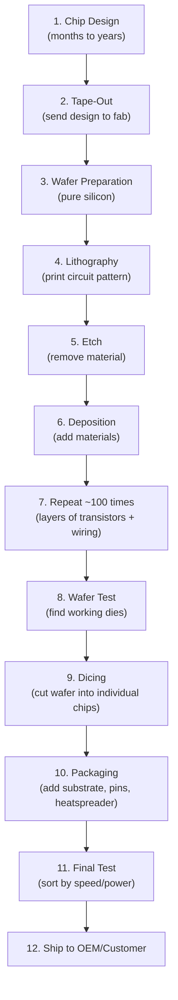

---

## Step 1: Chip Design

Before a single wafer is touched, chip designers spend **2-4 years** designing the chip in software.

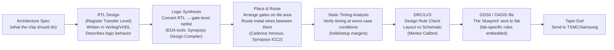

**Key EDA companies**: Synopsys, Cadence, Siemens EDA (Mentor)  
**Key IP companies**: ARM (CPU cores), NVIDIA (used to buy others' IP), Synopsys (standard cells)

---

## Step 2: The Silicon Wafer

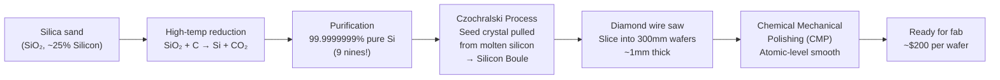

**300mm (12 inch)** wafers are the industry standard for advanced chips. Larger wafer = more chips per wafer = lower cost per chip.

---

## Step 3: Lithography — The Critical Step

**Lithography** (from Greek: "stone writing") is how the circuit pattern is transferred onto the wafer. It's like photography at atomic scale.

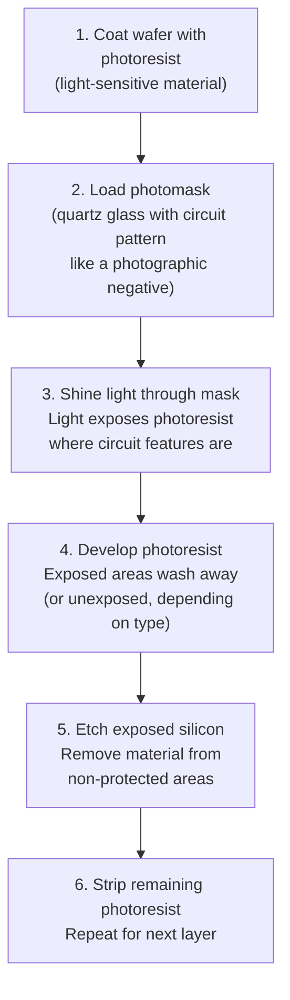

### The Wavelength Problem

To print smaller features, you need shorter wavelength light. Physics limits this:

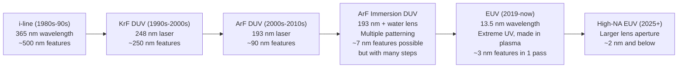

---

## ASML: The Only EUV Machine Maker

**ASML** (Netherlands) is one of the most important companies in the world that most people have never heard of. They make the **only** EUV lithography machines that can manufacture chips at 5nm and below.

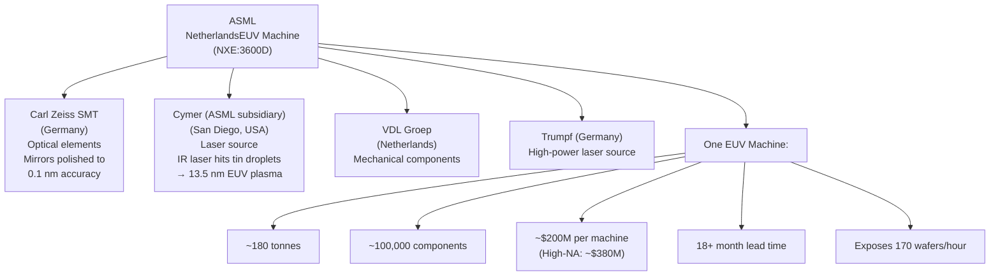

**Why ASML matters geopolitically**: The US, Netherlands, and Japan have restricted ASML from exporting EUV machines to China. Without EUV, China cannot manufacture chips below 7nm at scale. This is the central battlefield in the US-China semiconductor war.

---

## The Major Foundries

A **foundry** is a chip factory that manufactures chips designed by fabless companies:

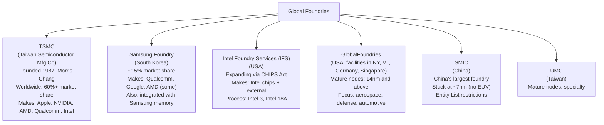

### TSMC: The World's Most Important Factory

TSMC is unique — nearly every advanced chip is made there:

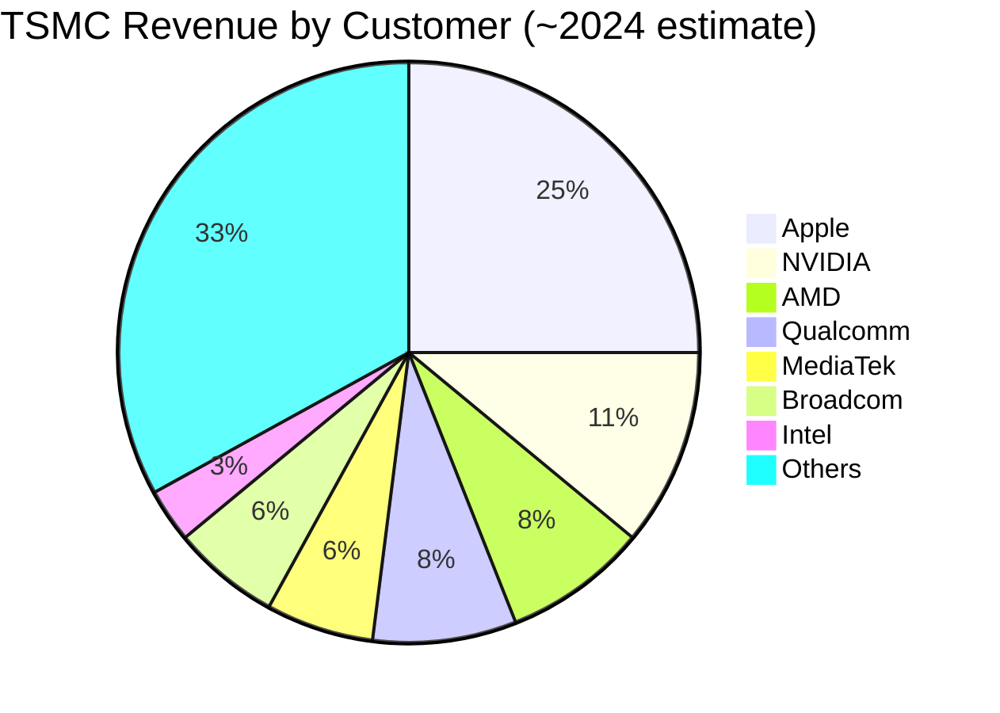

**TSMC's process nodes (as of 2025)**:

| Process | EUV? | Key Customers | Status |
|---------|------|---------------|--------|
| N7 (7nm) | No (DUV multi-pattern) | Older products | Mature |
| N5 (5nm) | Yes | iPhone 14, M3 | High volume |
| N4P (4nm enhanced) | Yes | RTX 4090, Ryzen 7000 | High volume |
| N3E (3nm) | Yes | iPhone 15, M3 | Ramping |
| N2 (2nm) | Yes (HiNA) | iPhone 17+, expected | 2025 |
| A16 (1.6nm) | Yes + BackSide Power | iPhone 18+, expected | 2026 |

---

## The Manufacturing Process in Detail

### Transistor Building: FinFET and Gate-All-Around

Modern transistors are 3D structures, not flat:

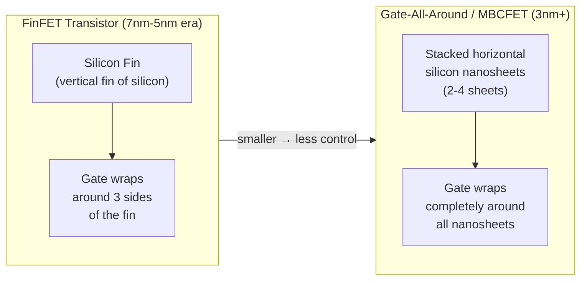

- **FinFET**: Gate wraps 3 sides — better control than flat (planar)
- **GAA/MBCFET (Samsung) / NSFET (TSMC N2)**: Gate wraps all 4 sides — even better control
- Better gate control = lower leakage current = lower power consumption

### Back End of Line (BEOL): Wiring the Chip

After transistors are built, they need to be connected with copper wires (metal layers):

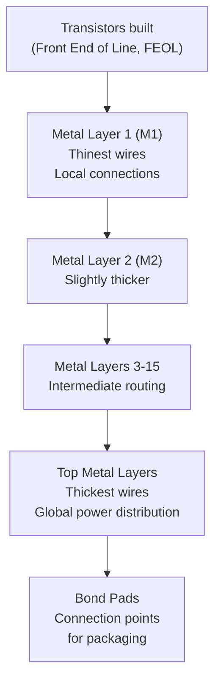

Modern chips have **15+ metal layers** — like a 15-story building where the transistors are the ground floor and each floor is a routing layer.

---

## Advanced Packaging: The New Frontier

As transistor scaling slows, **packaging** is becoming the new battlefield. Instead of putting everything on one die, chipmakers are connecting multiple smaller dies in a package:

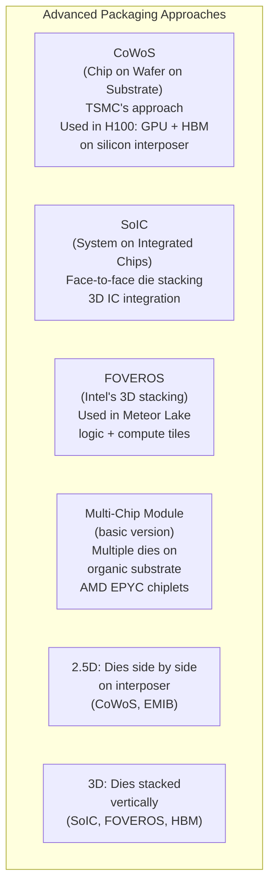

### Why Advanced Packaging Matters

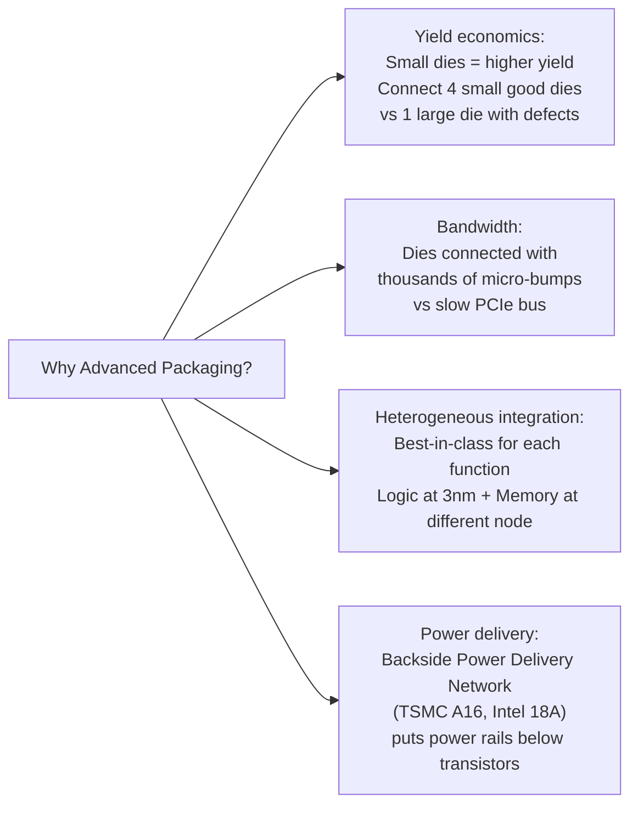

---

## The CHIPS Act: US Manufacturing Revival

The US CHIPS and Science Act (2022) allocated **$52.7 billion** to rebuild US semiconductor manufacturing:

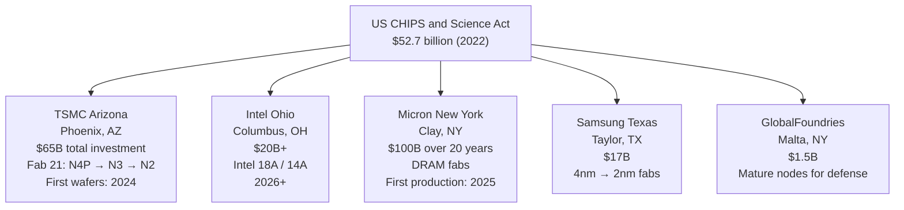

**Why the US is doing this:**
1. National security — 92% of advanced chips made in Taiwan (geopolitical risk)
2. Supply chain resilience — COVID exposed vulnerabilities
3. Economic competition with China
4. Defense applications need domestic supply

---

## Yield: The Economic Reality

**Yield** = percentage of dies on a wafer that pass testing.

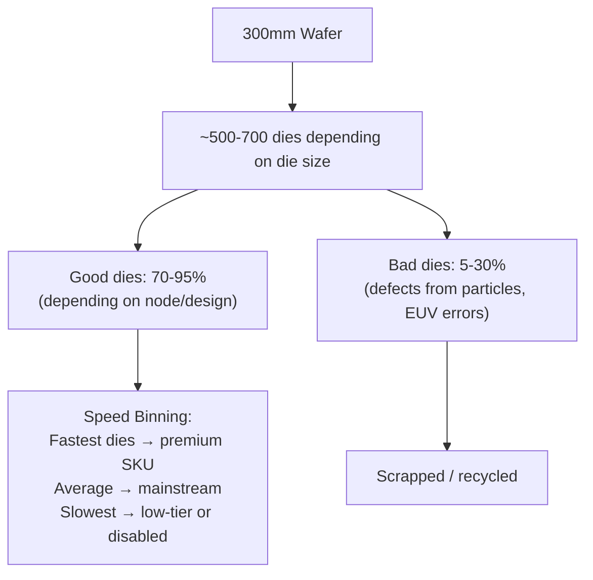

**Example: RTX 4090 die size vs yield**
- AD102 die: 608 mm² at 4nm TSMC
- Larger die = more area exposed to defects = lower yield
- This is why the RTX 4090 is so expensive — large dies are inherently expensive to manufacture
- AMD's chiplets solve this: multiple smaller dies, each with better yield

---

## Next: [Chapter 06 — The AI Silicon Race](./Chapter_06_AI_Silicon_Race.md)
