# Chapter 06: The AI Silicon Race

## Why AI Changed Everything

The launch of ChatGPT in November 2022 triggered the largest demand shock in semiconductor history. Suddenly, every company needed **massive compute** to train and run AI models. NVIDIA's data center revenue went from ~$15B (2022) to ~$90B (2024) in two years.

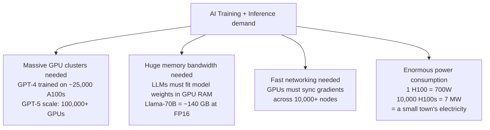

---

## Training vs Inference: Two Different Problems

The AI compute market splits into two distinct workloads with different requirements:

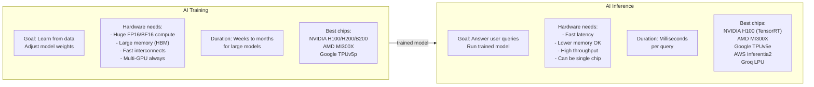

| Dimension | Training | Inference |
|-----------|---------|----------|
| Compute precision | FP16, BF16, FP8 | INT8, INT4, FP8 |
| Memory needed | 80-192 GB per GPU | 16-80 GB (smaller models) |
| Multi-chip required? | Always | Often optional |
| Power per chip | 700W+ | 300-700W |
| Latency requirement | Doesn't matter | Critical (user waiting) |
| Optimization | Throughput | Tokens/second/dollar |

---

## NVIDIA's AI Chips: The Dominant Line

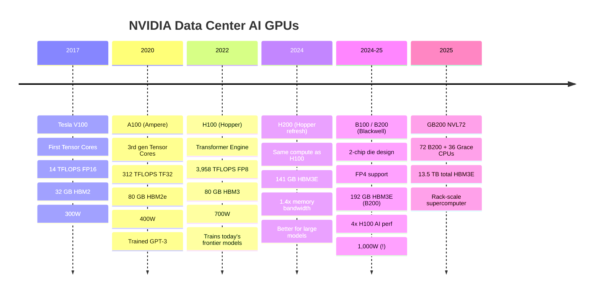

### The Transformer Engine (H100's Key Innovation)

Large Language Models are built on **transformers** (attention mechanisms). The Transformer Engine in Hopper specifically optimizes for this:

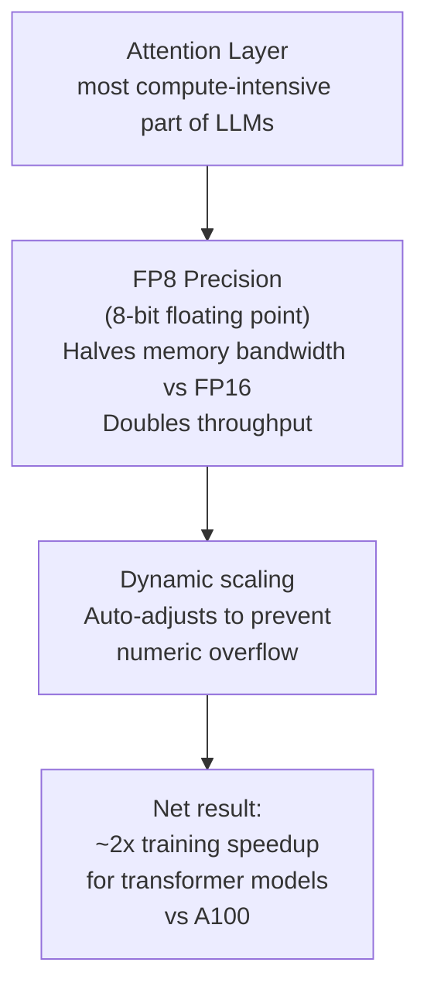

---

## AMD's AI Challenger: MI300X

AMD's Instinct MI300X launched in late 2023 and became the first credible alternative to NVIDIA's H100:

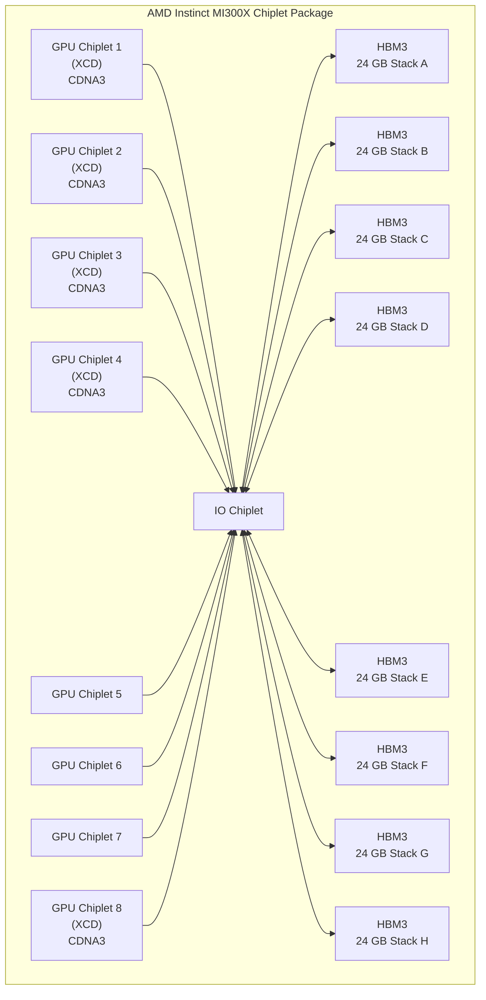

**Result**: 192 GB HBM3 (vs H100's 80 GB) — game-changing for large model inference.

| Spec | NVIDIA H100 SXM | AMD MI300X |
|------|-----------------|-----------|
| Architecture | Hopper (monolithic) | CDNA3 (chiplets) |
| VRAM | 80 GB HBM3 | **192 GB HBM3** |
| Memory BW | 3.35 TB/s | **5.3 TB/s** |
| FP8 TFLOPS | 3,958 | 2,614 |
| TDP | 700W | 750W |
| Price | ~$30-40K | ~$10-15K |
| CUDA compat | Native | Via HIP/ROCm |

**AMD wins**: Large models that barely fit in one GPU (needs 192 GB), or price-sensitive buyers.  
**NVIDIA wins**: Ecosystem, software, training workloads, enterprise support.

---

## Google TPU: Training Giants Without NVIDIA

Google has been making its own AI chips (TPUs) since 2016 to avoid paying NVIDIA:

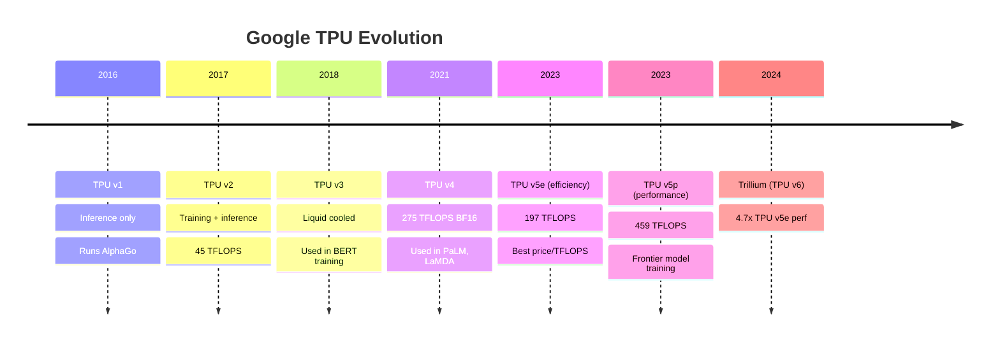

**TPUs are only available on Google Cloud (GCP)** — Google doesn't sell them externally. They're deeply integrated with JAX and TensorFlow.

**How a TPU works differently from a GPU**:

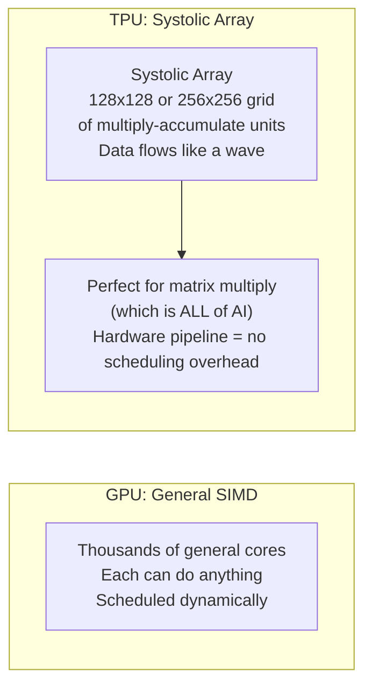

---

## AWS Trainium & Inferentia: Amazon's Chips

Amazon is the world's largest cloud provider. Paying NVIDIA for every GPU operation is expensive. So AWS built its own:

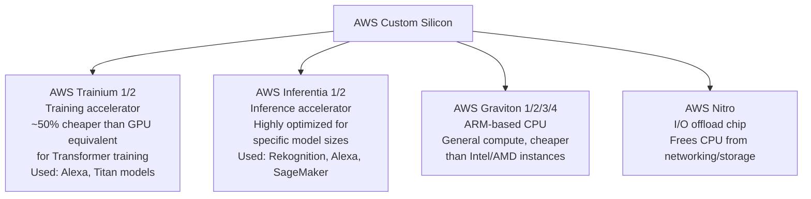

**Trainium vs NVIDIA H100**:
- ~50% cheaper per FLOP at scale for supported models
- But: requires AWS-specific SDK (Neuron SDK), porting existing PyTorch code
- Less flexible than NVIDIA — optimized for specific workloads
- Limited availability: only on AWS (no hardware purchase)

---

## Apple Neural Engine: On-Device AI

Apple's **Neural Engine** is an NPU (Neural Processing Unit) integrated into every Apple chip since A11 (iPhone X, 2017). It's optimized for on-device inference:

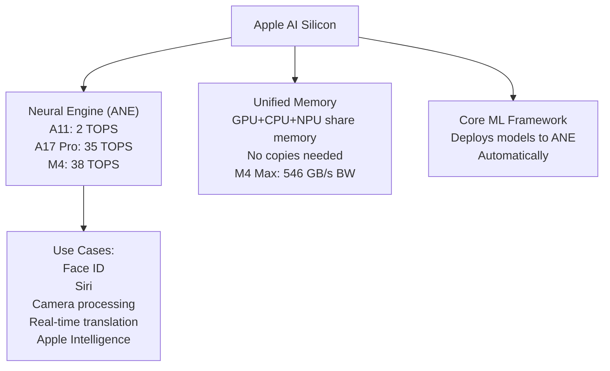

**M4 vs NVIDIA H100 for inference**:
- M4 Ultra: ~38 TOPS NPU + powerful GPU for LLMs
- Can run Llama 70B locally on 192 GB unified memory M4 Ultra
- But: $8,000 Mac Studio vs single H100 performance is orders of magnitude different
- Apple wins for: local/private inference, power efficiency, no internet needed

---

## Groq: The Deterministic LPU

**Groq** (not to be confused with "Grok") has a fundamentally different architecture:

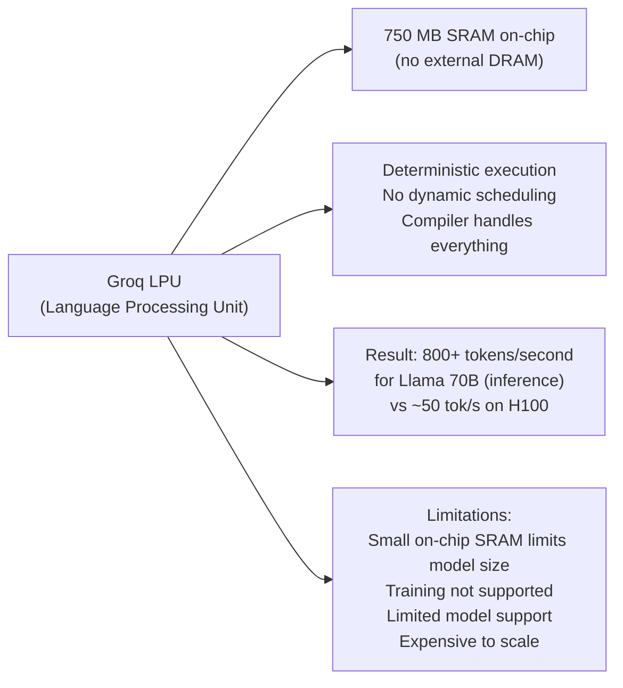

Groq shows that specialized architectures can beat NVIDIA at specific tasks — but the ecosystem problem remains.

---

## The Full AI Chip Landscape

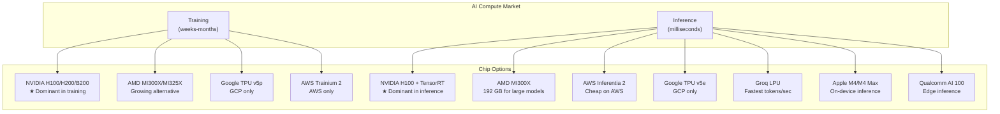

---

## Precision Matters: FP32, FP16, INT8, FP4

AI training uses different numeric formats. Lower precision = faster + cheaper:

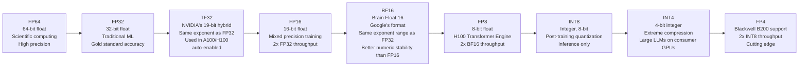

**Mixed precision training** (standard since 2018):
- Store weights in FP32 (precision)
- Compute in FP16/BF16 (speed)
- NVIDIA Tensor Cores are designed for FP16/BF16/FP8 matrix ops

---

## Power: The New Bottleneck

AI data centers are hitting power limits that no chip can solve:

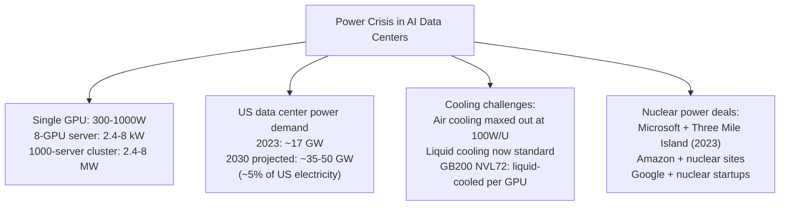

**Efficiency metrics** the industry cares about:
- **TFLOPS/Watt** — compute per watt
- **Tokens/second/$ ** — inference efficiency
- **PUE** (Power Usage Effectiveness) — how efficiently a data center uses power

---

## The Interconnect Problem at Scale

Training GPT-5 class models requires synchronizing gradients across 100,000+ GPUs. Networking is critical:

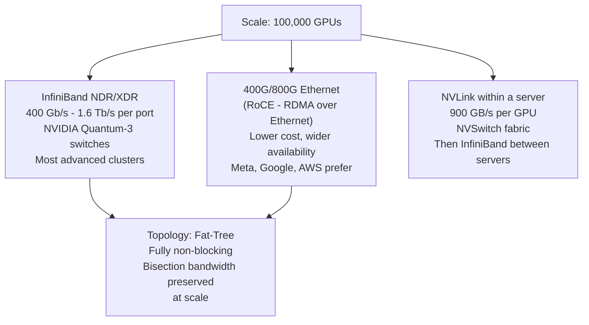

---

## What's Next in AI Silicon

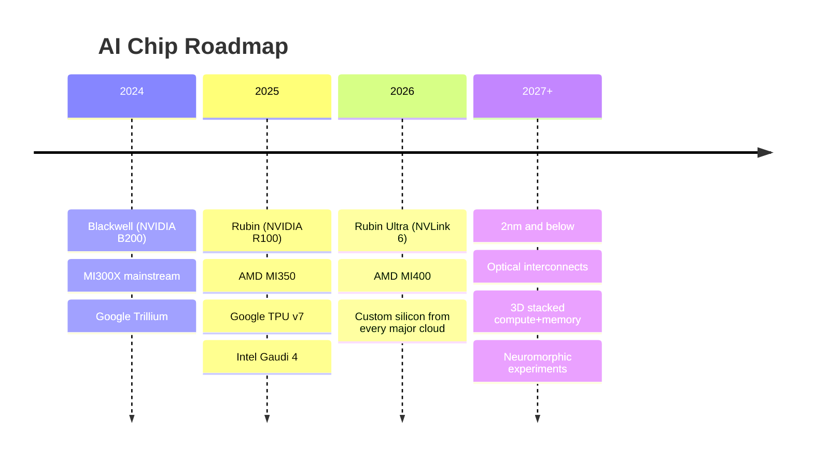

---

## Next: [Chapter 07 — Storage Deep Dive](./Chapter_07_Storage_Deep_Dive.md) | [Back to Chapter 04 — NVIDIA Ecosystem](./Chapter_04_NVIDIA_Ecosystem.md)
