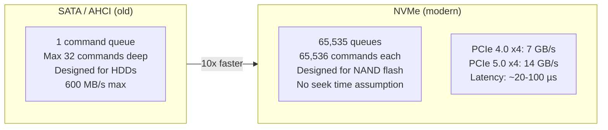
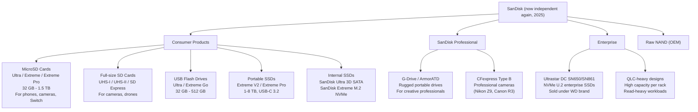
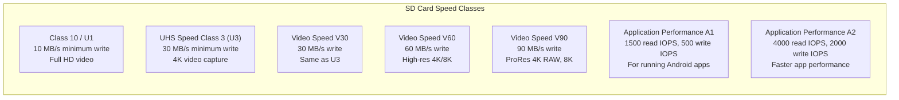
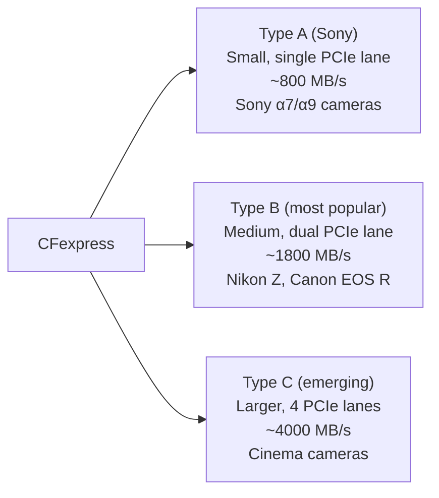
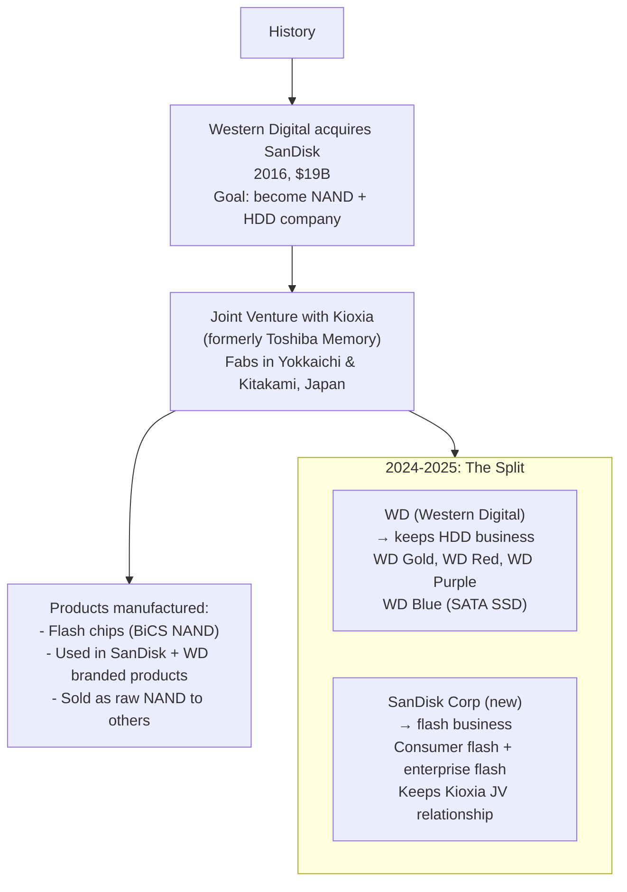
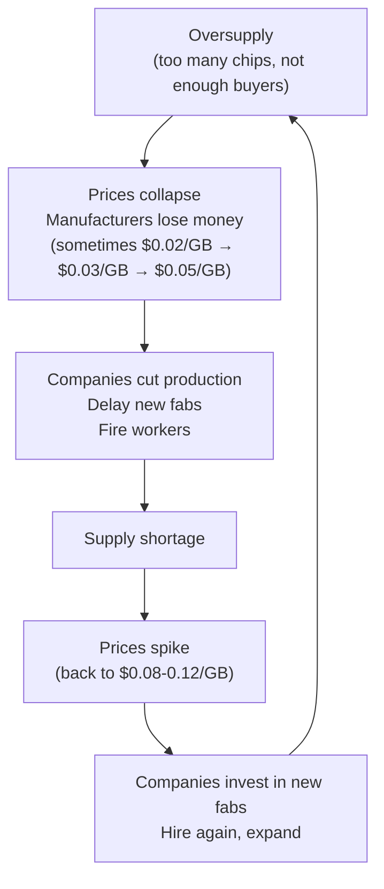
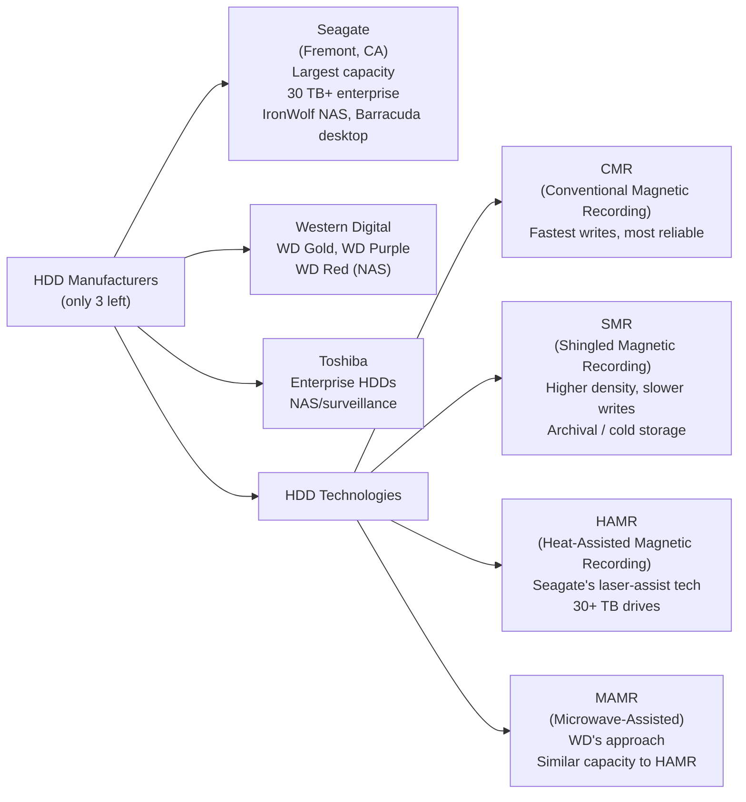
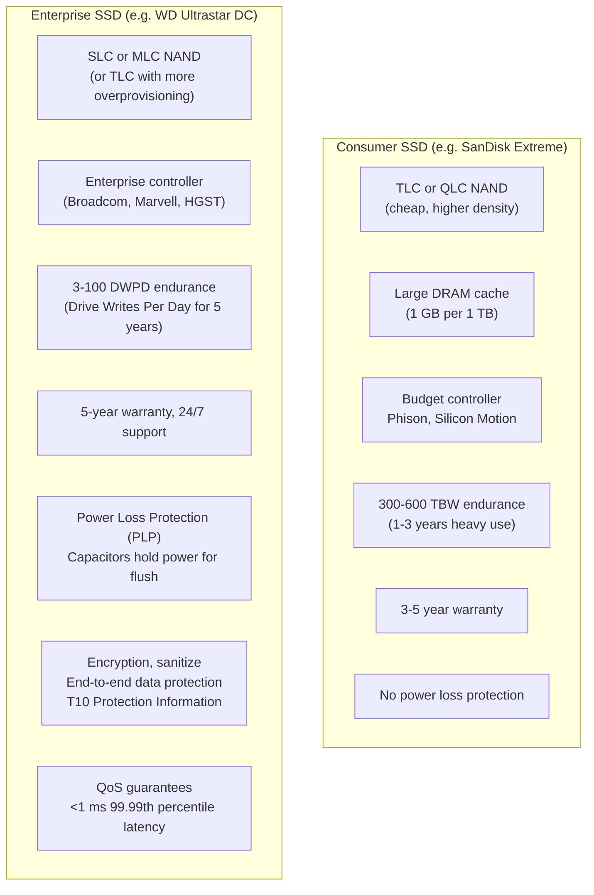
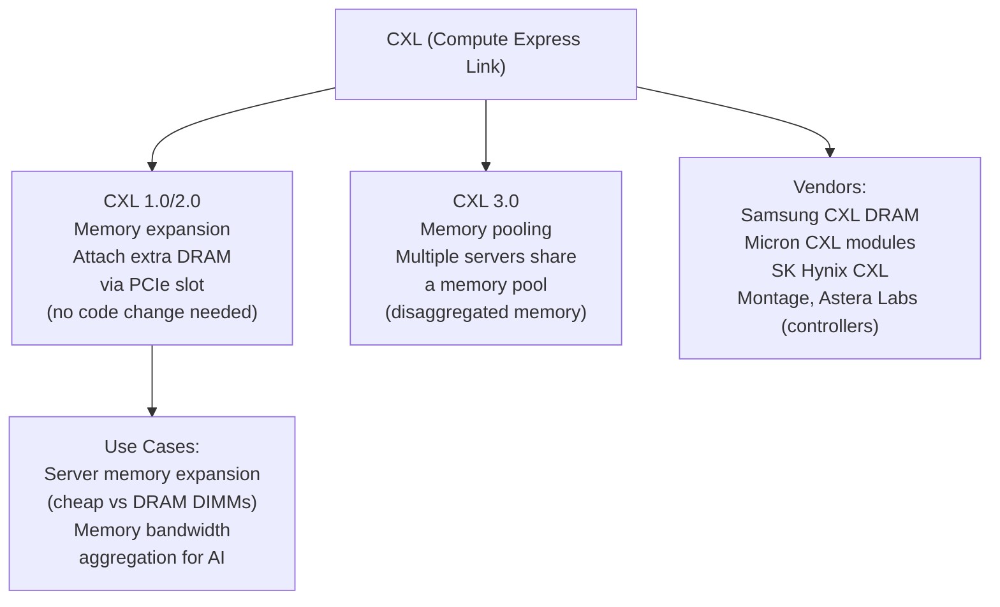
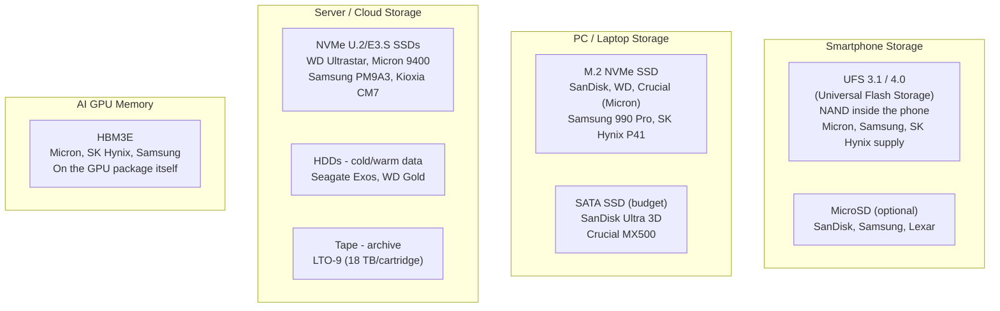

# Chapter 07: Storage — SSDs, NVMe, and the Full Picture

## The Storage Hierarchy Revisited

Storage is where data lives when it's not actively being computed. The key tension is always **speed vs cost vs capacity**:

```mermaid
flowchart TD
    subgraph Hierarchy["Full Storage Hierarchy"]
        CPU_Regs["CPU Registers\n~KB, sub-ns, $$$$$\nInside the CPU"]
        L1L2L3["CPU Cache (SRAM)\n~MB, 1-40 ns, $$$$\nInside the CPU die"]
        DRAM2["DRAM\n8 GB - 2 TB, ~100 ns, $$\nDIMMs/LPDDR modules"]
        NVMe2["NVMe SSD\n512 GB - 16 TB, ~100 µs, $0.10/GB\nM.2/U.2 slots, PCIe"]
        SATA_SSD["SATA SSD\n256 GB - 4 TB, ~200 µs, $0.07/GB\n2.5\" bay or M.2 B+M key"]
        HDD["HDD\n1 TB - 24 TB, ~5-10 ms, $0.02/GB\n3.5\" bay, spinning"]
        Tape["Tape Archive\nPB scale, minutes, <$0.001/GB\nAWS Glacier / enterprise backup"]

        CPU_Regs --> L1L2L3 --> DRAM2 --> NVMe2 --> SATA_SSD --> HDD --> Tape
    end
```

---

## NVMe: The Modern SSD Interface

**NVMe** (Non-Volatile Memory Express) is the protocol that connects SSDs to the CPU via PCIe. It replaced the old AHCI/SATA protocol designed for spinning disks.

### Why NVMe is Better Than SATA



| Interface | Max Bandwidth | Latency | Queues | Use Case |
|-----------|-------------|---------|--------|----------|
| SATA III | 600 MB/s | ~200 µs | 1 (32 deep) | Budget SSDs, legacy |
| PCIe 3.0 x4 (NVMe) | 3.5 GB/s | ~100 µs | 65K | Gen 3 NVMe (2015-2020) |
| PCIe 4.0 x4 (NVMe) | 7 GB/s | ~50 µs | 65K | Current mainstream |
| PCIe 5.0 x4 (NVMe) | 14 GB/s | ~20 µs | 65K | Enthusiast/workstation |
| PCIe 5.0 x4 enterprise | 14 GB/s | ~10 µs | 65K | Data center |

### M.2 Form Factor

Most consumer NVMe SSDs use the M.2 form factor — a small PCB that plugs directly into the motherboard:

```
M.2 2280 (22mm wide, 80mm long) — most common consumer SSD
┌─────────────────────────────────────────────────────────────┐
│  [Controller] [NAND] [NAND] [NAND] [NAND]  [DRAM cache]   │
└─────────────────────────────────────────────────────────────┘
                                                    M-key connector
```

**M.2 key types**:
- **M-key** — supports PCIe x4 NVMe AND SATA (check your SSD!)
- **B+M key** — usually SATA or PCIe x2 (slower)

### Enterprise Form Factors

| Form Factor | Description | Use |
|-------------|-------------|-----|
| U.2 (2.5") | Larger than M.2, hot-swappable | Enterprise servers |
| EDSFF E1.S | Thin, high density | Cloud data center |
| EDSFF E3.S | Wider, more NAND | Cloud data center |
| CXL Memory | CPU-attached pool memory | Hyperscaler memory expansion |

---

## SanDisk Deep Dive: Products and Technology

### SanDisk's Full Product Line (2025)



### SD Card Speed Classes: Decoded

SD cards have a confusing array of speed ratings:



**Practical guide**:
- Phone storage: **A2 UHS-I U3** (fast app launches + video)
- GoPro / action cam: **V30 or V60** (sustained 4K write)
- Mirrorless camera (burst mode): **V90** (fastest burst buffer clearing)
- Nintendo Switch: **A1 or A2 U3** (game loading)

### CFexpress: Professional Camera Storage



---

## The WD + SanDisk + Kioxia Triangle

This relationship is complicated but important:



**Why the split?**
- HDD and NAND flash are different businesses with different customers, cycles, and capital needs
- Activist investors pushed for separation
- HDD is mature/declining (cloud → NVMe SSDs)
- NAND flash is volatile but high-growth (AI storage, smartphones)

---

## Kioxia: Japan's Flash Giant

**Kioxia** (formerly Toshiba Memory, spun off in 2018) is the other half of the SanDisk JV:

| Fact | Detail |
|------|--------|
| Founded | 2018 (spun from Toshiba) |
| HQ | Tokyo, Japan |
| Ownership | Bain Capital (PE), Toshiba, SK Hynix (small) |
| Revenue | ~$10-12B (varies with NAND pricing) |
| Technology | BiCS NAND (co-invented with SanDisk) |
| Fabs | Yokkaichi (Mie Prefecture), Kitakami (Iwate Prefecture) |
| Brands | Kioxia (enterprise), Exceria (consumer) |

---

## NAND Pricing: Boom and Bust Cycles

NAND flash is notorious for dramatic price swings — this affects everything from SSD prices to company profits:



**Recent cycles:**
- 2021-2022: Supply crunch (COVID disruptions + demand surge) → High prices
- 2022-2023: Oversupply, prices crashed 60%+ — Micron, Samsung, SK Hynix all lost money
- 2024: Recovery, AI storage demand + discipline → Prices recovered
- This cycle repeats every 3-5 years

---

## Hard Drives: Still Relevant

HDDs (spinning magnetic disks) aren't dead — they're the cheapest storage at scale:



**Where HDDs still win:**
- Bulk cold storage: ~$0.02/GB vs SSD's ~$0.05-0.10/GB
- Video surveillance (write-optimized, continuous)
- Backup / archival
- Cloud storage tiers (hyperscalers use billions of HDDs)

---

## Enterprise SSD vs Consumer SSD: What's Different



**Power Loss Protection (PLP)** is critical for enterprise SSDs: if power cuts out mid-write without PLP, the SSD could corrupt data. Enterprise SSDs have capacitors that store enough energy to flush the write buffer to NAND safely.

---

## CXL: The Future of Memory

**CXL** (Compute Express Link) is an emerging standard built on PCIe 5.0 that will blur the line between memory and storage:



CXL essentially lets you add memory "drives" that the CPU treats like RAM — bridging the DRAM / SSD gap.

---

## Summary: The Full Storage Stack



---

## Key Takeaways

| Company | What They Make | Key Products |
|---------|---------------|-------------|
| **Micron** | DRAM + NAND + HBM | Crucial SSDs/RAM, HBM3E for H100/B200, enterprise SSDs |
| **SanDisk** | NAND flash products | MicroSD, USB drives, portable SSDs, enterprise SSDs |
| **Samsung** | DRAM + NAND + HDD components | 990 Pro, PM9A3, HBM2e, LPDDR6 |
| **SK Hynix** | DRAM + NAND | Gold P31, HBM3E (dominant supplier to NVIDIA) |
| **Kioxia** | NAND flash | Exceria consumer, CM7 enterprise (JV with SanDisk) |
| **Seagate** | HDD | Exos enterprise, IronWolf NAS, Barracuda desktop |
| **Western Digital** | HDD + NAND | WD Gold/Red/Purple, WD Black NVMe |

---

## Next Steps

You've completed all 8 chapters! Here's a review path:

1. **[Chapter 00](./Chapter_00_Overview.md)** — Industry structure (read again with context)
2. **[Chapter 05](./Chapter_05_Chip_Manufacturing.md)** — Manufacturing (re-read knowing what products need it)
3. **[Chapter 06](./Chapter_06_AI_Silicon_Race.md)** — The AI race (most current/fast-moving)
4. **[Chapter 04](./Chapter_04_NVIDIA_Ecosystem.md)** — Why NVIDIA won (the software story)

For further learning:
- **Semiconductors Explained** (IEEE Spectrum)
- **TSMC's annual report** — incredibly educational about manufacturing
- **NVIDIA GTC keynotes** — Jensen Huang explains their roadmap
- **AnandTech archives** (RIP, but archived) — deep technical chip reviews
- **Patrick Moorhead, Ian Cutress** — industry analysts on YouTube/Twitter
